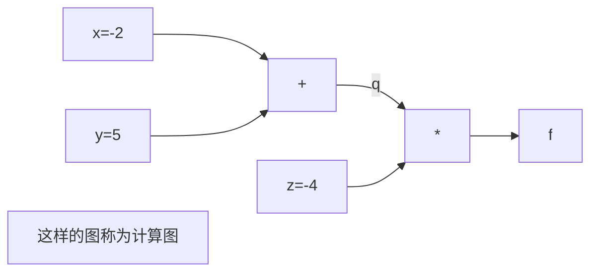
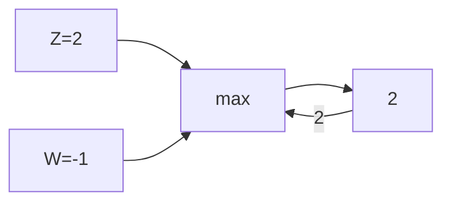
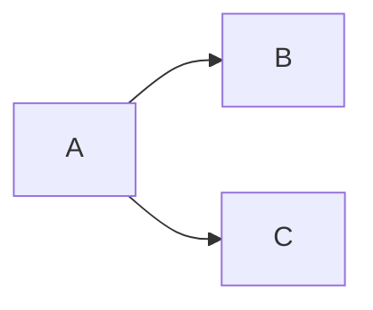

## 1.损失函数(Loss function)

​	定义一个函数，将权重矩阵**W**作为输入，输出W的输出得分，**定量**的估计W的好坏，这个函数称为损失函数。

正式定义：训练集x，y（N个样本），x作为输入，在图像分类问题中x是图片像素点构成的数据集，y是期望的输出(Label or target)，则损失函数L<sub>i</sub>是通过$f$给出的预测和真实的Label作比较可以定量的描述训练的好坏，而整个数据集L是整个数据集N个样本的损失函数的总和的平均：即
$$
L = \frac{1}{N}\sum\limits_iL_i(f(x_i, W), y_i)
$$
总的来说，损失函数描述了神经网络的预测与期望的误差，因此优化神经网络的任务即找到训练集上使损失函数达到最小的权重W

### 1.1 多分类svm与损失函数svm_loss

​	多分类svm：将图片像素点作为输入，会得到该图片在每个类的得分，神经网络判断图片属于某一类的可能性越大，图片在该类的得分就越高

​	svm_loss：将所有错误分类的得分与正确分类的得分做比较，若正确分类得分高出某个值(某个安全的边距)，即高出一定阈值，则损失为0

<center style="zoom:50%" />
<svg xmlns="http://www.w3.org/2000/svg" xmlns:xlink="http://www.w3.org/1999/xlink" width="480" height="226pt" viewBox="0 0 360 226"><defs><symbol overflow="visible" id="a"><path d="M5.203-2.063H.593v-.503h4.61zm0 0"/></symbol><symbol overflow="visible" id="b"><path d="M4.516 0H.48v-.918c.29-.273.563-.535.82-.789a16.1 16.1 0 00.755-.79c.496-.546.836-.983 1.02-1.312.179-.328.269-.668.273-1.027a1.399 1.399 0 00-.086-.476 1.032 1.032 0 00-.235-.344 1.088 1.088 0 00-.355-.196 1.478 1.478 0 00-.445-.066c-.157 0-.317.02-.473.059-.164.039-.317.09-.457.148-.125.05-.242.11-.356.18-.117.07-.21.133-.277.18H.617v-.934c.176-.09.43-.18.754-.266.324-.086.629-.129.922-.129.605 0 1.086.164 1.434.489.343.324.515.761.52 1.312a3.075 3.075 0 01-.09.711 2.566 2.566 0 01-.25.598 4.771 4.771 0 01-.391.57c-.153.188-.317.371-.485.55-.281.302-.586.614-.922.934-.336.325-.605.579-.808.766h3.215zm0 0"/></symbol><symbol overflow="visible" id="c"><path d="M4.688-2.25H3.91V0h-.844v-2.25H.176v-.922l2.926-3.371h.808v3.59h.777zm-1.622-.703v-2.559L.86-2.953zm0 0"/></symbol><symbol overflow="visible" id="d"><path d="M4.617-2.121c0 .336-.058.648-.168.93-.113.289-.261.523-.445.71-.2.204-.418.36-.66.461a2.095 2.095 0 01-.805.157 2.202 2.202 0 01-.805-.149 1.858 1.858 0 01-.64-.445c-.227-.234-.403-.55-.528-.95-.128-.398-.191-.886-.191-1.468 0-.566.059-1.078.176-1.54.117-.452.297-.855.539-1.198a2.43 2.43 0 01.918-.774c.37-.187.804-.281 1.3-.281a3.3 3.3 0 01.407.023c.125.016.234.04.336.07v.84h-.04a1.697 1.697 0 00-.343-.12 2.613 2.613 0 00-.477-.055c-.546.004-.988.187-1.32.55-.34.372-.539.919-.598 1.637.204-.14.418-.254.641-.336.219-.078.461-.117.723-.12a2.8 2.8 0 01.668.077c.191.055.39.16.601.309.239.188.418.418.535.691.118.282.176.606.176.98zm-.89.035c0-.27-.036-.492-.106-.676a1.179 1.179 0 00-.344-.468.973.973 0 00-.39-.184 2.381 2.381 0 00-.442-.043c-.21 0-.41.031-.601.094a2.597 2.597 0 00-.57.265 1.609 1.609 0 00-.012.188 1.395 1.395 0 00-.004.226c-.004.454.039.82.133 1.098.086.281.199.492.332.633.125.14.254.238.386.293a.999.999 0 00.434.082 1.05 1.05 0 00.855-.379c.22-.25.329-.629.329-1.129zm0 0"/></symbol><symbol overflow="visible" id="e"><path d="M3.563-5.02c0-.289-.098-.53-.293-.73-.196-.195-.47-.297-.817-.297-.324 0-.586.09-.785.266-.207.176-.309.414-.305.71a.875.875 0 00.157.551c.101.153.257.286.464.403.09.05.227.12.414.207.184.09.356.156.512.207.254-.195.426-.395.516-.606.09-.203.136-.441.136-.71zm.124 3.278c-.003-.266-.054-.48-.16-.637-.105-.156-.308-.316-.609-.488a5.716 5.716 0 00-.398-.176c-.165-.062-.352-.14-.56-.23a1.705 1.705 0 00-.562.597 1.666 1.666 0 00-.191.805c0 .398.117.723.36.98.234.258.535.387.898.387.367 0 .664-.11.887-.332.222-.219.332-.52.336-.906zM2.458.148a2.764 2.764 0 01-.89-.144 1.816 1.816 0 01-.68-.418 1.612 1.612 0 01-.422-.625 1.933 1.933 0 01-.14-.766c-.005-.351.09-.675.28-.976a1.96 1.96 0 01.829-.711v-.028c-.325-.183-.563-.386-.72-.613-.155-.219-.234-.5-.23-.836a1.552 1.552 0 01.559-1.23c.371-.328.84-.492 1.414-.492.59 0 1.066.156 1.43.468.355.313.535.711.539 1.196a1.73 1.73 0 01-.258.87c-.176.29-.422.512-.738.673v.027c.375.18.664.398.863.648.191.258.289.586.293.985a1.861 1.861 0 01-.61 1.406c-.406.379-.913.563-1.519.566zm0 0"/></symbol><symbol overflow="visible" id="f"><path d="M4.184 0H.992v-.668H2.18v-4.387H.992v-.597c.446.004.778-.059.992-.192.211-.125.332-.367.36-.722h.68v5.898h1.16zm0 0"/></symbol><symbol overflow="visible" id="g"><path d="M2.246-5.918c-.164 0-.32.02-.476.059-.157.039-.313.09-.465.148a2.467 2.467 0 00-.367.184c-.106.07-.2.129-.278.18H.605v-.926c.188-.102.446-.196.774-.282.324-.082.637-.125.937-.125.29 0 .547.032.774.09.219.063.422.156.601.277.192.145.336.313.438.512a1.6 1.6 0 01.148.7c0 .363-.12.68-.359.949-.238.277-.523.449-.852.52v.058c.133.031.282.078.442.14.152.063.297.157.437.282.133.129.243.293.328.488.082.2.125.441.13.723a2.261 2.261 0 01-.153.812c-.102.25-.242.469-.426.66-.191.2-.422.352-.691.453-.27.102-.574.149-.918.153a4.34 4.34 0 01-.977-.121A3.621 3.621 0 01.426-.27v-.925h.062c.18.136.43.265.742.386.31.125.618.188.934.184.172.004.352-.023.535-.086.176-.055.328-.148.453-.277a1.39 1.39 0 00.266-.426c.059-.152.09-.352.094-.59a1.55 1.55 0 00-.106-.582.978.978 0 00-.285-.363 1.126 1.126 0 00-.437-.18 3.467 3.467 0 00-.547-.05h-.375v-.731h.289c.394.004.715-.09.965-.281.246-.184.37-.457.37-.817a.913.913 0 00-.097-.426.87.87 0 00-.242-.285 1.154 1.154 0 00-.371-.156 2.195 2.195 0 00-.43-.043zm0 0"/></symbol><symbol overflow="visible" id="h"><path d="M4.441-2.082c0 .32-.05.613-.152.879a2.092 2.092 0 01-.422.7 1.99 1.99 0 01-.687.468 2.499 2.499 0 01-.922.172A4.543 4.543 0 011.332.03a3.352 3.352 0 01-.785-.27v-.925h.058c.063.05.16.105.29.168.125.062.265.125.417.18.172.062.329.109.477.14.14.04.305.055.484.051.172.004.34-.027.512-.094.164-.058.309-.16.434-.304.101-.13.183-.282.246-.454a2.01 2.01 0 00.086-.609 1.5 1.5 0 00-.094-.57.94.94 0 00-.277-.371 1.146 1.146 0 00-.461-.235 2.94 2.94 0 00-.614-.07 6.29 6.29 0 00-.718.055c-.242.039-.434.074-.575.105v-3.371h3.59v.77H1.66v1.738l.313-.024.28-.011c.333.004.614.03.849.086.226.054.449.164.668.324.21.168.378.375.496.617.117.25.175.57.175.961zm0 0"/></symbol></defs><path d="M7.66 11.563l.422.406.422.41.844.812 1.683 1.63 3.375 3.257 7.313 7.063 6.828 6.593 6.695 6.465 7.262 7.012 6.777 6.547 7.348 7.094 7.21 6.96 6.727 6.497 7.293 7.043 6.809 6.578 6.676 6.445 7.242 6.992 6.758 6.528 7.324 7.074 7.195 6.945 6.703 6.477 7.278 7.023 6.789 6.559 7.355 7.101 7.223 6.977 6.738 6.508 7.309 7.054 6.82 6.586 6.688 6.461 7.254 7.004 6.77 6.54 7.339 7.085.113.106.11.109.226.219.45.433.902.871 1.8 1.739.114.109.11.11.226.214.449.438.902.867 1.801 1.738.211.203.207.203.633.61.207.203.633.61.207.202.105.102.106.098.105.101.012.012M213.977 210.695H351.34" fill="none" stroke-width="1.6" stroke-linecap="square" stroke="#5e81b5" stroke-miterlimit="3.25"/><path d="M7.66 210.695v-4" fill="none" stroke-width=".2" stroke="#666" stroke-miterlimit="3.25"/><use xlink:href="#a" x="2.16" y="222.693" fill="#93a1a1"/><use xlink:href="#b" x="8.16" y="222.693" fill="#93a1a1"/><path d="M24.844 210.695v-2.402M42.027 210.695v-2.402M59.21 210.695v-2.402M76.395 210.695v-4M93.578 210.695v-2.402M110.766 210.695v-2.402M127.95 210.695v-2.402M145.133 210.695v-4" fill="none" stroke-width=".2" stroke="#666" stroke-miterlimit="3.25"/><use xlink:href="#b" x="142.632" y="222.693" fill="#93a1a1"/><path d="M162.316 210.695v-2.402M179.5 210.695v-2.402M196.684 210.695v-2.402M213.867 210.695v-4" fill="none" stroke-width=".2" stroke="#666" stroke-miterlimit="3.25"/><use xlink:href="#c" x="211.368" y="222.693" fill="#93a1a1"/><path d="M231.05 210.695v-2.402M248.234 210.695v-2.402M265.422 210.695v-2.402M282.605 210.695v-4" fill="none" stroke-width=".2" stroke="#666" stroke-miterlimit="3.25"/><use xlink:href="#d" x="280.104" y="222.693" fill="#93a1a1"/><path d="M299.79 210.695v-2.402M316.973 210.695v-2.402M334.156 210.695v-2.402M351.34 210.695v-4" fill="none" stroke-width=".2" stroke="#666" stroke-miterlimit="3.25"/><use xlink:href="#e" x="348.84" y="222.693" fill="#93a1a1"/><path d="M.5 210.695h358" fill="none" stroke-width=".2" stroke="#93a1a1" stroke-miterlimit="3.25"/><path d="M76.395 217.332h2.402M76.395 210.695h4M76.395 204.055h2.402M76.395 197.418h2.402M76.395 190.781h2.402M76.395 184.145h2.402M76.395 177.504h4" fill="none" stroke-width=".2" stroke="#666" stroke-miterlimit="3.25"/><use xlink:href="#f" x="68.396" y="181.005" fill="#93a1a1"/><path d="M76.395 170.867h2.402M76.395 164.23h2.402M76.395 157.594h2.402M76.395 150.953h2.402M76.395 144.316h4" fill="none" stroke-width=".2" stroke="#666" stroke-miterlimit="3.25"/><use xlink:href="#b" x="68.396" y="147.817" fill="#93a1a1"/><path d="M76.395 137.68h2.402M76.395 131.043h2.402M76.395 124.402h2.402M76.395 117.766h2.402M76.395 111.129h4" fill="none" stroke-width=".2" stroke="#666" stroke-miterlimit="3.25"/><use xlink:href="#g" x="68.396" y="114.628" fill="#93a1a1"/><path d="M76.395 104.492h2.402M76.395 97.852h2.402M76.395 91.215h2.402M76.395 84.578h2.402M76.395 77.941h4" fill="none" stroke-width=".2" stroke="#666" stroke-miterlimit="3.25"/><use xlink:href="#c" x="68.396" y="81.44" fill="#93a1a1"/><path d="M76.395 71.3h2.402M76.395 64.664h2.402M76.395 58.027h2.402M76.395 51.39h2.402M76.395 44.75h4" fill="none" stroke-width=".2" stroke="#666" stroke-miterlimit="3.25"/><use xlink:href="#h" x="68.396" y="48.251" fill="#93a1a1"/><path d="M76.395 38.113h2.402M76.395 31.477h2.402M76.395 24.84h2.402M76.395 18.2h2.402M76.395 11.563h4" fill="none" stroke-width=".2" stroke="#666" stroke-miterlimit="3.25"/><use xlink:href="#d" x="68.396" y="15.063" fill="#93a1a1"/><path d="M76.395 4.926h2.402" fill="none" stroke-width=".2" stroke="#666" stroke-miterlimit="3.25"/><path d="M76.395 221.758V.5" fill="none" stroke-width=".2" stroke="#93a1a1" stroke-miterlimit="3.25"/></svg>
$$
L_i = \sum\limits_{j\neq y_i}\begin{cases}0, & \text{if $S_{y_i}$ > $S_j$+1
}\\
S_j-S_{y_i}+1, & \text{otherwise}\end{cases} = \sum\limits_{j\neq y_i}max(0,S_j-S_{y_i}+1) \text{（安全边距设为1）}
$$

$S_j$为错误分类的得分，$S_{y_i}$为其真实类别的得分，由上式可知分数越高，损失$L_i$越接近于0

$S_{y_i}$命名的含义：$S$为分类器预测的输出，即各类的得分，若用于分猫狗两类的分类器，则$S_1$和$S_2$分别是猫和狗的分数，$y_i$为样本正确的类别标签，因此$S_{y_i}$就是第$i$个样本所属的真实类别的得分。

#### 1.1.1 svm和svm_loss的性质

1. 权重矩阵W在初始化时都是使用**较小**的随机数初始化的，这就导致W产生的各类的得分，在训练初期倾向于呈现较小的均匀分布的值。若 假设一开始训练产生的分数都近似于0且近似相等，**那么使用多分类svm后的损失大致是$C-1$($C$为分类数，即类别数目)**，这是因为 由$Li=\sum\limits_{j\neq y_i}max(0, S_j-S_{y_i}+1)$在 $S_j$与$S_{y_i}$近似相等且 $S_j-S_{y_i}\thickapprox0$$\Rightarrow$每个$i$的$max(0, S_i-S_{y_i}+1)\thickapprox1$，且$j\neq y_i$共$C-1$类，所以累加$C-1$次，结果为$C-1$

   这个性质可以作为一开始训练时预估的是损失函数的大小，若损失函数在第一次迭代时并不等于$C-1$，那么程序可能有bug 

 2. 前面提到的整个数据集的损失函数 $L$: $L = \frac{1}{N}\sum\limits_iL_i(f(x_i, W), y_i)$ 只是将整个损失函数缩小一个倍数，任何缩放操作都不会产生影响，因为我们并不在意损失函数的真实值，这只是用来评估网络的一个标准。

 3. **一个损失函数的全部意义在于量化不同的误差有多大**，而不同的分类器会有产生不同的误差，因此，**选择不同的损失函数意义在于如何权衡和处理不同的分类器可能出现的误差**。例如，如果使用**平方项**损失函数，即$L_i=\sum\limits_{j\neq y_i}max^2(0, S_j-S_{y_i}+1)$，则意味着处理误差的方式是放大误差，一个较大的误差会平方式的放大，则权衡单个样例的错误时就会平方放大其错误，这会对我们的评估网络和反馈训练造成很大的影响，因为一个被放大的错误就可能导致了对矩阵的更新会非常大；而使用**非平方项**损失函数（合页损失函数），即$Li=\sum\limits_{j\neq y_i}max(0, S_j-S_{y_i}+1)$，我们对于单个微小的错误并不在意，对评估和反馈的影响也不会非常大，但如果出现了非常多的样例有错误，错误才会累加到很大，此时产生的影响才会非常大，即合页损失函数综合了多个错误样例才进行较大的更新，单个错误样例的影响并不大

### 1.2 权重矩阵W的选取（奥卡姆剃刀原则）

​	上一节提到最优W即在损失函数达到最小（最小就是$L_i=0$，但通常达不到0，且达到0会过拟合）时取到，但由于前面提到的：对于损失函数的缩放并不会产生任何影响，因此会产生多个最优W

#### 1.2.1 分类器将如何在多个达到极小的损失函数的W中作选择？

分类器会产生多个符合条件的W，是因为前面的损失函数里只以数据的误差作为分类器选择W的标准，让分类器尽可能的去拟合训练集数据，但实际上，我们并不关心训练集拟合得有多好，只是关心训练出来的分类器在**测试集中的表现**，也就是**我们关心的是训练出普适的规律，而不是训练集的规律**。

因此之前的只以训练集的损失定义的损失函数是不够的！所以在损失函数里加入一项：
$$
L(W) = \frac{1}{N}\sum_{i=1}^m L_i(f(x_i, W),y_i)+\lambda R(W)
$$
该项称为正则项(regulation) ，该项鼓励模型(W)趋于简洁，这里的“简洁”并不是越小越好，而是基于任务的规模和模型的种类。这方面也体现了“奥卡姆剃刀原则”：要让一个理论的应用更加广泛，当你有多个能解释你观察结果的假设，你应该选择最简洁的，因为这样利于在未来将其用于解释新的结果 (泛化的概念) ，越不简洁，越苛刻，对新的结果的解释也就越不友好。


“奥卡姆剃刀原则”在机器学习中的体现就是，假设**正则化惩罚项(regularization penalty)**，记作$R$. 而其中的超参数$\lambda$用于平衡 Data loss 和 Regularization 这两项。$\lambda ,R,W$这三项的相互作用组成的正则项$\lambda R(W)$使模型趋于简单并惩罚模型（降低高幂次）防止过拟合，而高幂次模型想要得到保留，就必须克服这项正则惩罚项，这三者并不是正则化的一般的线性的关系。

这样，我们就可以回答开始**“如何在多个符合条件的W中作选取”**的问题了——通过正则惩罚项得到最适应任务和模型的最“简洁”的W

#### 1.2.2 正则化类型

​	正如1.2.1提到的正则项 $\lambda R(W)$ ，按正则化的类型有多种计算方法
$$
L2\ Regularization: R(W) = \sum_k\sum_lW^2_{k,l}\\
L1\ Regularization: R(W) = \sum_k\sum_l|W_{k,l}|\\
Elastic\ net(L1+L2):R(W)=\sum_k\sum_l\beta W^2_{k,l}+|W_{k,l}|
$$
最常用的是**L2正则化**，即对权重W的欧式范数进行惩罚；

>欧式范数(Euclidean norm)即距离 = $\sqrt{\sum_1^n{x_i^2}}$

类似的，**L1正则化**就是对权重向量W的L1范数作惩罚。**弹性网络正则化Elastic net**，将L1和L2组合一起。

**最大规范正则化**，按最高准则进行惩罚，不属于L1或L2。

还有一些具体的正则化实现：例如**Dropout**，**批量归一化 batch normalization**，**随机深度stochatic depth**等等

#### 1.2.3 正则化如何度量模型复杂度

一个简单的例子就是：对比两个矩阵 $W_1=[1,0,0,0]$ 和 $W_2=[0.25,0.25,0.25,0.25]$，两者在x=[1,1,1,1]时有着相同输出，但$L2(W_1)=1,\ L2(W_2)=\sqrt{0.25^2+0.25^2+0.25^2+0.25^2}=0.5$，$W_2$的L2范数更小。这样就通过了L2范数来度量两个W的复杂度。

可以看到，上例中L2正则 是粗糙的通过L2范数来铺展开W中的每个元素值，来度量每个元素的影响，而不是仅反映单个元素的影响。

### 1.3 softmax函数与softmax损失函数(softmax loss)

​	前面提到的损失函数与正则惩罚项都是基于**svm loss**进行讨论的，但深度学习中**softmax loss**更为常用。softmax loss也称**multinomial logistic regression loss function——多项式逻辑回归损失函数**。在得到softmax loss之前，先引入**softmax函数(softmax function)**

其表达式：
$$
Softmax\ function:P(Y=k|X=x_i)=\frac{e^{s_k}}{\sum_je^{s_j}}\quad(\sum_je^{s_j}为所有类别分数指数化后的累加)\\
where:s=f(x_i,W)\quad(即x_i经过分类器后各类对应的分数)
$$
分数指数化以便于结果都是正数，再除以指数化的和来**归一化**，**Softmax函数的效果**是类别对应的分数经过softmax函数后就得到了类别的相应概率$P(0\leqslant P \leqslant 1)$且所有类别的$P_i$的和为1。至此就得到了每类得分分数的概率分布。

各类得分经过softmax后，就可以用真实的概率分布与我们的softmax function输出的概率分布作比较并计算softmax loss了

>真实的概率分布很显然应是：一张图片对应的真实类别的概率为1，其他类别的概率为0

我们期望输出的概率分布要逼近于真实概率分布，也就是真实类别的概率较高并接近于1，因此损失函数softmax loss表达式为：
$$
Softmax\ loss:L_i=-logP(Y=y_i|X=x_i)\quad （P(Y=y_i|X=x_i)为真实类别的概率）
$$
因为对数函数log是一个单调函数，找到数学上log函数的最大值只需$P$最大即可，因此选择log函数但底数$P$越逼近于1其对数值越大，但**损失函数是描述分类器的误差程度（就是有多不好）**，所以对log取了负号，以符合 $P(Y=y_i|X=x_i)$ 越大，分类器越好，损失函数越小的预设。

softmax loss函数图象

<center style="zoom:50%;"/>
<svg xmlns="http://www.w3.org/2000/svg" xmlns:xlink="http://www.w3.org/1999/xlink" width="480" height="300" viewBox="0 0 360 225"><defs><symbol overflow="visible" id="a"><path d="M4.547-3.273c0 1.175-.172 2.039-.512 2.586-.344.55-.87.82-1.578.824C1.73.133 1.203-.145.867-.703.531-1.262.363-2.113.363-3.266c0-1.175.168-2.039.512-2.59.34-.542.867-.816 1.582-.82.719.004 1.25.285 1.586.848.336.566.504 1.418.504 2.555zM3.422-1.277c.086-.22.144-.493.18-.825.035-.328.054-.718.054-1.171 0-.446-.02-.836-.054-1.168a3.345 3.345 0 00-.184-.829 1.186 1.186 0 00-.363-.503 1.022 1.022 0 00-.598-.176c-.246.004-.445.062-.602.176-.16.117-.285.285-.37.511a2.854 2.854 0 00-.18.848c-.035.344-.051.726-.047 1.148-.004.461.008.844.039 1.149.023.312.086.586.183.824.083.23.204.406.364.523.152.125.355.184.613.18a.958.958 0 00.598-.172c.156-.117.28-.289.367-.515zm0 0"/></symbol><symbol overflow="visible" id="b"><path d="M1.887 0H.836v-1.254h1.05zm0 0"/></symbol><symbol overflow="visible" id="c"><path d="M4.516 0H.48v-.918c.29-.273.563-.535.82-.789a16.1 16.1 0 00.755-.79c.496-.546.836-.983 1.02-1.312.179-.328.269-.668.273-1.027a1.399 1.399 0 00-.086-.476 1.032 1.032 0 00-.235-.344 1.088 1.088 0 00-.355-.196 1.478 1.478 0 00-.445-.066c-.157 0-.317.02-.473.059-.164.039-.317.09-.457.148-.125.05-.242.11-.356.18-.117.07-.21.133-.277.18H.617v-.934c.176-.09.43-.18.754-.266.324-.086.629-.129.922-.129.605 0 1.086.164 1.434.489.343.324.515.761.52 1.312a3.075 3.075 0 01-.09.711 2.566 2.566 0 01-.25.598 4.771 4.771 0 01-.391.57c-.153.188-.317.371-.485.55-.281.302-.586.614-.922.934-.336.325-.605.579-.808.766h3.215zm0 0"/></symbol><symbol overflow="visible" id="d"><path d="M4.688-2.25H3.91V0h-.844v-2.25H.176v-.922l2.926-3.371h.808v3.59h.777zm-1.622-.703v-2.559L.86-2.953zm0 0"/></symbol><symbol overflow="visible" id="e"><path d="M4.617-2.121c0 .336-.058.648-.168.93-.113.289-.261.523-.445.71-.2.204-.418.36-.66.461a2.095 2.095 0 01-.805.157 2.202 2.202 0 01-.805-.149 1.858 1.858 0 01-.64-.445c-.227-.234-.403-.55-.528-.95-.128-.398-.191-.886-.191-1.468 0-.566.059-1.078.176-1.54.117-.452.297-.855.539-1.198a2.43 2.43 0 01.918-.774c.37-.187.804-.281 1.3-.281a3.3 3.3 0 01.407.023c.125.016.234.04.336.07v.84h-.04a1.697 1.697 0 00-.343-.12 2.613 2.613 0 00-.477-.055c-.546.004-.988.187-1.32.55-.34.372-.539.919-.598 1.637.204-.14.418-.254.641-.336.219-.078.461-.117.723-.12a2.8 2.8 0 01.668.077c.191.055.39.16.601.309.239.188.418.418.535.691.118.282.176.606.176.98zm-.89.035c0-.27-.036-.492-.106-.676a1.179 1.179 0 00-.344-.468.973.973 0 00-.39-.184 2.381 2.381 0 00-.442-.043c-.21 0-.41.031-.601.094a2.597 2.597 0 00-.57.265 1.609 1.609 0 00-.012.188 1.395 1.395 0 00-.004.226c-.004.454.039.82.133 1.098.086.281.199.492.332.633.125.14.254.238.386.293a.999.999 0 00.434.082 1.05 1.05 0 00.855-.379c.22-.25.329-.629.329-1.129zm0 0"/></symbol><symbol overflow="visible" id="f"><path d="M3.563-5.02c0-.289-.098-.53-.293-.73-.196-.195-.47-.297-.817-.297-.324 0-.586.09-.785.266-.207.176-.309.414-.305.71a.875.875 0 00.157.551c.101.153.257.286.464.403.09.05.227.12.414.207.184.09.356.156.512.207.254-.195.426-.395.516-.606.09-.203.136-.441.136-.71zm.124 3.278c-.003-.266-.054-.48-.16-.637-.105-.156-.308-.316-.609-.488a5.716 5.716 0 00-.398-.176c-.165-.062-.352-.14-.56-.23a1.705 1.705 0 00-.562.597 1.666 1.666 0 00-.191.805c0 .398.117.723.36.98.234.258.535.387.898.387.367 0 .664-.11.887-.332.222-.219.332-.52.336-.906zM2.458.148a2.764 2.764 0 01-.89-.144 1.816 1.816 0 01-.68-.418 1.612 1.612 0 01-.422-.625 1.933 1.933 0 01-.14-.766c-.005-.351.09-.675.28-.976a1.96 1.96 0 01.829-.711v-.028c-.325-.183-.563-.386-.72-.613-.155-.219-.234-.5-.23-.836a1.552 1.552 0 01.559-1.23c.371-.328.84-.492 1.414-.492.59 0 1.066.156 1.43.468.355.313.535.711.539 1.196a1.73 1.73 0 01-.258.87c-.176.29-.422.512-.738.673v.027c.375.18.664.398.863.648.191.258.289.586.293.985a1.861 1.861 0 01-.61 1.406c-.406.379-.913.563-1.519.566zm0 0"/></symbol><symbol overflow="visible" id="g"><path d="M4.184 0H.992v-.668H2.18v-4.387H.992v-.597c.446.004.778-.059.992-.192.211-.125.332-.367.36-.722h.68v5.898h1.16zm0 0"/></symbol><symbol overflow="visible" id="h"><path d="M2.246-5.918c-.164 0-.32.02-.476.059-.157.039-.313.09-.465.148a2.467 2.467 0 00-.367.184c-.106.07-.2.129-.278.18H.605v-.926c.188-.102.446-.196.774-.282.324-.082.637-.125.937-.125.29 0 .547.032.774.09.219.063.422.156.601.277.192.145.336.313.438.512a1.6 1.6 0 01.148.7c0 .363-.12.68-.359.949-.238.277-.523.449-.852.52v.058c.133.031.282.078.442.14.152.063.297.157.437.282.133.129.243.293.328.488.082.2.125.441.13.723a2.261 2.261 0 01-.153.812c-.102.25-.242.469-.426.66-.191.2-.422.352-.691.453-.27.102-.574.149-.918.153a4.34 4.34 0 01-.977-.121A3.621 3.621 0 01.426-.27v-.925h.062c.18.136.43.265.742.386.31.125.618.188.934.184.172.004.352-.023.535-.086.176-.055.328-.148.453-.277a1.39 1.39 0 00.266-.426c.059-.152.09-.352.094-.59a1.55 1.55 0 00-.106-.582.978.978 0 00-.285-.363 1.126 1.126 0 00-.437-.18 3.467 3.467 0 00-.547-.05h-.375v-.731h.289c.394.004.715-.09.965-.281.246-.184.37-.457.37-.817a.913.913 0 00-.097-.426.87.87 0 00-.242-.285 1.154 1.154 0 00-.371-.156 2.195 2.195 0 00-.43-.043zm0 0"/></symbol></defs><path d="M16.59 11.55l.09.571.113.703.23 1.383.457 2.664.915 4.961.113.59.113.582.227 1.148.457 2.223.914 4.191 1.828 7.512.105.41.106.403.215.8.425 1.567.852 3.004 1.707 5.543.105.328.11.328.21.644.427 1.274.855 2.453 1.703 4.602.106.27.105.265.207.535.418 1.047.836 2.039 1.672 3.86.105.234.106.23.207.461.418.906.836 1.77 1.672 3.379.113.218.113.223.227.438.457.867.906 1.691 1.813 3.23 3.629 5.938.21.328.211.325.422.644.848 1.266 1.691 2.445 3.387 4.578 7.34 8.766 7.203 7.41 6.719 6.101 7.289 5.918 6.8 4.993 6.669 4.484 7.238 4.477 6.75 3.867 7.316 3.898 7.188 3.574 6.699 3.133 7.266 3.203 6.785 2.825 7.351 2.906 7.215 2.707 6.73 2.41 7.301 2.496 6.813 2.227 6.684 2.101 7.246 2.192 6.761 1.964 7.332 2.055 7.196 1.942 6.714 1.75 7.278 1.835 6.797 1.66 6.66 1.579 7.23 1.664 6.743 1.504 7.312 1.59 6.824 1.437 6.696 1.379 7.257 1.453 6.778 1.32 7.34 1.399 7.21 1.336 6.723 1.219 7.293 1.292 6.809 1.176 6.672 1.133 7.242 1.2 6.754 1.097.117.02.117.015.238.04.47.073.944.153 1.883.3.121.02.118.016.234.039.473.074.94.148.235.04.239.035.468.074.121.02.118.019.234.035.234.04.121.019.118.015" fill="none" stroke-width="1.6" stroke-linecap="square" stroke="#5e81b5" stroke-miterlimit="3.25"/><path d="M8 210.488v-4M25.168 210.488v-2.398M42.336 210.488v-2.398M59.504 210.488v-2.398M76.668 210.488v-4" fill="none" stroke-width=".2" stroke="#666" stroke-miterlimit="3.25"/><g fill="#93a1a1"><use xlink:href="#a" x="70.169" y="222.49"/><use xlink:href="#b" x="75.082" y="222.49"/><use xlink:href="#c" x="77.807" y="222.49"/></g><path d="M93.836 210.488v-2.398M111.004 210.488v-2.398M128.172 210.488v-2.398M145.34 210.488v-4" fill="none" stroke-width=".2" stroke="#666" stroke-miterlimit="3.25"/><g fill="#93a1a1"><use xlink:href="#a" x="138.839" y="222.49"/><use xlink:href="#b" x="143.752" y="222.49"/><use xlink:href="#d" x="146.476" y="222.49"/></g><path d="M162.508 210.488v-2.398M179.672 210.488v-2.398M196.84 210.488v-2.398M214.008 210.488v-4" fill="none" stroke-width=".2" stroke="#666" stroke-miterlimit="3.25"/><g fill="#93a1a1"><use xlink:href="#a" x="207.508" y="222.49"/><use xlink:href="#b" x="212.421" y="222.49"/><use xlink:href="#e" x="215.146" y="222.49"/></g><path d="M231.176 210.488v-2.398M248.344 210.488v-2.398M265.512 210.488v-2.398M282.676 210.488v-4" fill="none" stroke-width=".2" stroke="#666" stroke-miterlimit="3.25"/><g fill="#93a1a1"><use xlink:href="#a" x="276.178" y="222.49"/><use xlink:href="#b" x="281.091" y="222.49"/><use xlink:href="#f" x="283.815" y="222.49"/></g><path d="M299.844 210.488v-2.398M317.012 210.488v-2.398M334.18 210.488v-2.398M351.348 210.488v-4" fill="none" stroke-width=".2" stroke="#666" stroke-miterlimit="3.25"/><g fill="#93a1a1"><use xlink:href="#g" x="344.847" y="222.49"/><use xlink:href="#b" x="349.76" y="222.49"/><use xlink:href="#a" x="352.485" y="222.49"/></g><path d="M.848 210.488H358.5" fill="none" stroke-width=".2" stroke="#93a1a1" stroke-miterlimit="3.25"/><path d="M8 221.277h2.398M8 210.488h4M8 199.703h2.398M8 188.914h2.398M8 178.125h2.398M8 167.34h2.398M8 156.55h4" fill="none" stroke-width=".2" stroke="#666" stroke-miterlimit="3.25"/><use xlink:href="#g" y="160.051" fill="#93a1a1"/><path d="M8 145.762h2.398M8 134.977h2.398M8 124.188h2.398M8 113.398h2.398M8 102.613h4" fill="none" stroke-width=".2" stroke="#666" stroke-miterlimit="3.25"/><use xlink:href="#c" y="106.112" fill="#93a1a1"/><path d="M8 91.824h2.398M8 81.035h2.398M8 70.25h2.398M8 59.46h2.398M8 48.672h4" fill="none" stroke-width=".2" stroke="#666" stroke-miterlimit="3.25"/><use xlink:href="#h" y="52.174" fill="#93a1a1"/><path d="M8 37.887h2.398M8 27.098h2.398M8 16.309h2.398M8 5.523h2.398" fill="none" stroke-width=".2" stroke="#666" stroke-miterlimit="3.25"/><path d="M8 221.543V.5" fill="none" stroke-width=".2" stroke="#93a1a1" stroke-miterlimit="3.25"/></svg>
#### 1.3.1 softmax loss函数性质

1. 正如之前提到的svm loss的 *预估首次迭代后的损失值检测机制*  性质一样，softmax loss**首次迭代后的值应是$-log\frac{1}{C}=logC$，**这同样可以作为调试和检测依据。
2. 通过对比 softmax loss 与 svm loss 发现：在某一个正确类别的得分高出错误分类得分一个阈值时，svm loss=0，这个数据点就不会再影响loss了，带来的影响就是在后续的优化过程中不再考虑这个得到高分的数据点；而softmax loss 不同，就算正确类别的得分再高，错误类别的得分再低，softmax loss 仍不会达到0，这样在**优化方向上就会持续给正确类别积累更多的概率**，也就会给正确类别的分数推向无穷大，并将不正确的类别的分数推向负无穷。

## 2. 优化(Optimization)

多元情况下生成的导数就是梯度

**step size 步长**，也叫**learning rate 学习率**是在训练网络的时候第一个要检查的超参数


## 3. 反向传播与神经网络(Back propagation and neural network)
### 3.1 反向传播是如何工作的——链式法则 (chain rule)



先用上图中$f(x,y,z)=(x+y)*z\quad e.g.\ x=-2, y=5, z=-4$ 这样简单的函数来作链式法则，有：
$$
f(x,y,z)=(x+y)*z\quad e.g.\ x=-2, y=5, z=-4\\
q=x+y\quad\frac{\partial {q}}{\partial x}=1,\frac{\partial {q}}{\partial y}=1\\
f=qz\quad\frac{\partial{f}}{\partial{q}}=z,\frac{\partial{f}}{\partial{z}}=q\\
Want:\frac{\partial{f}}{\partial{x}},\frac{\partial{f}}{\partial{y}}\\
Chain\ rule:\frac{\partial{f}}{\partial{x}}=\frac{\partial{q}}{\partial{x}}\frac{\partial{f}}{\partial{q}}=z=-4,\ \frac{\partial{f}}{\partial{y}}=\frac{\partial{q}}{\partial{y}}\frac{\partial{f}}{\partial{q}}=z=-4
$$
总的来说，对于每个节点，我们都可以用其输入和直接输出得到相应的梯度，称作**本地梯度**。而**反向传播**所做的是，从一个节点的上游为该节点返回一个梯度，该梯度是对节点输出的求导，接着根据链式法则将 传播回来的梯度和该节点的本地梯度相乘，就得到关于*该节点输入*的梯度。

之所以在这里不使用微积分直接得出$\frac{\partial{f}}{\partial{x}}$ 而是要用链式法则的方式得出，是因为在在深度学习复杂的模型下$\frac{\partial{f}}{\partial{x}}$用微积分的方法难以计算，而通过链式法则，就可以利用乘法将上游传递的梯度和本地梯度连接得到想要的梯度。

#### 3.1.1 max门的反向传播



假设max门接收到从上游传回来梯度是2，则反向传播得到Z，W梯度分别是2和0，即表明：max门选取的其中一个变量（也就是最大值）会获得传播回来的梯度完整值，而另外一个变量获得的梯度会取为0，也就是**max门会获取上游梯度并将其全部传递到其中前向传递最大值的那个分支**。

可以通过**前向传递过程**解释max门这种梯度传递的效果。前向传递过程中只有最大值Z能通过max门被传递到计算图的剩余部分，所以**只有这个最大值真正影响到了最终的计算结果，因此，同样在反向传播梯度的时候，上游梯度只需要去更新那个产生影响的值**。

#### 3.1.2 反向传播的实质

​	由max门的例子可以看出，一个节点在前向传递的过程中产生了多少程度的影响，在反向传播时的上游梯度就会对这个节点产生多少程度的调整，**一个节点的的影响越大，反向传播对其做出相对应更新的比重也就越大，获得的上游梯度也就越大**。由此可知，当一个节点连接多个节点时，如



在前向传递过程中节点A的微小改变会对连接节点A的所有节点都产生影响，所以B、C返回的梯度也都会对A产生影响，因此节点A的总上游梯度等于节点B、C返回的上游梯度相加。

#### 3.1.3 向量输入的反向传播

向量作为输入时的反向传播：
$$
f(x,W)=||W\cdot x||^2=\sum_{i=1}^n(W\cdot x)^2\\
q=W\cdot x=\left (\begin{matrix}
W_{1,1}x_1+...+W_{1,n}x_n\\.\\.\\W_{n,1}x_1+...+W_{n,n}x_n\end{matrix}\right)\\
f(q)=||q||^2=q_1^2+...+q_n^2\\
\Downarrow \\
\frac{\partial q_k}{\partial W_{i,j}}=x_j,\ \frac{\partial{f}}{\partial W_{i,j}}=\sum_k\frac{\partial{f}}{\partial q_k}\frac{\partial{q_k}}{\partial W_{i,j}}=\sum_k{(2q_k)x_j}=2q_ix_j \Rightarrow\bigtriangledown_wf=\left[\begin{matrix} \frac{\partial{f}}{\partial W_{1,1}} &...&\frac{\partial{f}}{\partial W_{1,n}}\\
 &.& \\
 &.& \\
 &.& \\
 \frac{\partial{f}}{\partial W_{n,1}} &...&\frac{\partial{f}}{\partial W_{n,n}}\end{matrix}\right]_{(雅可比矩阵)}=2q\cdot x^T\\
\frac{\partial q_k}{\partial x_i}=W_{k,i}\ (k=1,2,3...,n)因为每行q都有x_i的参与,\ \frac{\partial{f}}{\partial x_i}=\sum_k\frac{\partial{f}}{\partial q_k}\frac{\partial{q_k}}{\partial x_i}=\sum_k{(2q_k)W_{k,i}} \Rightarrow\bigtriangledown_xf=\left[\begin{matrix} \frac{\partial{f}}{\partial x_{1,1}} &...&\frac{\partial{f}}{\partial x_{1,n}}\\
 &.& \\
 &.& \\
 &.& \\
 \frac{\partial{f}}{\partial x_{n,1}} &...&\frac{\partial{f}}{\partial x_{n,n}}\end{matrix}\right]=2W^T\cdot q
$$
示例：$W=\left [\begin{matrix} 0.1&0.5\\-0.3&0.8 \end{matrix}\right],x=\left [\begin{matrix} 0.2\\0.4 \end{matrix}\right],求\frac{\partial{f}}{\partial W}、\frac{\partial{f}}{\partial x}$


**修正：$\frac{\partial{f}}{\partial W}=\left[\begin{matrix}0.088&0.176\\0.104&0.208\end{matrix}\right]$，是图片中的矩阵的转置**

向量中每个元素的梯度，代表着对应的这个元素对最终计算结果的影响的大小，而每个梯度元素，量化了每个元素对最终输出影响的贡献。

### 3.2 神经网络(neural networks)

#### 3.2.1 神经网络的基本结构——层的堆叠(stack of layers)

以一组简化的函数作为例子：
$$
Linear\ score\ function:f=Wx\\
(用max函数简单的作为非线性部分的示例)\\
2-layer\ Neural\ Network:f=W_2max(0,W_1x)\\
3-layer\ Neural\ Network:f=W_3(max(0,W_2max(0,W_1x)))
$$
线性层：$W_kx,(k=1,2,3...)$；非线性计算部分：$max函数$。线性层和非线性计算部分的组合形成一个**层**(layer)，继而在层的顶部再加上另一个线性层$W_2$ ，得到两层神经网络的输出向量；还可以再加上非线性计算形成神经网络的第二层，再加上线性层$W_3$形成三层神经网络。神经网络就是**线性层和非线性计算部分组成的许多组简单函数，再用一种层次化的嵌套方式将这些组函数堆叠而成，层层堆叠形成网络深度**，其中的**非线性计算部分**特别重要，如果没有非线性部分，整个网络就简化成了一个线性方程。

#### 3.2.2 生物神经元的工作与神经网络的类比与区别

**类比**：


神经元之间通过树突(dendrite)接收传递的脉冲信号，细胞体(cell body)集中处理传入的信号，再通过轴突(axon)传递给连接的下游神经元


而在神经网络中，权重矩阵$W$类比接收信号的树突，提取传递进来的信号x，再对所有传递的信号进行集中，经过激活函数（类比于细胞体和轴突的处理和激发机制），最后传递到下游。

**区别**：生物神经元的工作机制远比神经网络复杂多变，而神经网络的线性与非线性的简单堆叠远模拟不了神经元的种种多变情况，**在这里列出两者区别希望可以给更进神经网络结构一些启发**

1. 生物神经元有许多不同的种类
2. 类比为权重矩阵$W_0$的神经元树突，并不像$W_0$描述的那样只有简单的权重，而是实际上是一个复杂的动态非线性系统
3. 类比为激活函数的神经元轴突的触发(firing)机制，其激发阈值可能会变化，~~相比较起来，一个具有固定数学形式的激活函数设定可能有些过于简单~~

## 4. 卷积神经网络(Convolutional neural network)

与全连接神经网络展开输入图像的像素，形成一组向量不同，卷积神经网络可以保留输入图像的空间结构。

### 4.1 卷积层的工作机制

卷积神经网络利用的是一个大小小于输入图像的**卷积核(filter)**作为权重，在输入图像上（以一定的步长）进行滑动直至遍历整张图像，计算与每个经过的空间区域的**哈达玛积(hadamard products，也称点积，dot products)**

> 哈达玛积，大小完全相同的矩阵，对应元素相乘，例如$\left (\begin {matrix}1&3&2\\1&0&0\\1&2&2\end{matrix}\right)\ast\left (\begin {matrix}0&0&2\\7&5&0\\2&1&1\end{matrix}\right)=\left (\begin {matrix}1\times 0&3\times 0&2\times 2\\1\times 7&0\times 5&0\times 0\\1\times 2&2\times 1&2\times 1\end{matrix}\right)=\left (\begin {matrix}0&0&4\\7&0&0\\2&2&2\end{matrix}\right)$

**点积的结果的每个元素相加并加上偏置，就得到输出激活映射(output activation map)的一个值，垂直方向和水平方向做相同的卷积核滑动处理，最终得到整个输出激活映射**


输入图像每经过一次卷积核处理后（即输入图像的部分区域经过一个哈达玛积），输出是一个值，这就要求卷积核遍历输入图像的所有通道，**因此卷积核的深度（维数）必须与输入深度一致**。例如输入一个$32\times 32\times 3$的图像，选取大小为5的卷积核，则卷积核为$5\times 5\times 3$的矩阵，因此可以看到上图中输出的维数相比输入发生了变化。**在实际应用中，通常使用多个卷积核对同一图像进行处理，因为每个卷积核都可以从图像中获取不同的信息**，每个卷积核得到不同的输出，形成了每层卷积层输出的深度(维度)


卷积核每次滑动扫过的像素区间，称为**步长(stride)**，步长($srtide$)、输入大小($N$)、卷积核大小($F$)三者与输出的关系（简化）：
$$
Output\ size:(N-F)/stride+1\\
e.g.N=7,F=3:\\
stride\ 1 \Rightarrow(7-3)/1+1=5\\
stride\ 2 \Rightarrow(7-3)/2+1=3\\
stride\ 3 \Rightarrow(7-3)/3+1=2.33\ (error)
$$

#### 4.1.1 解决边缘区域问题

可以观察到，卷积核滑动过程中，边界内的像素都经历了两次卷积运算，而边界像素只经历了一次；并且卷积处理后的大小相比于输入有所缩小，这样就会随着层数的深入，图像会越来越小，而用很大程度缩小后的图像来包含原图像的信息是不好的。

为了在实际应用中为了得到实际需要的输出大小（与输入大小相同）且边界区域像素可以和其他区域应用相同次数的卷积核运算，**通常使用0像素拓展输入图像的边界**：


上图中，边界上拓展一层0像素，步长仍为1时，输出就变成$output\ size=(N+2-F)/1=7$；当卷积核大小改变，相应需要拓展的0像素层数也就改变，在步长恒为1情况下其二者**关系为：$zero-padding=(F-1)/2$**（可由前面的数学公式推导）**！注意：拓展是对图像的边界进行拓展，因此每拓展一层，输入大小由$N\rightarrow N+2$，拓展x层，输入大小:$N\rightarrow N+2\times x$**

#### 4.1.2 如何选择步长

可以想到，当选择一个较大的步长的时候，获得的输出图像是一个**对输入图像降采样的结果**；再者，因为卷积网络的全连接层会连接到最后的所有卷积层的输出值，所以步长的大小会影响到最后的全连接层(FC)连接到的参数个数，**步长越大，降采样的比例越大，参数越少**，最终**提供给全连接层的信息**也就越少

综上，选取步长的考虑因素涉及：参数数量，模型尺寸，以及过拟合之间的权衡

### 4.2 卷积神经网络的结构

与 *3.2.1 神经网络的基本结构——层的堆叠* 提到的类似，卷积神经网络是多个卷积层（每个卷积层具有多个卷积核）依次堆叠组成的一个**序列(sequence)**，每层卷积层得到的**激活映射图**都经过激活函数（像Relu函数等等，作为非线性层）的处理，得到的输出又作为下一个卷积层的输入，**将最后的卷积层输出展开成一维输入，连接一个全连接层**，最终得到类别分值


通过由浅入深的每层输入观察到，卷积网络的输出是一个由简单到复杂的序列

#### 4.2.1 卷积神经网络的设计因素及卷积层参数

**设计因素**：在设计Conv Net时，步长的大小，每层卷积核的大小及数量，拓展的零像素边界大小（这几个因素都符合4.1节提到的数学形式），都会称为设计架构考虑的因素。

**卷积核的大小通常为3x3，5x5，7x7；步长通常为1或2；根据期望输出的大小以及相应数学公式设置零像素层数；卷积核个数通常使用2的次方数，32，64，128，512等等**

**卷积层参数**：卷积核作为权重再加上偏置，并考虑每层卷积核的个数；假设一个$5\times 5$的卷积核，深度与输入图像深度对应，假设为3，则每个卷积核有$5\times 5\times 3=75$个参数，加上一个偏置$=76$，假设卷积层有十个卷积核，那该卷积层的参数$=76\times 10=760$。

### 4.3 关于卷积神经网络的补充

#### 4.3.1 大脑层面理解卷积神经网络

每个卷积核可以看作一个神经元的**感受野(receptive field)**

> 神经元的感受野，即该神经元所能接收到的视野

与全连接中一个神经元和图像的整个区域相关不同，卷积神经网络中的一个神经元只与图像的一个局部区域发生关联，也就是一个神经元只负责图像的一部分信息处理

#### 4.3.2 池化层(Pooling layer)

除了*4.2神经网络结构* 提到的之外，在非线性层后还通常会进行池化层处理，使输出变得更小而更好控制（属于一种降采样处理的方法）


**注意，池化层的降采样只会对平面层面上进行操作，并不会对输入层的深度产生影响。**

##### 最大池化法(Max pooling)

与选取卷积核类似，选取一个大小小于被处理矩阵的矩阵作为**过滤器(filter)**并规定步长，过滤器遍历被处理矩阵，每经过一个区域**取该区域最大值**，最终得到输出，例如：


像上例一样，通常规定步长以**使过滤器滑动过程经过区域不会重叠**，因为池化过程期望的是**降采样**的效果，因此**保证每个区域避免重叠并用区域最大值代表整个区域**是符合降采样的要求的。 

##### 最大池化法的优点

前面提到，池化层是在非线性层之后的，因此池化层处理的矩阵是由经过激活函数后的激活值组成的，**每个激活值代表了这个位置的卷积核激发程度，也就是该位置的特征信息影响程度**，因此区域的一个值代表区域包含的所有位置的激发程度，最好的方法是取最大值而不是取均值等等，以避免总激发程度（区域的总影响程度）经过池化后衰减，而是以最大的激活程度激活这个区域。

##### 池化层的设置

1. 进行池化前不对矩阵做零填充，因为池化只是在做降采样且池化过滤器经过的区域不会相互重叠
2. 池化层的典型设置：$2\times 2$过滤器和2的步长；或$3\times 3$的过滤器和3的步长

### 4.4 池化层的补充

[知乎：CNN的Pooling layer 有什么作用？]: https://www.zhihu.com/question/36686900

第一个视频回答可以比较好的从**降采样**层面理解；第二个回答从**平移不变性、旋转不变性、缩放不变性**（以及防止过拟合）角度可视化了Pooling的效果；摘要：

1. **平移不变性(translation invariance)**：两张具有相同特征的图像，但两张图像的特征的相对位置是平移的关系(如下图，一个是在图像的偏左位置，一个在偏右位置)，池化可以将具有平移关系的两组特征都映射到图片的相同位置。图例：

   

2. **旋转不变性(rotation invariance)**：两组特征是旋转的关系（下图例是两张汉字“一”的特征，一组偏右上倾斜，一组平行），经过多次池化后也可以将其映射到相同位置

   

3. **缩放不变性(scale invariance)**：同理（下图例是两组数字“0”的特征，一组较大一组较小）

   

# 训练网络(Train Neural Network)

## 5. 激活函数(Activation functions)

### 5.1 sigmoid
<center style="zoom:50%;"/>
<svg xmlns="http://www.w3.org/2000/svg" xmlns:xlink="http://www.w3.org/1999/xlink" width="480" height="300" viewBox="0 0 360 225"><defs><symbol overflow="visible" id="a"><path d="M5.203-2.063H.593v-.503h4.61zm0 0"/></symbol><symbol overflow="visible" id="b"><path d="M4.184 0H.992v-.668H2.18v-4.387H.992v-.597c.446.004.778-.059.992-.192.211-.125.332-.367.36-.722h.68v5.898h1.16zm0 0"/></symbol><symbol overflow="visible" id="c"><path d="M4.547-3.273c0 1.175-.172 2.039-.512 2.586-.344.55-.87.82-1.578.824C1.73.133 1.203-.145.867-.703.531-1.262.363-2.113.363-3.266c0-1.175.168-2.039.512-2.59.34-.542.867-.816 1.582-.82.719.004 1.25.285 1.586.848.336.566.504 1.418.504 2.555zM3.422-1.277c.086-.22.144-.493.18-.825.035-.328.054-.718.054-1.171 0-.446-.02-.836-.054-1.168a3.345 3.345 0 00-.184-.829 1.186 1.186 0 00-.363-.503 1.022 1.022 0 00-.598-.176c-.246.004-.445.062-.602.176-.16.117-.285.285-.37.511a2.854 2.854 0 00-.18.848c-.035.344-.051.726-.047 1.148-.004.461.008.844.039 1.149.023.312.086.586.183.824.083.23.204.406.364.523.152.125.355.184.613.18a.958.958 0 00.598-.172c.156-.117.28-.289.367-.515zm0 0"/></symbol><symbol overflow="visible" id="d"><path d="M4.441-2.082c0 .32-.05.613-.152.879a2.092 2.092 0 01-.422.7 1.99 1.99 0 01-.687.468 2.499 2.499 0 01-.922.172A4.543 4.543 0 011.332.03a3.352 3.352 0 01-.785-.27v-.925h.058c.063.05.16.105.29.168.125.062.265.125.417.18.172.062.329.109.477.14.14.04.305.055.484.051.172.004.34-.027.512-.094.164-.058.309-.16.434-.304.101-.13.183-.282.246-.454a2.01 2.01 0 00.086-.609 1.5 1.5 0 00-.094-.57.94.94 0 00-.277-.371 1.146 1.146 0 00-.461-.235 2.94 2.94 0 00-.614-.07 6.29 6.29 0 00-.718.055c-.242.039-.434.074-.575.105v-3.371h3.59v.77H1.66v1.738l.313-.024.28-.011c.333.004.614.03.849.086.226.054.449.164.668.324.21.168.378.375.496.617.117.25.175.57.175.961zm0 0"/></symbol><symbol overflow="visible" id="e"><path d="M1.887 0H.836v-1.254h1.05zm0 0"/></symbol><symbol overflow="visible" id="f"><path d="M4.516 0H.48v-.918c.29-.273.563-.535.82-.789a16.1 16.1 0 00.755-.79c.496-.546.836-.983 1.02-1.312.179-.328.269-.668.273-1.027a1.399 1.399 0 00-.086-.476 1.032 1.032 0 00-.235-.344 1.088 1.088 0 00-.355-.196 1.478 1.478 0 00-.445-.066c-.157 0-.317.02-.473.059-.164.039-.317.09-.457.148-.125.05-.242.11-.356.18-.117.07-.21.133-.277.18H.617v-.934c.176-.09.43-.18.754-.266.324-.086.629-.129.922-.129.605 0 1.086.164 1.434.489.343.324.515.761.52 1.312a3.075 3.075 0 01-.09.711 2.566 2.566 0 01-.25.598 4.771 4.771 0 01-.391.57c-.153.188-.317.371-.485.55-.281.302-.586.614-.922.934-.336.325-.605.579-.808.766h3.215zm0 0"/></symbol><symbol overflow="visible" id="g"><path d="M4.688-2.25H3.91V0h-.844v-2.25H.176v-.922l2.926-3.371h.808v3.59h.777zm-1.622-.703v-2.559L.86-2.953zm0 0"/></symbol><symbol overflow="visible" id="h"><path d="M4.617-2.121c0 .336-.058.648-.168.93-.113.289-.261.523-.445.71-.2.204-.418.36-.66.461a2.095 2.095 0 01-.805.157 2.202 2.202 0 01-.805-.149 1.858 1.858 0 01-.64-.445c-.227-.234-.403-.55-.528-.95-.128-.398-.191-.886-.191-1.468 0-.566.059-1.078.176-1.54.117-.452.297-.855.539-1.198a2.43 2.43 0 01.918-.774c.37-.187.804-.281 1.3-.281a3.3 3.3 0 01.407.023c.125.016.234.04.336.07v.84h-.04a1.697 1.697 0 00-.343-.12 2.613 2.613 0 00-.477-.055c-.546.004-.988.187-1.32.55-.34.372-.539.919-.598 1.637.204-.14.418-.254.641-.336.219-.078.461-.117.723-.12a2.8 2.8 0 01.668.077c.191.055.39.16.601.309.239.188.418.418.535.691.118.282.176.606.176.98zm-.89.035c0-.27-.036-.492-.106-.676a1.179 1.179 0 00-.344-.468.973.973 0 00-.39-.184 2.381 2.381 0 00-.442-.043c-.21 0-.41.031-.601.094a2.597 2.597 0 00-.57.265 1.609 1.609 0 00-.012.188 1.395 1.395 0 00-.004.226c-.004.454.039.82.133 1.098.086.281.199.492.332.633.125.14.254.238.386.293a.999.999 0 00.434.082 1.05 1.05 0 00.855-.379c.22-.25.329-.629.329-1.129zm0 0"/></symbol><symbol overflow="visible" id="i"><path d="M3.563-5.02c0-.289-.098-.53-.293-.73-.196-.195-.47-.297-.817-.297-.324 0-.586.09-.785.266-.207.176-.309.414-.305.71a.875.875 0 00.157.551c.101.153.257.286.464.403.09.05.227.12.414.207.184.09.356.156.512.207.254-.195.426-.395.516-.606.09-.203.136-.441.136-.71zm.124 3.278c-.003-.266-.054-.48-.16-.637-.105-.156-.308-.316-.609-.488a5.716 5.716 0 00-.398-.176c-.165-.062-.352-.14-.56-.23a1.705 1.705 0 00-.562.597 1.666 1.666 0 00-.191.805c0 .398.117.723.36.98.234.258.535.387.898.387.367 0 .664-.11.887-.332.222-.219.332-.52.336-.906zM2.458.148a2.764 2.764 0 01-.89-.144 1.816 1.816 0 01-.68-.418 1.612 1.612 0 01-.422-.625 1.933 1.933 0 01-.14-.766c-.005-.351.09-.675.28-.976a1.96 1.96 0 01.829-.711v-.028c-.325-.183-.563-.386-.72-.613-.155-.219-.234-.5-.23-.836a1.552 1.552 0 01.559-1.23c.371-.328.84-.492 1.414-.492.59 0 1.066.156 1.43.468.355.313.535.711.539 1.196a1.73 1.73 0 01-.258.87c-.176.29-.422.512-.738.673v.027c.375.18.664.398.863.648.191.258.289.586.293.985a1.861 1.861 0 01-.61 1.406c-.406.379-.913.563-1.519.566zm0 0"/></symbol></defs><path d="M8 210.48h3.582l.207-.003h4.777l1.829-.004h1.824l1.828-.004h1.703l1.707-.004h.852l.855-.004h1.809l.105-.004h1.461l1.672-.004h.418l.418-.004h.836l1.672-.004h.453l.457-.004h.906l1.813-.007h.453l.453-.004h.906l1.816-.008h.211l.211-.004h.422l.848-.004 1.691-.008h.215l.211-.004h.422l.848-.004 1.691-.011h.461l.457-.004.918-.008 1.832-.012h.23l.23-.004.458-.004 2.754-.023h.223l.226-.004.45-.004.902-.008 1.8-.02h.114l.11-.003h.226l.449-.008.902-.008 1.801-.023.105-.004h.106l.207-.004.422-.004.84-.015 1.68-.024.105-.004h.105l.211-.004.418-.007 2.52-.047.226-.008.23-.004.454-.008.914-.02 1.82-.046h.114l.34-.012.456-.012.91-.023 1.825-.055.105-.004h.106l.21-.008.426-.015.852-.028 1.7-.062.109-.004.316-.012.426-.015.851-.035 1.7-.075.105-.004.102-.007.21-.008.415-.02.836-.043 1.668-.09.101-.003.106-.008.207-.012.418-.023.832-.051 1.668-.106.906-.062.902-.067 1.809-.144.113-.008.113-.012.68-.058.906-.082 1.809-.176.105-.012.106-.008.21-.023.423-.043.843-.094 1.688-.203.21-.023.634-.082.843-.114 1.688-.242.113-.02.117-.015.227-.035.457-.07.914-.153 1.832-.32.113-.024.114-.02.23-.042.457-.09.914-.183 1.828-.395.114-.027.113-.024.222-.05 1.348-.329 1.797-.476.227-.063.222-.062.45-.13.898-.269 1.797-.582.105-.035.102-.035.21-.074.419-.145.84-.304 1.671-.653.422-.172.418-.175.836-.364 1.676-.781.227-.11.226-.113.457-.23.906-.477 1.817-1.02.226-.132.23-.137.454-.277.906-.574 1.817-1.235.109-.074.105-.074.211-.156.426-.309.848-.64 1.695-1.372.106-.086.105-.09.211-.183.426-.367.847-.758 1.696-1.613.46-.461.458-.469.918-.969 1.84-2.07.113-.133.117-.137.227-.273.46-.555.918-1.148 1.84-2.434.11-.152.113-.16.227-.313.449-.64.902-1.313 1.805-2.777.226-.36.227-.363.45-.738.901-1.516 1.805-3.187.211-.383.211-.39.418-.786.844-1.601 1.683-3.348 3.364-7.234.113-.258.117-.258.227-.52.457-1.05.91-2.133 1.824-4.414 3.652-9.364 6.813-18.93 6.684-19.292 7.246-20.11.105-.28.316-.833.422-1.105.848-2.18 1.691-4.254 3.38-8.027.117-.258.113-.262.23-.515.457-1.02.918-2.004 1.832-3.844.227-.468.687-1.375.918-1.786 1.832-3.414.114-.203.113-.199.223-.402.449-.79.902-1.542 1.797-2.934.227-.352.222-.351.453-.688.899-1.34 1.797-2.538.105-.145.317-.422.417-.555.84-1.078 1.68-2.043.102-.125.316-.363.418-.48.84-.93 1.68-1.754.453-.453.457-.442.91-.855 1.82-1.605.113-.098.34-.281.457-.371.907-.72 1.82-1.34.11-.073.316-.223.425-.289.848-.563 1.7-1.046.21-.125.215-.125.426-.243.847-.468 1.7-.88.105-.05.102-.05.207-.102.418-.2.832-.386 1.668-.719.101-.043.106-.043.207-.086.418-.164.832-.324 1.664-.602.226-.078.227-.074.45-.152.905-.29 1.805-.539.453-.125.453-.12.903-.239 1.808-.441.422-.094.418-.098.844-.18 1.687-.34.844-.156.84-.152 1.688-.277.113-.02.117-.02.227-.034.457-.067.914-.137 1.828-.246.226-.03.23-.028 1.372-.164 1.933-.215.106-.008.215-.023.426-.043.855-.082 1.707-.157.211-.015.215-.02.426-.035.851-.066 1.707-.13.211-.015.207-.012.422-.03.836-.056 1.672-.101.105-.004.106-.008.207-.012 1.254-.07 1.676-.082.113-.008.113-.004.227-.011 1.36-.059 1.815-.074.114-.008.793-.027.91-.035 1.812-.06.211-.007.215-.004.422-.015 2.543-.07.105-.005h.106l.21-.007.423-.008.847-.024 1.696-.035.113-.004.117-.004.227-.004.46-.007.919-.02 1.836-.031.113-.004h.113l.692-.012.918-.015 1.832-.028h.113l.113-.004h.227l.449-.007.902-.012 1.801-.02.113-.004h.114l.226-.004.45-.003.902-.008 1.8-.02h.211l.211-.004.418-.004.84-.007 1.684-.012h.207l.21-.004.423-.004.84-.004 1.68-.012h.23l.226-.003h.457l.91-.008 1.825-.008h.226l.227-.004h.457l.91-.004 1.824-.008h.211l.215-.004h.426l.851-.004 1.7-.003h.109l.105-.004h.637l.852-.004 1.703-.004h.414l.418-.004h.836l1.668-.004h.418l.414-.004h.836l1.668-.004h.906l.902-.004h2.04l.226-.004h1.355l1.813-.004h1.687l1.688-.003h3.851l.47-.004h5.187l.468-.004h.946" fill="none" stroke-width="1.6" stroke-linecap="square" stroke="#5e81b5" stroke-miterlimit="3.25"/><path d="M8 210.488v-4" fill="none" stroke-width=".2" stroke="#666" stroke-miterlimit="3.25"/><use xlink:href="#a" y="222.49" fill="#93a1a1"/><g fill="#93a1a1"><use xlink:href="#b" x="6" y="222.49"/><use xlink:href="#c" x="10.913" y="222.49"/></g><path d="M25.168 210.488v-2.398M42.336 210.488v-2.398M59.504 210.488v-2.398M76.668 210.488v-2.398M93.836 210.488v-4" fill="none" stroke-width=".2" stroke="#666" stroke-miterlimit="3.25"/><use xlink:href="#a" x="88.337" y="222.49" fill="#93a1a1"/><use xlink:href="#d" x="94.337" y="222.49" fill="#93a1a1"/><path d="M111.004 210.488v-2.398M128.172 210.488v-2.398M145.34 210.488v-2.398M162.508 210.488v-2.398M179.672 210.488v-4M196.84 210.488v-2.398M214.008 210.488v-2.398M231.176 210.488v-2.398M248.344 210.488v-2.398M265.512 210.488v-4" fill="none" stroke-width=".2" stroke="#666" stroke-miterlimit="3.25"/><use xlink:href="#d" x="263.01" y="222.49" fill="#93a1a1"/><path d="M282.676 210.488v-2.398M299.844 210.488v-2.398M317.012 210.488v-2.398M334.18 210.488v-2.398M351.348 210.488v-4" fill="none" stroke-width=".2" stroke="#666" stroke-miterlimit="3.25"/><g fill="#93a1a1"><use xlink:href="#b" x="346.347" y="222.49"/><use xlink:href="#c" x="351.26" y="222.49"/></g><path d="M.848 210.488H358.5" fill="none" stroke-width=".2" stroke="#93a1a1" stroke-miterlimit="3.25"/><path d="M179.672 220.438h2.402M179.672 210.488h4M179.672 200.543h2.402M179.672 190.594h2.402M179.672 180.648h2.402M179.672 170.7h4" fill="none" stroke-width=".2" stroke="#666" stroke-miterlimit="3.25"/><g fill="#93a1a1"><use xlink:href="#c" x="163.673" y="174.2"/><use xlink:href="#e" x="168.587" y="174.2"/><use xlink:href="#f" x="171.311" y="174.2"/></g><path d="M179.672 160.754h2.402M179.672 150.805h2.402M179.672 140.86h2.402M179.672 130.91h4" fill="none" stroke-width=".2" stroke="#666" stroke-miterlimit="3.25"/><g fill="#93a1a1"><use xlink:href="#c" x="163.673" y="134.411"/><use xlink:href="#e" x="168.587" y="134.411"/><use xlink:href="#g" x="171.311" y="134.411"/></g><path d="M179.672 120.965h2.402M179.672 111.016h2.402M179.672 101.07h2.402M179.672 91.121h4" fill="none" stroke-width=".2" stroke="#666" stroke-miterlimit="3.25"/><g fill="#93a1a1"><use xlink:href="#c" x="163.673" y="94.622"/><use xlink:href="#e" x="168.587" y="94.622"/><use xlink:href="#h" x="171.311" y="94.622"/></g><path d="M179.672 81.176h2.402M179.672 71.227h2.402M179.672 61.281h2.402M179.672 51.332h4" fill="none" stroke-width=".2" stroke="#666" stroke-miterlimit="3.25"/><g fill="#93a1a1"><use xlink:href="#c" x="163.673" y="54.832"/><use xlink:href="#e" x="168.587" y="54.832"/><use xlink:href="#i" x="171.311" y="54.832"/></g><path d="M179.672 41.387h2.402M179.672 31.438h2.402M179.672 21.492h2.402M179.672 11.543h4" fill="none" stroke-width=".2" stroke="#666" stroke-miterlimit="3.25"/><g fill="#93a1a1"><use xlink:href="#b" x="163.673" y="15.043"/><use xlink:href="#e" x="168.587" y="15.043"/><use xlink:href="#c" x="171.311" y="15.043"/></g><path d="M179.672 1.598h2.402" fill="none" stroke-width=".2" stroke="#666" stroke-miterlimit="3.25"/><path d="M179.672 221.543V.5" fill="none" stroke-width=".2" stroke="#93a1a1" stroke-miterlimit="3.25"/></svg>
$\sigma (x)=\frac{1}{1+e^{-x}}$  

sigmoid函数的问题：

1. 趋于饱和(x趋于非常大或非常小)时，函数会“消灭”梯度：当x趋于正饱和或负饱和时，sigmoid函数对x的导接近于0，根据链式法则，上游梯度传递下来后乘本地梯度，而本地梯度$\frac{\partial \sigma}{\partial x}=0$，因此会把零梯度传递到下游节点。

2. sigmoid函数不以0为中心：不以零为中心，输出都为正数的函数激活值作为下一层的输出，这就导致了**从第二层开始所有神经元的输入均为正值**，（权重矩阵W会乘每个输入的x）导致W的本地梯度全是正值，上游梯度是正值或负值，因此**所有W的梯度都一致为正或一致为负**，这就导致更新权重矩阵时所有W**朝着同一个方向**更新，要么正要么负。这种情况下，权重矩阵的更新将变得非常低效。例如

   

   W的最优解是蓝色的线(假设W是二维向量)，但蓝色的线的方向并不满足两种更新方向，就会像图中所示的红色线一样，出现难以更新到最优解的情况

3. sigmoid函数中包含指数函数，计算代价比较大，但在包含了卷积等大量计算的整个神经网络架构里这个问题不大

### 5.2 tanh

<center style="zoom:50%;"/>
  <svg xmlns="http://www.w3.org/2000/svg" xmlns:xlink="http://www.w3.org/1999/xlink" width="480" height="223pt" viewBox="0 0 360 223"><defs><symbol overflow="visible" id="a"><path d="M5.2031-2.0625H.5937v-.504h4.6094zm0 0"/></symbol><symbol overflow="visible" id="b"><path d="M4.1836 0H.9922v-.668h1.1875v-4.3867H.9922v-.5976c.4453.0039.7773-.0586.9922-.1914.211-.125.332-.3672.3594-.7227h.6796V-.668h1.1602zm0 0"/></symbol><symbol overflow="visible" id="c"><path d="M4.5469-3.2734c0 1.1757-.1719 2.039-.5117 2.5859-.3438.5508-.8711.8203-1.5782.8242C1.7305.1328 1.2031-.1445.8672-.703c-.336-.5586-.504-1.4102-.504-2.5625 0-1.1758.168-2.039.5118-2.5899.3398-.543.8672-.8164 1.582-.8203.7188.004 1.25.2852 1.586.8477.336.5664.5039 1.418.5039 2.5547zm-1.125 1.996c.086-.2187.1445-.4921.1797-.8242.0351-.328.0547-.7187.0547-1.1718 0-.4453-.0196-.836-.0547-1.168-.0352-.3281-.0977-.6016-.1836-.8281-.0899-.2188-.211-.3868-.3633-.504-.1563-.1132-.3555-.1718-.5977-.1757-.246.0039-.4453.0625-.6015.1758-.1602.1171-.2852.2851-.3711.5117-.0938.2265-.1524.5117-.1797.8476-.0352.3438-.0508.7266-.0469 1.1485-.0039.461.0078.8437.039 1.1484.0235.3125.086.586.1837.8242.082.2305.203.4063.3633.5235.1523.125.3554.1836.6132.1797.2383.0039.4375-.0547.5977-.172.1562-.1171.2812-.289.3672-.5155zm0 0"/></symbol><symbol overflow="visible" id="d"><path d="M4.4414-2.082c0 .3203-.0508.6132-.1523.8789-.1016.2734-.2422.5039-.422.6992-.1874.1992-.4179.3555-.6874.4687-.2774.1133-.586.168-.9219.172A4.543 4.543 0 011.332.0311C1.0273-.039.7656-.125.547-.2383v-.9258h.0586c.0625.0508.1601.1055.289.168.125.0625.2657.125.418.1797.1719.0625.3281.1094.4766.1406.1406.039.3047.0547.4843.0508.172.004.3399-.0273.5118-.0938.164-.0585.3085-.1601.4335-.3046.1016-.129.1836-.2813.2461-.4532.0547-.1718.086-.375.086-.6093 0-.2305-.0313-.418-.0938-.5703a.9395.9395 0 00-.2773-.3711c-.129-.1094-.2813-.1875-.461-.2344-.1835-.043-.3906-.0664-.6132-.0703a6.2892 6.2892 0 00-.7188.0547c-.2422.039-.4336.0742-.5742.1054v-3.371h3.5898v.7695H1.6602v1.7382c.1015-.0078.207-.0156.3125-.0234.0976-.0039.1914-.0078.2812-.0117.332.0039.6133.0312.8477.086.2265.0546.4492.164.668.3241.2109.168.3788.375.496.6172.1172.25.1758.5703.1758.961zm0 0"/></symbol><symbol overflow="visible" id="e"><path d="M1.8867 0H.836v-1.254h1.0508zm0 0"/></symbol></defs><path d="M8 210.4883h77.1406l.211-.004h6.4765l.2266-.0038h3.3906l.2266-.004h2.2617l.9062-.0038h.8438l.8437-.004h.8438l.8437-.0039h.8438l.8437-.0039h.422l.4218-.0039.8437-.0039h.457l.4571-.0039.914-.0039h.2305l.2266-.0039h.461l.914-.0078h.457l1.3711-.0117h.2305l.2266-.004 1.371-.0117h.1133l.1133-.0039h.2227l.4492-.0039.8984-.0117h.1133l.1133-.0039h.2226l.4493-.0078.8984-.0117h.1133l.1133-.004.2226-.0038 1.3477-.0235h.1133l.1093-.0039.2266-.0039.4492-.0078.8984-.0195h.1055l.1016-.004.211-.0038.4179-.0118.8398-.0195.1016-.0039.1055-.0039.2109-.004.418-.0155.836-.0235.4218-.0156 1.2539-.0469.211-.0078.207-.0078.4218-.0195.836-.039.1132-.004.1133-.0078.2266-.0117.457-.0235.9063-.0507.2265-.0157.2266-.0117.457-.0312 1.0196-.0703.1132-.0118.2305-.0156.4531-.0351.9063-.082.1133-.0079.1132-.0117.2305-.0234.4531-.043.9063-.0977.1094-.0117.1054-.0117.211-.0274.4258-.0507.8476-.1094.4219-.0625.4258-.0625.8476-.1328.1055-.0196.1055-.0156.2109-.039.4258-.0743.8476-.164.1055-.0235.1055-.0195.211-.0469.4257-.0898.8476-.1992.1133-.0313.1172-.0273.2305-.0586.457-.1211.918-.2656.1172-.0352.1133-.0351.6914-.2227.918-.3281.1132-.043.1172-.043.2266-.0898.4609-.1836.918-.4024.1172-.0507.1132-.0547.2305-.1094.457-.2266.922-.4921.1093-.0625.3398-.1993.4493-.2734.9023-.5898.2266-.1563.2265-.1601.4492-.332.9024-.7188.1133-.0938.3398-.293.4492-.4023.9024-.871.2265-.2345.2227-.2343.4531-.4922.9024-1.0508.1054-.129.3164-.3983.418-.5508.8438-1.168.2109-.3125.207-.3125.4219-.6523.8437-1.3868.1016-.1797.1055-.1835.211-.375.4218-.7657.8398-1.6328 1.6836-3.6758.1133-.2695.1172-.2734.2266-.5547.457-1.1406.9101-2.422.1172-.3163.1133-.3203.2266-.6485.457-1.336.9102-2.8163.1172-.3672.1132-.3711.2266-.75.457-1.539.914-3.2383 1.8243-7.1211.211-.8907.2148-.8984.4258-1.832.8515-3.8047 1.7032-8.129 3.4062-18.039 6.6836-38.2266.2266-1.2656.2265-1.2539.4531-2.4922.9024-4.8867 1.8125-9.3125.1133-.5625.1133-.5547.2265-1.1054.4531-2.172.9063-4.203 1.8125-7.793.1055-.4297.1054-.4258.211-.8398.4218-1.6524.8477-3.1601.1055-.3828.1054-.379.211-.75.4219-1.4648.8476-2.7969.211-.6718.2109-.6602.4219-1.2852.8476-2.4414 1.6875-4.3945.1172-.2734.1133-.2735.2304-.5351.457-1.039.918-1.9493.2266-.461.2305-.453.457-.875.918-1.6368.2265-.3906.2305-.375.457-.7344.918-1.3672.1133-.164.1172-.1602.2265-.3125.461-.6094.914-1.1367.1133-.1289.1133-.1328.2227-.2578.4492-.4922.9023-.9219.1094-.1093.1133-.1094.2265-.211.4493-.4101.8984-.7617.2266-.1797.2226-.1719.4531-.3398.8985-.625.1133-.0743.1093-.0742.2266-.1406.4492-.2773.8985-.5157.1054-.0547.1055-.0586.211-.1093.4179-.211.8398-.3984.1055-.0469.1055-.043.207-.0937.4219-.1758.8398-.3281.1016-.039.1055-.0391.2109-.0742.418-.1446.8398-.2734.4219-.125.418-.1211.8398-.2266.2266-.0547.2265-.0586.457-.1054.9102-.1992.4531-.0938.457-.086.9102-.16.2266-.0391.2266-.0352.457-.0703.9062-.1328.1172-.0157.1133-.0156.2266-.0273.453-.0586.9102-.1055.1094-.0117.3164-.0352.4258-.043.8477-.082.1054-.0078.1094-.0117.211-.0195.4257-.0352.8477-.0664.211-.0156.2148-.0156.4257-.0274.8477-.0547.211-.0156.2148-.0117.4219-.0235.8515-.0468.1055-.004.1016-.0038.207-.0118.418-.0195.832-.0351.211-.0079.207-.0117.414-.0156.836-.0273.1015-.004.1055-.0039.207-.0078.418-.0117.832-.0273h.1055l.1015-.004.207-.0077.418-.0079.832-.0234h.1134l.1132-.004.2266-.0038.4492-.0117.9063-.0157.1132-.0039h.1133l.2227-.0039.4531-.0078.9024-.0156.1132-.004h.1133l.2266-.0038.4531-.004.9024-.0116.1132-.004h.1133l.2266-.0039.4492-.0039.9062-.0117h.211l.211-.0039.4179-.0039.8437-.0078h.422l1.2655-.0117h.422l.4218-.004.8398-.0038.1055-.004h.3164l.4219-.0038.8437-.004h.457l.457-.0039.9142-.0039h.914l.914-.0039h.4571l.457-.0039h1.1407l.2304-.0039h1.582l.215-.0039h2.1327l.8555-.0039h2.1328l.4258-.004h5.0351l.836-.0038h15.9414l.2265-.004h63.129" fill="none" stroke-width="1.6" stroke-linecap="square" stroke="#5e81b5" stroke-miterlimit="3.25"/><path d="M8 111.0195v-4" fill="none" stroke-width=".2" stroke="#666" stroke-miterlimit="3.25"/><use xlink:href="#a" y="123.0209" fill="#93a1a1"/><g fill="#93a1a1"><use xlink:href="#b" x="6" y="123.0209"/><use xlink:href="#c" x="10.9131" y="123.0209"/></g><path d="M25.168 111.0195v-2.3984M42.336 111.0195v-2.3984M59.504 111.0195v-2.3984M76.668 111.0195v-2.3984M93.836 111.0195v-4" fill="none" stroke-width=".2" stroke="#666" stroke-miterlimit="3.25"/><use xlink:href="#a" x="88.3367" y="123.0209" fill="#93a1a1"/><use xlink:href="#d" x="94.3367" y="123.0209" fill="#93a1a1"/><path d="M111.004 111.0195v-2.3984M128.1719 111.0195v-2.3984M145.3398 111.0195v-2.3984M162.5078 111.0195v-2.3984M179.6719 111.0195v-4M196.8398 111.0195v-2.3984M214.0078 111.0195v-2.3984M231.1758 111.0195v-2.3984M248.3438 111.0195v-2.3984M265.5117 111.0195v-4" fill="none" stroke-width=".2" stroke="#666" stroke-miterlimit="3.25"/><use xlink:href="#d" x="263.0102" y="123.0209" fill="#93a1a1"/><path d="M282.6758 111.0195v-2.3984M299.8438 111.0195v-2.3984M317.0117 111.0195v-2.3984M334.1797 111.0195v-2.3984M351.3477 111.0195v-4" fill="none" stroke-width=".2" stroke="#666" stroke-miterlimit="3.25"/><g fill="#93a1a1"><use xlink:href="#b" x="346.3469" y="123.0209"/><use xlink:href="#c" x="351.26" y="123.0209"/></g><path d="M.8477 111.0195H358.5" fill="none" stroke-width=".2" stroke="#93a1a1" stroke-miterlimit="3.25"/><path d="M179.6719 220.4375h2.4023M179.6719 210.4883h4" fill="none" stroke-width=".2" stroke="#666" stroke-miterlimit="3.25"/><use xlink:href="#a" x="157.6735" y="213.9897" fill="#93a1a1"/><g fill="#93a1a1"><use xlink:href="#b" x="163.6735" y="213.9897"/><use xlink:href="#e" x="168.5866" y="213.9897"/><use xlink:href="#c" x="171.3112" y="213.9897"/></g><path d="M179.6719 200.543h2.4023M179.6719 190.5977h2.4023M179.6719 180.6484h2.4023M179.6719 170.7031h2.4023M179.6719 160.754h4" fill="none" stroke-width=".2" stroke="#666" stroke-miterlimit="3.25"/><use xlink:href="#a" x="157.6735" y="164.2553" fill="#93a1a1"/><g fill="#93a1a1"><use xlink:href="#c" x="163.6735" y="164.2553"/><use xlink:href="#e" x="168.5866" y="164.2553"/><use xlink:href="#d" x="171.3112" y="164.2553"/></g><path d="M179.6719 150.8086h2.4023M179.6719 140.8633h2.4023M179.6719 130.914h2.4023M179.6719 120.9688h2.4023M179.6719 111.0195h4M179.6719 101.0742h2.4023M179.6719 91.129h2.4023M179.6719 81.1797h2.4023M179.6719 71.2344h2.4023M179.6719 61.2852h4" fill="none" stroke-width=".2" stroke="#666" stroke-miterlimit="3.25"/><g fill="#93a1a1"><use xlink:href="#c" x="163.6735" y="64.7865"/><use xlink:href="#e" x="168.5866" y="64.7865"/><use xlink:href="#d" x="171.3112" y="64.7865"/></g><path d="M179.6719 51.3398h2.4023M179.6719 41.3945h2.4023M179.6719 31.4453h2.4023M179.6719 21.5h2.4023M179.6719 11.5508h4" fill="none" stroke-width=".2" stroke="#666" stroke-miterlimit="3.25"/><g fill="#93a1a1"><use xlink:href="#b" x="163.6735" y="15.0521"/><use xlink:href="#e" x="168.5866" y="15.0521"/><use xlink:href="#c" x="171.3112" y="15.0521"/></g><path d="M179.6719 1.6055h2.4023" fill="none" stroke-width=".2" stroke="#666" stroke-miterlimit="3.25"/><path d="M179.6719 221.543V.5" fill="none" stroke-width=".2" stroke="#93a1a1" stroke-miterlimit="3.25"/></svg>
正切曲线

优点：解决了sigmoid不以0为中心的问题；

缺点：但仍然存在饱和时梯度消失的问题

### 5.3 ReLU(Rectified Linear Unit)

<center style="zoom:50%;"/>
  <svg xmlns="http://www.w3.org/2000/svg" xmlns:xlink="http://www.w3.org/1999/xlink" width="480" height="300" viewBox="0 0 360 225"><defs><symbol overflow="visible" id="a"><path d="M5.2031-2.0625H.5937v-.504h4.6094zm0 0"/></symbol><symbol overflow="visible" id="b"><path d="M4.1836 0H.9922v-.668h1.1875v-4.3867H.9922v-.5976c.4453.0039.7773-.0586.9922-.1914.211-.125.332-.3672.3594-.7227h.6796V-.668h1.1602zm0 0"/></symbol><symbol overflow="visible" id="c"><path d="M4.5469-3.2734c0 1.1757-.1719 2.039-.5117 2.5859-.3438.5508-.8711.8203-1.5782.8242C1.7305.1328 1.2031-.1445.8672-.703c-.336-.5586-.504-1.4102-.504-2.5625 0-1.1758.168-2.039.5118-2.5899.3398-.543.8672-.8164 1.582-.8203.7188.004 1.25.2852 1.586.8477.336.5664.5039 1.418.5039 2.5547zm-1.125 1.996c.086-.2187.1445-.4921.1797-.8242.0351-.328.0547-.7187.0547-1.1718 0-.4453-.0196-.836-.0547-1.168-.0352-.3281-.0977-.6016-.1836-.8281-.0899-.2188-.211-.3868-.3633-.504-.1563-.1132-.3555-.1718-.5977-.1757-.246.0039-.4453.0625-.6015.1758-.1602.1171-.2852.2851-.3711.5117-.0938.2265-.1524.5117-.1797.8476-.0352.3438-.0508.7266-.0469 1.1485-.0039.461.0078.8437.039 1.1484.0235.3125.086.586.1837.8242.082.2305.203.4063.3633.5235.1523.125.3554.1836.6132.1797.2383.0039.4375-.0547.5977-.172.1562-.1171.2812-.289.3672-.5155zm0 0"/></symbol><symbol overflow="visible" id="d"><path d="M4.4414-2.082c0 .3203-.0508.6132-.1523.8789-.1016.2734-.2422.5039-.422.6992-.1874.1992-.4179.3555-.6874.4687-.2774.1133-.586.168-.9219.172A4.543 4.543 0 011.332.0311C1.0273-.039.7656-.125.547-.2383v-.9258h.0586c.0625.0508.1601.1055.289.168.125.0625.2657.125.418.1797.1719.0625.3281.1094.4766.1406.1406.039.3047.0547.4843.0508.172.004.3399-.0273.5118-.0938.164-.0585.3085-.1601.4335-.3046.1016-.129.1836-.2813.2461-.4532.0547-.1718.086-.375.086-.6093 0-.2305-.0313-.418-.0938-.5703a.9395.9395 0 00-.2773-.3711c-.129-.1094-.2813-.1875-.461-.2344-.1835-.043-.3906-.0664-.6132-.0703a6.2892 6.2892 0 00-.7188.0547c-.2422.039-.4336.0742-.5742.1054v-3.371h3.5898v.7695H1.6602v1.7382c.1015-.0078.207-.0156.3125-.0234.0976-.0039.1914-.0078.2812-.0117.332.0039.6133.0312.8477.086.2265.0546.4492.164.668.3241.2109.168.3788.375.496.6172.1172.25.1758.5703.1758.961zm0 0"/></symbol><symbol overflow="visible" id="e"><path d="M4.5156 0H.4805v-.918c.289-.2734.5625-.5351.8203-.789.2578-.25.5078-.5157.7539-.789.496-.547.836-.9845 1.0195-1.3126.1797-.3281.2696-.668.2735-1.0273-.004-.1758-.0313-.336-.086-.4766-.0586-.1367-.1367-.25-.2344-.3438a1.0884 1.0884 0 00-.3554-.1953 1.4778 1.4778 0 00-.4453-.0664c-.1563 0-.3164.0196-.4727.0586a2.9845 2.9845 0 00-.457.1485 2.3321 2.3321 0 00-.3555.1796 4.5126 4.5126 0 00-.2773.1797H.617v-.9336c.1759-.0898.4298-.1796.754-.2656S2-6.6797 2.293-6.6797c.6054 0 1.086.164 1.4336.4883.3437.3242.5156.7617.5195 1.3125-.004.2578-.0352.496-.0899.711-.0625.2187-.1445.4179-.25.5976A4.7712 4.7712 0 013.5156-3c-.1523.1875-.3164.371-.4844.5508-.2812.3008-.5859.6133-.9218.9336-.336.3242-.6055.5781-.8086.7656h3.2148zm0 0"/></symbol><symbol overflow="visible" id="f"><path d="M4.6875-2.25h-.7773V0h-.8438v-2.25H.1758v-.9219l2.9258-3.371h.8086v3.5898h.7773zm-1.621-.7031v-2.5586L.8593-2.9531zm0 0"/></symbol><symbol overflow="visible" id="g"><path d="M4.6172-2.121c0 .3358-.0586.6483-.168.9296-.1133.289-.2617.5234-.4453.711-.1992.203-.418.3593-.6601.4609-.2461.1054-.5157.1523-.8047.1562-.297-.0039-.5625-.0508-.8047-.1484a1.8582 1.8582 0 01-.6406-.4453C.8671-.6914.6914-1.0078.5664-1.4062.4375-1.8048.375-2.293.375-2.875c0-.5664.0586-1.0781.1758-1.539.1172-.4532.2969-.8555.539-1.1993.2344-.3281.5391-.586.918-.7734.3711-.1875.8047-.2813 1.3008-.2813.1445 0 .2812.0078.4062.0235.125.0156.2344.039.336.0703v.8398h-.039c-.0821-.043-.1954-.082-.3438-.121a2.6134 2.6134 0 00-.4766-.0548c-.5469.004-.9883.1875-1.3203.5508-.3398.3711-.539.918-.5977 1.6367.2032-.1406.418-.2539.6407-.3359.2187-.0781.4609-.1172.7226-.121.254.0038.4766.0273.668.078.1914.0547.3906.1602.6016.3086.2382.1875.418.418.5351.6914.1172.2813.1758.6055.1758.9805zm-.8906.035c0-.2695-.0352-.4921-.1055-.6757-.0703-.1797-.1875-.336-.3438-.4688-.1171-.0898-.246-.1523-.3906-.1836a2.3812 2.3812 0 00-.4414-.043c-.211 0-.4101.0313-.6016.0938-.1953.0625-.3867.1524-.5703.2656a1.6089 1.6089 0 00-.0117.1875c-.0078.0625-.0078.1368-.0039.2266-.0039.4531.039.8203.1328 1.0977.086.2812.1992.4922.332.6328.125.1406.254.2383.3868.293.1328.0585.2773.0859.4336.082.3515.0039.6367-.1211.8554-.379.2188-.25.3282-.6288.3282-1.1288zm0 0"/></symbol><symbol overflow="visible" id="h"><path d="M3.5625-5.0195c0-.289-.0977-.5313-.293-.7305-.1953-.1953-.4687-.2969-.8164-.2969-.3242 0-.586.0899-.7851.2656-.207.1758-.3086.4141-.3047.711-.004.2187.0469.4023.1562.5508.1016.1523.2578.2851.4649.4023.0898.0508.2265.1211.414.207.1836.0899.3555.1563.5118.207.2539-.1952.4257-.3945.5156-.6054.0898-.2031.1367-.4414.1367-.711zm.125 3.2773c-.004-.2656-.0547-.4805-.1602-.6367-.1054-.1563-.3085-.3164-.6093-.4883-.1016-.0508-.2344-.1094-.3985-.1758-.164-.0625-.3515-.1406-.5586-.2304-.246.164-.4336.3632-.5625.5976-.1289.2383-.1914.5078-.1914.8047 0 .3984.1172.7227.3594.9805.2344.2578.5352.3867.8984.3867.3672 0 .6641-.1094.8868-.332.2226-.2188.332-.5196.3359-.9063zM2.457.1484C2.129.1445 1.832.0977 1.5664.004c-.2695-.0977-.496-.2344-.6797-.418C.6992-.5859.5586-.793.4648-1.039c-.0976-.2382-.1445-.496-.1406-.7656-.0039-.3516.0899-.6758.2813-.9766.1875-.2968.4648-.5351.828-.7109v-.0273c-.3241-.1836-.5624-.3868-.7187-.6133-.1562-.2188-.2343-.5-.2304-.836-.004-.4921.1836-.9023.5586-1.2304.371-.3281.8398-.4922 1.414-.4922.5899 0 1.0664.1562 1.4297.4687.3555.3125.5352.711.539 1.1954-.0038.2968-.0898.5898-.2577.871-.1758.2891-.422.5118-.7383.672v.0273c.375.1797.664.3984.8633.6484.1914.2578.289.586.293.9844-.004.5625-.207 1.0312-.6094 1.4062-.4063.379-.9141.5625-1.5196.5664zm0 0"/></symbol></defs><path d="M8 210.4883h171.5938l.1054-.0274.211-.2422.1015-.121.211-.2422.207-.2422.836-.9688 1.6718-1.9336.2266-.2656.6797-.7851.9023-1.0508 1.8125-2.1016 3.625-4.1992 6.7617-7.836 7.332-8.496 7.1954-8.3399 6.7148-7.7773 7.2773-8.4336 6.797-7.875 6.66-7.7188 7.2305-8.3789 6.7422-7.8125 7.3125-8.4726 6.8243-7.9102 6.6953-7.7578 7.2578-8.4102 6.7773-7.8515 7.3399-8.5117 7.2109-8.3516 6.7227-7.793 7.293-8.4492 6.8085-7.8906 6.6719-7.7305 7.2422-8.3906 6.7539-7.8281.2344-.2735.2382-.2734.4688-.5469.9453-1.0937 1.8828-2.1836.1211-.1367.3516-.4102.4726-.5469.9414-1.0898.2344-.2735.2383-.2734.4687-.5469.1211-.1367.586-.6836.121-.1367.1173-.1367" fill="none" stroke-width="1.6" stroke-linecap="square" stroke="#5e81b5" stroke-miterlimit="3.25"/><path d="M8 210.4883v-4" fill="none" stroke-width=".2" stroke="#666" stroke-miterlimit="3.25"/><use xlink:href="#a" y="222.4897" fill="#93a1a1"/><g fill="#93a1a1"><use xlink:href="#b" x="6" y="222.4897"/><use xlink:href="#c" x="10.9131" y="222.4897"/></g><path d="M25.168 210.4883v-2.3985M42.336 210.4883v-2.3985M59.504 210.4883v-2.3985M76.668 210.4883v-2.3985M93.836 210.4883v-4" fill="none" stroke-width=".2" stroke="#666" stroke-miterlimit="3.25"/><use xlink:href="#a" x="88.3367" y="222.4897" fill="#93a1a1"/><use xlink:href="#d" x="94.3367" y="222.4897" fill="#93a1a1"/><path d="M111.004 210.4883v-2.3985M128.1719 210.4883v-2.3985M145.3398 210.4883v-2.3985M162.5078 210.4883v-2.3985M179.6719 210.4883v-4M196.8398 210.4883v-2.3985M214.0078 210.4883v-2.3985M231.1758 210.4883v-2.3985M248.3438 210.4883v-2.3985M265.5117 210.4883v-4" fill="none" stroke-width=".2" stroke="#666" stroke-miterlimit="3.25"/><use xlink:href="#d" x="263.0102" y="222.4897" fill="#93a1a1"/><path d="M282.6758 210.4883v-2.3985M299.8438 210.4883v-2.3985M317.0117 210.4883v-2.3985M334.1797 210.4883v-2.3985M351.3477 210.4883v-4" fill="none" stroke-width=".2" stroke="#666" stroke-miterlimit="3.25"/><g fill="#93a1a1"><use xlink:href="#b" x="346.3469" y="222.4897"/><use xlink:href="#c" x="351.26" y="222.4897"/></g><path d="M.8477 210.4883H358.5" fill="none" stroke-width=".2" stroke="#93a1a1" stroke-miterlimit="3.25"/><path d="M179.6719 220.4375h2.4023M179.6719 210.4883h4M179.6719 200.543h2.4023M179.6719 190.5977h2.4023M179.6719 180.6484h2.4023M179.6719 170.7031h4" fill="none" stroke-width=".2" stroke="#666" stroke-miterlimit="3.25"/><use xlink:href="#e" x="171.6735" y="174.2021" fill="#93a1a1"/><path d="M179.6719 160.754h2.4023M179.6719 150.8086h2.4023M179.6719 140.8633h2.4023M179.6719 130.914h4" fill="none" stroke-width=".2" stroke="#666" stroke-miterlimit="3.25"/><use xlink:href="#f" x="171.6735" y="134.4146" fill="#93a1a1"/><path d="M179.6719 120.9688h2.4023M179.6719 111.0195h2.4023M179.6719 101.0742h2.4023M179.6719 91.129h4" fill="none" stroke-width=".2" stroke="#666" stroke-miterlimit="3.25"/><use xlink:href="#g" x="171.6735" y="94.6271" fill="#93a1a1"/><path d="M179.6719 81.1797h2.4023M179.6719 71.2344h2.4023M179.6719 61.2852h2.4023M179.6719 51.3398h4" fill="none" stroke-width=".2" stroke="#666" stroke-miterlimit="3.25"/><use xlink:href="#h" x="171.6735" y="54.8396" fill="#93a1a1"/><path d="M179.6719 41.3945h2.4023M179.6719 31.4453h2.4023M179.6719 21.5h2.4023M179.6719 11.5508h4" fill="none" stroke-width=".2" stroke="#666" stroke-miterlimit="3.25"/><g fill="#93a1a1"><use xlink:href="#b" x="166.6735" y="15.0521"/><use xlink:href="#c" x="171.5866" y="15.0521"/></g><path d="M179.6719 1.6055h2.4023" fill="none" stroke-width=".2" stroke="#666" stroke-miterlimit="3.25"/><path d="M179.6719 221.543V.5" fill="none" stroke-width=".2" stroke="#93a1a1" stroke-miterlimit="3.25"/></svg>  
$\sigma(x)=max(0,x)$

优点：在正半轴区域不会出现梯度消失问题；max函数计算代价非常小，计算速度快，收敛速度大约比sigmoid和tanh函数快6倍；更符合生物学神经元特性

缺点：

1. ReLU函数不以0为中心；
2. 负半轴区域梯度消失，这种情况称为“dead ReLU”。训练使用的数据云会有一定的概率会在负半轴区域，或如果初始化了一个大多数为负的权重矩阵，则这些数据会死掉而不会有激活神经元更新的作用；并且在权值不断更新的过程中，也会不断的会有一些数据被淘汰从而数据的多样性会减弱

### 5.4 Leaky ReLU

<center style="zoom:50%;"/>
  <svg xmlns="http://www.w3.org/2000/svg" xmlns:xlink="http://www.w3.org/1999/xlink" width="480" height="223pt" viewBox="0 0 360 223"><defs><symbol overflow="visible" id="a"><path d="M5.2031-2.0625H.5937v-.504h4.6094zm0 0"/></symbol><symbol overflow="visible" id="b"><path d="M4.1836 0H.9922v-.668h1.1875v-4.3867H.9922v-.5976c.4453.0039.7773-.0586.9922-.1914.211-.125.332-.3672.3594-.7227h.6796V-.668h1.1602zm0 0"/></symbol><symbol overflow="visible" id="c"><path d="M4.5469-3.2734c0 1.1757-.1719 2.039-.5117 2.5859-.3438.5508-.8711.8203-1.5782.8242C1.7305.1328 1.2031-.1445.8672-.703c-.336-.5586-.504-1.4102-.504-2.5625 0-1.1758.168-2.039.5118-2.5899.3398-.543.8672-.8164 1.582-.8203.7188.004 1.25.2852 1.586.8477.336.5664.5039 1.418.5039 2.5547zm-1.125 1.996c.086-.2187.1445-.4921.1797-.8242.0351-.328.0547-.7187.0547-1.1718 0-.4453-.0196-.836-.0547-1.168-.0352-.3281-.0977-.6016-.1836-.8281-.0899-.2188-.211-.3868-.3633-.504-.1563-.1132-.3555-.1718-.5977-.1757-.246.0039-.4453.0625-.6015.1758-.1602.1171-.2852.2851-.3711.5117-.0938.2265-.1524.5117-.1797.8476-.0352.3438-.0508.7266-.0469 1.1485-.0039.461.0078.8437.039 1.1484.0235.3125.086.586.1837.8242.082.2305.203.4063.3633.5235.1523.125.3554.1836.6132.1797.2383.0039.4375-.0547.5977-.172.1562-.1171.2812-.289.3672-.5155zm0 0"/></symbol><symbol overflow="visible" id="d"><path d="M4.4414-2.082c0 .3203-.0508.6132-.1523.8789-.1016.2734-.2422.5039-.422.6992-.1874.1992-.4179.3555-.6874.4687-.2774.1133-.586.168-.9219.172A4.543 4.543 0 011.332.0311C1.0273-.039.7656-.125.547-.2383v-.9258h.0586c.0625.0508.1601.1055.289.168.125.0625.2657.125.418.1797.1719.0625.3281.1094.4766.1406.1406.039.3047.0547.4843.0508.172.004.3399-.0273.5118-.0938.164-.0585.3085-.1601.4335-.3046.1016-.129.1836-.2813.2461-.4532.0547-.1718.086-.375.086-.6093 0-.2305-.0313-.418-.0938-.5703a.9395.9395 0 00-.2773-.3711c-.129-.1094-.2813-.1875-.461-.2344-.1835-.043-.3906-.0664-.6132-.0703a6.2892 6.2892 0 00-.7188.0547c-.2422.039-.4336.0742-.5742.1054v-3.371h3.5898v.7695H1.6602v1.7382c.1015-.0078.207-.0156.3125-.0234.0976-.0039.1914-.0078.2812-.0117.332.0039.6133.0312.8477.086.2265.0546.4492.164.668.3241.2109.168.3788.375.496.6172.1172.25.1758.5703.1758.961zm0 0"/></symbol><symbol overflow="visible" id="e"><path d="M4.5156 0H.4805v-.918c.289-.2734.5625-.5351.8203-.789.2578-.25.5078-.5157.7539-.789.496-.547.836-.9845 1.0195-1.3126.1797-.3281.2696-.668.2735-1.0273-.004-.1758-.0313-.336-.086-.4766-.0586-.1367-.1367-.25-.2344-.3438a1.0884 1.0884 0 00-.3554-.1953 1.4778 1.4778 0 00-.4453-.0664c-.1563 0-.3164.0196-.4727.0586a2.9845 2.9845 0 00-.457.1485 2.3321 2.3321 0 00-.3555.1796 4.5126 4.5126 0 00-.2773.1797H.617v-.9336c.1759-.0898.4298-.1796.754-.2656S2-6.6797 2.293-6.6797c.6054 0 1.086.164 1.4336.4883.3437.3242.5156.7617.5195 1.3125-.004.2578-.0352.496-.0899.711-.0625.2187-.1445.4179-.25.5976A4.7712 4.7712 0 013.5156-3c-.1523.1875-.3164.371-.4844.5508-.2812.3008-.5859.6133-.9218.9336-.336.3242-.6055.5781-.8086.7656h3.2148zm0 0"/></symbol><symbol overflow="visible" id="f"><path d="M4.6875-2.25h-.7773V0h-.8438v-2.25H.1758v-.9219l2.9258-3.371h.8086v3.5898h.7773zm-1.621-.7031v-2.5586L.8593-2.9531zm0 0"/></symbol><symbol overflow="visible" id="g"><path d="M4.6172-2.121c0 .3358-.0586.6483-.168.9296-.1133.289-.2617.5234-.4453.711-.1992.203-.418.3593-.6601.4609-.2461.1054-.5157.1523-.8047.1562-.297-.0039-.5625-.0508-.8047-.1484a1.8582 1.8582 0 01-.6406-.4453C.8671-.6914.6914-1.0078.5664-1.4062.4375-1.8048.375-2.293.375-2.875c0-.5664.0586-1.0781.1758-1.539.1172-.4532.2969-.8555.539-1.1993.2344-.3281.5391-.586.918-.7734.3711-.1875.8047-.2813 1.3008-.2813.1445 0 .2812.0078.4062.0235.125.0156.2344.039.336.0703v.8398h-.039c-.0821-.043-.1954-.082-.3438-.121a2.6134 2.6134 0 00-.4766-.0548c-.5469.004-.9883.1875-1.3203.5508-.3398.3711-.539.918-.5977 1.6367.2032-.1406.418-.2539.6407-.3359.2187-.0781.4609-.1172.7226-.121.254.0038.4766.0273.668.078.1914.0547.3906.1602.6016.3086.2382.1875.418.418.5351.6914.1172.2813.1758.6055.1758.9805zm-.8906.035c0-.2695-.0352-.4921-.1055-.6757-.0703-.1797-.1875-.336-.3438-.4688-.1171-.0898-.246-.1523-.3906-.1836a2.3812 2.3812 0 00-.4414-.043c-.211 0-.4101.0313-.6016.0938-.1953.0625-.3867.1524-.5703.2656a1.6089 1.6089 0 00-.0117.1875c-.0078.0625-.0078.1368-.0039.2266-.0039.4531.039.8203.1328 1.0977.086.2812.1992.4922.332.6328.125.1406.254.2383.3868.293.1328.0585.2773.0859.4336.082.3515.0039.6367-.1211.8554-.379.2188-.25.3282-.6288.3282-1.1288zm0 0"/></symbol><symbol overflow="visible" id="h"><path d="M3.5625-5.0195c0-.289-.0977-.5313-.293-.7305-.1953-.1953-.4687-.2969-.8164-.2969-.3242 0-.586.0899-.7851.2656-.207.1758-.3086.4141-.3047.711-.004.2187.0469.4023.1562.5508.1016.1523.2578.2851.4649.4023.0898.0508.2265.1211.414.207.1836.0899.3555.1563.5118.207.2539-.1952.4257-.3945.5156-.6054.0898-.2031.1367-.4414.1367-.711zm.125 3.2773c-.004-.2656-.0547-.4805-.1602-.6367-.1054-.1563-.3085-.3164-.6093-.4883-.1016-.0508-.2344-.1094-.3985-.1758-.164-.0625-.3515-.1406-.5586-.2304-.246.164-.4336.3632-.5625.5976-.1289.2383-.1914.5078-.1914.8047 0 .3984.1172.7227.3594.9805.2344.2578.5352.3867.8984.3867.3672 0 .6641-.1094.8868-.332.2226-.2188.332-.5196.3359-.9063zM2.457.1484C2.129.1445 1.832.0977 1.5664.004c-.2695-.0977-.496-.2344-.6797-.418C.6992-.5859.5586-.793.4648-1.039c-.0976-.2382-.1445-.496-.1406-.7656-.0039-.3516.0899-.6758.2813-.9766.1875-.2968.4648-.5351.828-.7109v-.0273c-.3241-.1836-.5624-.3868-.7187-.6133-.1562-.2188-.2343-.5-.2304-.836-.004-.4921.1836-.9023.5586-1.2304.371-.3281.8398-.4922 1.414-.4922.5899 0 1.0664.1562 1.4297.4687.3555.3125.5352.711.539 1.1954-.0038.2968-.0898.5898-.2577.871-.1758.2891-.422.5118-.7383.672v.0273c.375.1797.664.3984.8633.6484.1914.2578.289.586.293.9844-.004.5625-.207 1.0312-.6094 1.4062-.4063.379-.9141.5625-1.5196.5664zm0 0"/></symbol></defs><path d="M8 210.4883l.1055-.0078.3164-.0352.4218-.043.8399-.0898 1.6875-.1797 3.3672-.3516 7.3086-.7695 6.8203-.7187 6.6875-.707 7.2578-.7618 6.7695-.7148 7.3399-.7735 7.2031-.7578 6.7188-.707 7.289-.7695 6.8008-.7149 6.668-.7031 7.2382-.7617 6.75-.7149 7.3165-.7695 7.1874-.7578 6.6993-.7031 7.2656-.7657 6.7851-.7148 7.3516-.7734 7.2149-.7618 6.7304-.7109 7.3008-.7656.211-.0235.2148-.0234.4258-.043 2.5547-.2695.1054-.0117.1094-.0117.211-.0235.4257-.043 2.5547-.2695.211-.0234.207-.0234 1.2539-.129.1054-.0117.1016-.0117.211-.0234.418-.043.1015-.0117.1054-.0078.211-.0235.1016-.0117.2812-.0312M179.7813 192.289l.2304-.2421.211-.2188.207-.2226 2.5078-2.6368.1133-.121.1133-.1172.2265-.2383.4531-.4805.9024-.9531 1.8125-1.9102 3.625-3.8164 6.7617-7.125 7.332-7.7226 7.1954-7.582 6.7148-7.0704 7.2773-7.668 6.797-7.16 6.66-7.0157 7.2305-7.6172 6.7422-7.1016 7.3125-7.703 6.8243-7.1915 6.6953-7.0508 7.2578-7.6484 6.7773-7.1367 7.3399-7.7344 7.2109-7.5977 6.7227-7.082 7.293-7.6836 6.8085-7.168 6.6719-7.0312 7.2422-7.629 6.7539-7.1171.1172-.125.1172-.1211.2382-.25.4688-.496.9453-.9923 1.8828-1.9883.1211-.121.3516-.375.4726-.4962.9414-.9921.2344-.25.2383-.2461.4687-.4961.1211-.125.3516-.375.1172-.1211.1172-.125.121-.125.1173-.125" fill="none" stroke-width="1.6" stroke-linecap="square" stroke="#5e81b5" stroke-miterlimit="3.25"/><path d="M8 192.4063v-4" fill="none" stroke-width=".2" stroke="#666" stroke-miterlimit="3.25"/><use xlink:href="#a" y="204.4044" fill="#93a1a1"/><g fill="#93a1a1"><use xlink:href="#b" x="6" y="204.4044"/><use xlink:href="#c" x="10.9131" y="204.4044"/></g><path d="M25.168 192.4063v-2.4024M42.336 192.4063v-2.4024M59.504 192.4063v-2.4024M76.668 192.4063v-2.4024M93.836 192.4063v-4" fill="none" stroke-width=".2" stroke="#666" stroke-miterlimit="3.25"/><use xlink:href="#a" x="88.3367" y="204.4044" fill="#93a1a1"/><use xlink:href="#d" x="94.3367" y="204.4044" fill="#93a1a1"/><path d="M111.004 192.4063v-2.4024M128.1719 192.4063v-2.4024M145.3398 192.4063v-2.4024M162.5078 192.4063v-2.4024M179.6719 192.4063v-4M196.8398 192.4063v-2.4024M214.0078 192.4063v-2.4024M231.1758 192.4063v-2.4024M248.3438 192.4063v-2.4024M265.5117 192.4063v-4" fill="none" stroke-width=".2" stroke="#666" stroke-miterlimit="3.25"/><use xlink:href="#d" x="263.0102" y="204.4044" fill="#93a1a1"/><path d="M282.6758 192.4063v-2.4024M299.8438 192.4063v-2.4024M317.0117 192.4063v-2.4024M334.1797 192.4063v-2.4024M351.3477 192.4063v-4" fill="none" stroke-width=".2" stroke="#666" stroke-miterlimit="3.25"/><g fill="#93a1a1"><use xlink:href="#b" x="346.3469" y="204.4044"/><use xlink:href="#c" x="351.26" y="204.4044"/></g><path d="M.8477 192.4063H358.5" fill="none" stroke-width=".2" stroke="#93a1a1" stroke-miterlimit="3.25"/><path d="M179.6719 219.5313h2.4023M179.6719 210.4883h2.4023M179.6719 201.4453h2.4023M179.6719 192.4063h4M179.6719 183.3633h2.4023M179.6719 174.3203h2.4023M179.6719 165.2773h2.4023M179.6719 156.2344h4" fill="none" stroke-width=".2" stroke="#666" stroke-miterlimit="3.25"/><use xlink:href="#e" x="171.6735" y="159.734" fill="#93a1a1"/><path d="M179.6719 147.1914h2.4023M179.6719 138.1484h2.4023M179.6719 129.1055h2.4023M179.6719 120.0625h4" fill="none" stroke-width=".2" stroke="#666" stroke-miterlimit="3.25"/><use xlink:href="#f" x="171.6735" y="123.5635" fill="#93a1a1"/><path d="M179.6719 111.0195h2.4023M179.6719 101.9766h2.4023M179.6719 92.9375h2.4023M179.6719 83.8945h4" fill="none" stroke-width=".2" stroke="#666" stroke-miterlimit="3.25"/><use xlink:href="#g" x="171.6735" y="87.393" fill="#93a1a1"/><path d="M179.6719 74.8516h2.4023M179.6719 65.8086h2.4023M179.6719 56.7656h2.4023M179.6719 47.7227h4" fill="none" stroke-width=".2" stroke="#666" stroke-miterlimit="3.25"/><use xlink:href="#h" x="171.6735" y="51.2225" fill="#93a1a1"/><path d="M179.6719 38.6797h2.4023M179.6719 29.6367h2.4023M179.6719 20.5938h2.4023M179.6719 11.5508h4" fill="none" stroke-width=".2" stroke="#666" stroke-miterlimit="3.25"/><g fill="#93a1a1"><use xlink:href="#b" x="166.6735" y="15.0521"/><use xlink:href="#c" x="171.5866" y="15.0521"/></g><path d="M179.6719 2.5078h2.4023" fill="none" stroke-width=".2" stroke="#666" stroke-miterlimit="3.25"/><path d="M179.6719 221.543V.5" fill="none" stroke-width=".2" stroke="#93a1a1" stroke-miterlimit="3.25"/></svg>  
$\sigma(x)=max(0.01x,x)$

优点：解决了之前提到的诸多问题，例如梯度不会消失，计算代价小计算速度快，函数输出均值为0，也因为在负半轴给了一个小斜率**而不会有数据被淘汰**。

在Leaky ReLU之上提出了参数整流器：**Parametric Rectifier(PReLU): $f(x)=max(\alpha x,x)$**，其中的负区域的斜率$\alpha$不需要指定它，**而是把它当作一个可以反向传播和学习的参数**

 ### 5.5 ELU(Exponential Linear Units)

<center  style="zoom:50%;"/>  
<svg xmlns="http://www.w3.org/2000/svg" xmlns:xlink="http://www.w3.org/1999/xlink" width="480" height="223pt" viewBox="0 0 360 223"><defs><symbol overflow="visible" id="a"><path d="M5.2031-2.0625H.5937v-.504h4.6094zm0 0"/></symbol><symbol overflow="visible" id="b"><path d="M4.1836 0H.9922v-.668h1.1875v-4.3867H.9922v-.5976c.4453.0039.7773-.0586.9922-.1914.211-.125.332-.3672.3594-.7227h.6796V-.668h1.1602zm0 0"/></symbol><symbol overflow="visible" id="c"><path d="M4.5469-3.2734c0 1.1757-.1719 2.039-.5117 2.5859-.3438.5508-.8711.8203-1.5782.8242C1.7305.1328 1.2031-.1445.8672-.703c-.336-.5586-.504-1.4102-.504-2.5625 0-1.1758.168-2.039.5118-2.5899.3398-.543.8672-.8164 1.582-.8203.7188.004 1.25.2852 1.586.8477.336.5664.5039 1.418.5039 2.5547zm-1.125 1.996c.086-.2187.1445-.4921.1797-.8242.0351-.328.0547-.7187.0547-1.1718 0-.4453-.0196-.836-.0547-1.168-.0352-.3281-.0977-.6016-.1836-.8281-.0899-.2188-.211-.3868-.3633-.504-.1563-.1132-.3555-.1718-.5977-.1757-.246.0039-.4453.0625-.6015.1758-.1602.1171-.2852.2851-.3711.5117-.0938.2265-.1524.5117-.1797.8476-.0352.3438-.0508.7266-.0469 1.1485-.0039.461.0078.8437.039 1.1484.0235.3125.086.586.1837.8242.082.2305.203.4063.3633.5235.1523.125.3554.1836.6132.1797.2383.0039.4375-.0547.5977-.172.1562-.1171.2812-.289.3672-.5155zm0 0"/></symbol><symbol overflow="visible" id="d"><path d="M4.4414-2.082c0 .3203-.0508.6132-.1523.8789-.1016.2734-.2422.5039-.422.6992-.1874.1992-.4179.3555-.6874.4687-.2774.1133-.586.168-.9219.172A4.543 4.543 0 011.332.0311C1.0273-.039.7656-.125.547-.2383v-.9258h.0586c.0625.0508.1601.1055.289.168.125.0625.2657.125.418.1797.1719.0625.3281.1094.4766.1406.1406.039.3047.0547.4843.0508.172.004.3399-.0273.5118-.0938.164-.0585.3085-.1601.4335-.3046.1016-.129.1836-.2813.2461-.4532.0547-.1718.086-.375.086-.6093 0-.2305-.0313-.418-.0938-.5703a.9395.9395 0 00-.2773-.3711c-.129-.1094-.2813-.1875-.461-.2344-.1835-.043-.3906-.0664-.6132-.0703a6.2892 6.2892 0 00-.7188.0547c-.2422.039-.4336.0742-.5742.1054v-3.371h3.5898v.7695H1.6602v1.7382c.1015-.0078.207-.0156.3125-.0234.0976-.0039.1914-.0078.2812-.0117.332.0039.6133.0312.8477.086.2265.0546.4492.164.668.3241.2109.168.3788.375.496.6172.1172.25.1758.5703.1758.961zm0 0"/></symbol><symbol overflow="visible" id="e"><path d="M4.5156 0H.4805v-.918c.289-.2734.5625-.5351.8203-.789.2578-.25.5078-.5157.7539-.789.496-.547.836-.9845 1.0195-1.3126.1797-.3281.2696-.668.2735-1.0273-.004-.1758-.0313-.336-.086-.4766-.0586-.1367-.1367-.25-.2344-.3438a1.0884 1.0884 0 00-.3554-.1953 1.4778 1.4778 0 00-.4453-.0664c-.1563 0-.3164.0196-.4727.0586a2.9845 2.9845 0 00-.457.1485 2.3321 2.3321 0 00-.3555.1796 4.5126 4.5126 0 00-.2773.1797H.617v-.9336c.1759-.0898.4298-.1796.754-.2656S2-6.6797 2.293-6.6797c.6054 0 1.086.164 1.4336.4883.3437.3242.5156.7617.5195 1.3125-.004.2578-.0352.496-.0899.711-.0625.2187-.1445.4179-.25.5976A4.7712 4.7712 0 013.5156-3c-.1523.1875-.3164.371-.4844.5508-.2812.3008-.5859.6133-.9218.9336-.336.3242-.6055.5781-.8086.7656h3.2148zm0 0"/></symbol><symbol overflow="visible" id="f"><path d="M4.6875-2.25h-.7773V0h-.8438v-2.25H.1758v-.9219l2.9258-3.371h.8086v3.5898h.7773zm-1.621-.7031v-2.5586L.8593-2.9531zm0 0"/></symbol><symbol overflow="visible" id="g"><path d="M4.6172-2.121c0 .3358-.0586.6483-.168.9296-.1133.289-.2617.5234-.4453.711-.1992.203-.418.3593-.6601.4609-.2461.1054-.5157.1523-.8047.1562-.297-.0039-.5625-.0508-.8047-.1484a1.8582 1.8582 0 01-.6406-.4453C.8671-.6914.6914-1.0078.5664-1.4062.4375-1.8048.375-2.293.375-2.875c0-.5664.0586-1.0781.1758-1.539.1172-.4532.2969-.8555.539-1.1993.2344-.3281.5391-.586.918-.7734.3711-.1875.8047-.2813 1.3008-.2813.1445 0 .2812.0078.4062.0235.125.0156.2344.039.336.0703v.8398h-.039c-.0821-.043-.1954-.082-.3438-.121a2.6134 2.6134 0 00-.4766-.0548c-.5469.004-.9883.1875-1.3203.5508-.3398.3711-.539.918-.5977 1.6367.2032-.1406.418-.2539.6407-.3359.2187-.0781.4609-.1172.7226-.121.254.0038.4766.0273.668.078.1914.0547.3906.1602.6016.3086.2382.1875.418.418.5351.6914.1172.2813.1758.6055.1758.9805zm-.8906.035c0-.2695-.0352-.4921-.1055-.6757-.0703-.1797-.1875-.336-.3438-.4688-.1171-.0898-.246-.1523-.3906-.1836a2.3812 2.3812 0 00-.4414-.043c-.211 0-.4101.0313-.6016.0938-.1953.0625-.3867.1524-.5703.2656a1.6089 1.6089 0 00-.0117.1875c-.0078.0625-.0078.1368-.0039.2266-.0039.4531.039.8203.1328 1.0977.086.2812.1992.4922.332.6328.125.1406.254.2383.3868.293.1328.0585.2773.0859.4336.082.3515.0039.6367-.1211.8554-.379.2188-.25.3282-.6288.3282-1.1288zm0 0"/></symbol><symbol overflow="visible" id="h"><path d="M3.5625-5.0195c0-.289-.0977-.5313-.293-.7305-.1953-.1953-.4687-.2969-.8164-.2969-.3242 0-.586.0899-.7851.2656-.207.1758-.3086.4141-.3047.711-.004.2187.0469.4023.1562.5508.1016.1523.2578.2851.4649.4023.0898.0508.2265.1211.414.207.1836.0899.3555.1563.5118.207.2539-.1952.4257-.3945.5156-.6054.0898-.2031.1367-.4414.1367-.711zm.125 3.2773c-.004-.2656-.0547-.4805-.1602-.6367-.1054-.1563-.3085-.3164-.6093-.4883-.1016-.0508-.2344-.1094-.3985-.1758-.164-.0625-.3515-.1406-.5586-.2304-.246.164-.4336.3632-.5625.5976-.1289.2383-.1914.5078-.1914.8047 0 .3984.1172.7227.3594.9805.2344.2578.5352.3867.8984.3867.3672 0 .6641-.1094.8868-.332.2226-.2188.332-.5196.3359-.9063zM2.457.1484C2.129.1445 1.832.0977 1.5664.004c-.2695-.0977-.496-.2344-.6797-.418C.6992-.5859.5586-.793.4648-1.039c-.0976-.2382-.1445-.496-.1406-.7656-.0039-.3516.0899-.6758.2813-.9766.1875-.2968.4648-.5351.828-.7109v-.0273c-.3241-.1836-.5624-.3868-.7187-.6133-.1562-.2188-.2343-.5-.2304-.836-.004-.4921.1836-.9023.5586-1.2304.371-.3281.8398-.4922 1.414-.4922.5899 0 1.0664.1562 1.4297.4687.3555.3125.5352.711.539 1.1954-.0038.2968-.0898.5898-.2577.871-.1758.2891-.422.5118-.7383.672v.0273c.375.1797.664.3984.8633.6484.1914.2578.289.586.293.9844-.004.5625-.207 1.0312-.6094 1.4062-.4063.379-.9141.5625-1.5196.5664zm0 0"/></symbol></defs><path d="M8 210.4883h27.7813l.2265-.004H47.043l.8476-.0038h5.8203l.457-.004h4.5548l1.8007-.0038h1.8008l1.8008-.004h.8398l.8399-.0039h2.5195l.8399-.0039 1.6796-.0039h.9102l.914-.0039 1.8204-.0039h.9101l.9102-.0039 1.8242-.0039h.4219l.4258-.0039h.8515l1.6993-.0078h.8515l.8516-.004 1.6992-.0077h.418l.414-.004.836-.0038 1.668-.0079h.207l.207-.0039h.418l.832-.0039 1.668-.0117h.2265l.2266-.0039h.4531l.9024-.0078 1.8085-.0117h.1133l.1133-.004h.2266l1.3594-.0117 1.8085-.0156h.1055l.1055-.0039h.211l1.2655-.0117 1.6875-.0195.1055-.004h.1055l.211-.0038.4218-.004.8437-.0117 1.6875-.0195.1133-.004h.1172l.2266-.0038.457-.0078.914-.0117 1.8321-.0313.1133-.0039h.1133l.2304-.004.457-.0077.9141-.0196 1.8281-.0351.1133-.004h.1133l.2227-.0077.4492-.0078.8984-.0235 1.7969-.043.2266-.0078.2226-.0039.4492-.0156.8985-.0234 1.7969-.0547.1054-.004.1016-.0038.211-.0078.4179-.0157.8398-.0273 1.672-.0625.1054-.0078.3164-.0117.418-.0157.8359-.0351 1.6758-.0781.1132-.0079.1133-.0039.2266-.0117.457-.0234.9063-.0469 1.8164-.1016.2265-.0156.2305-.0117.4531-.0313.9063-.0585 1.8164-.125.1094-.0079.3164-.0234.4258-.0351.8476-.0665 1.6953-.1445.1055-.0117.1055-.0078.2109-.0196.4258-.039.8476-.082 1.6953-.1797.1133-.0118.1172-.0117.2305-.0273.457-.0508.918-.1094 1.8398-.2382.1133-.0157.1172-.0156.2266-.0313.4609-.0664.918-.1328 1.8398-.293.1094-.0195.3398-.0586.4493-.078.9023-.1642 1.8047-.3554.1133-.0235.1132-.0273.2266-.0469.4492-.0976.9024-.2032 1.8047-.4375.4218-.1093.418-.1133.8438-.2305 1.6835-.5.1016-.0312.1055-.0352.211-.0664.4218-.1367.8398-.2813 1.6836-.6093.1133-.043.1172-.043.2266-.0898.457-.1797.9101-.375 1.8243-.8125.1172-.0547.1132-.0508.2266-.1094.457-.2226.914-.4649 1.8243-1.0039.211-.125.2148-.125.4258-.2578.8515-.5312 1.7032-1.1485.1054-.078.1094-.0743.211-.1563.4257-.3125.8516-.6484 1.7031-1.3984.1055-.0899.1054-.0937.207-.1836.418-.3711.836-.7774 1.668-1.668 3.3437-3.5195 7.246-7.6367 6.7618-7.125 7.332-7.7226 7.1954-7.582 6.7148-7.0704 7.2773-7.668 6.797-7.16 6.66-7.0157 7.2305-7.6133 6.7422-7.1055 7.3125-7.703 6.8243-7.1915 6.6953-7.0508 7.2578-7.6484 6.7773-7.1367 7.3399-7.7344 7.2109-7.5977 6.7227-7.082 7.293-7.6797 6.8085-7.1719 6.6719-7.0312 7.2422-7.629 6.7539-7.1171.1172-.1211.1172-.125.2382-.25.4688-.496.9453-.9923 1.8828-1.9883.1211-.121.3516-.375.4726-.4962.9414-.9921.2344-.25.2383-.2461.4687-.4961.1211-.125.3516-.375.1172-.1211.1172-.125.121-.125.1173-.125" fill="none" stroke-width="1.6" stroke-linecap="square" stroke="#5e81b5" stroke-miterlimit="3.25"/><path d="M8 192.4063v-4" fill="none" stroke-width=".2" stroke="#666" stroke-miterlimit="3.25"/><use xlink:href="#a" y="204.4052" fill="#93a1a1"/><g fill="#93a1a1"><use xlink:href="#b" x="6" y="204.4052"/><use xlink:href="#c" x="10.9131" y="204.4052"/></g><path d="M25.168 192.4063v-2.4024M42.336 192.4063v-2.4024M59.504 192.4063v-2.4024M76.668 192.4063v-2.4024M93.836 192.4063v-4" fill="none" stroke-width=".2" stroke="#666" stroke-miterlimit="3.25"/><use xlink:href="#a" x="88.3367" y="204.4052" fill="#93a1a1"/><use xlink:href="#d" x="94.3367" y="204.4052" fill="#93a1a1"/><path d="M111.004 192.4063v-2.4024M128.1719 192.4063v-2.4024M145.3398 192.4063v-2.4024M162.5078 192.4063v-2.4024M179.6719 192.4063v-4M196.8398 192.4063v-2.4024M214.0078 192.4063v-2.4024M231.1758 192.4063v-2.4024M248.3438 192.4063v-2.4024M265.5117 192.4063v-4" fill="none" stroke-width=".2" stroke="#666" stroke-miterlimit="3.25"/><use xlink:href="#d" x="263.0102" y="204.4052" fill="#93a1a1"/><path d="M282.6758 192.4063v-2.4024M299.8438 192.4063v-2.4024M317.0117 192.4063v-2.4024M334.1797 192.4063v-2.4024M351.3477 192.4063v-4" fill="none" stroke-width=".2" stroke="#666" stroke-miterlimit="3.25"/><g fill="#93a1a1"><use xlink:href="#b" x="346.3469" y="204.4052"/><use xlink:href="#c" x="351.26" y="204.4052"/></g><path d="M.8477 192.4063H358.5" fill="none" stroke-width=".2" stroke="#93a1a1" stroke-miterlimit="3.25"/><path d="M179.6719 219.5313h2.4023M179.6719 210.4922h2.4023M179.6719 201.4492h2.4023M179.6719 192.4063h4M179.6719 183.3633h2.4023M179.6719 174.3203h2.4023M179.6719 165.2773h2.4023M179.6719 156.2344h4" fill="none" stroke-width=".2" stroke="#666" stroke-miterlimit="3.25"/><use xlink:href="#e" x="171.6735" y="159.7346" fill="#93a1a1"/><path d="M179.6719 147.1914h2.4023M179.6719 138.1484h2.4023M179.6719 129.1055h2.4023M179.6719 120.0625h4" fill="none" stroke-width=".2" stroke="#666" stroke-miterlimit="3.25"/><use xlink:href="#f" x="171.6735" y="123.5639" fill="#93a1a1"/><path d="M179.6719 111.0195h2.4023M179.6719 101.9805h2.4023M179.6719 92.9375h2.4023M179.6719 83.8945h4" fill="none" stroke-width=".2" stroke="#666" stroke-miterlimit="3.25"/><use xlink:href="#g" x="171.6735" y="87.3933" fill="#93a1a1"/><path d="M179.6719 74.8516h2.4023M179.6719 65.8086h2.4023M179.6719 56.7656h2.4023M179.6719 47.7227h4" fill="none" stroke-width=".2" stroke="#666" stroke-miterlimit="3.25"/><use xlink:href="#h" x="171.6735" y="51.2227" fill="#93a1a1"/><path d="M179.6719 38.6797h2.4023M179.6719 29.6367h2.4023M179.6719 20.5938h2.4023M179.6719 11.5508h4" fill="none" stroke-width=".2" stroke="#666" stroke-miterlimit="3.25"/><g fill="#93a1a1"><use xlink:href="#b" x="166.6735" y="15.0521"/><use xlink:href="#c" x="171.5866" y="15.0521"/></g><path d="M179.6719 2.5078h2.4023" fill="none" stroke-width=".2" stroke="#666" stroke-miterlimit="3.25"/><path d="M179.6719 221.543V.5" fill="none" stroke-width=".2" stroke="#93a1a1" stroke-miterlimit="3.25"/></svg>  
$f(x)=\begin{cases}x,if\ x>0\\a(e^x-1),otherwise)\end{cases}$

函数实际上在负区域建立了一个负饱和机制，有说法是ELU函数的负饱和机制对数据噪声有更好的鲁棒性并有更健壮的反激活状态。

### 5.6 Maxout "Neuron"

$$
f(x)=max(w_1^Tx+b_1,w_2^Tx+b_2)
$$

线性操作机制，不会产生饱和或数据消亡；但参数个数会翻倍

### 5.7 总结：实际应用

1. 首选的是**ReLU**函数，这是在大多数方法中最为标准的；
2. 学习速率很关键，这个参数需要非常谨慎的调整，在*第2节优化* 也提到学习率是在训练网络的时候第一个要检查的超参数
3. 可以尝试**Leaky ReLU / Maxout / ELU**，但一般实用性较弱，还是根据函数的属性和实际问题决定是否尝试使用
4. 可以尝试tanh但可能不会有更好的表现
5. **不要使用sigmoid**

## 6. 数据预处理(Data preprocess)

对原始数据做**零均值化（中心化，zero-centered）**处理和**归一化（标准化，normalized）**处理

>意义：数据中心化和标准化在回归分析中是取消由于不同的特征本身的**量纲不同、自身变异或者数值相差较大**所引起的误差。
>原理：
>数据中心化：是指变量减去它的均值；**数据标准化：中心化后的数据，再除以标准差(方差开根号)。**
>目的：通过中心化和标准化处理，得到**均值为0，标准差为1的服从标准正态分布**的数据。


由于不同特征数据数值相差较大，导致权重参数更新时的“抖动”较大，收敛较慢。因此将数据归一化可以加速权重的收敛

但是在深度学习对图像预处理的过程不用对图像的像素数据做太多的归一化，因为图像本身具有的每个位置的像素值已经有较好的且可比较的分布；而在一般的机器学习分类问题中，不同特征值之间的数值范围会相差比较多，应用归一化、PCA、白化等复杂操作会应用得更多，而深度学习的图像处理过程并不常用，因为**在深度学习的过程中我们并不是真正想用到所有的像素值，因此并不需要将数据处理得很友好，而是更多的把数据处理和提取的工作交给权重参数**

### 6.1 深度学习中图像处理的实际操作

上文提到深度学习的图像处理一般仅采用零均值化，即使用所有的训练集图像数据计算**均值图像(mean image)**，再在传入网络之前，用训练集的每张图像减去均值图像，得到一组零均值化的数据；**在测试阶段，使用训练集的均值图像做相同的操作**。而在实际网络中，通常通过减去**三个单通道的均值(per-channel mean)**代替减去整张均值图像的操作：

>以训练集样本为[32,32,3]图像为例：
>
>- 减去均值图像（例如AlexNet）**均值图像与样本图像尺寸相同，为[32,32,3]数组**
>- 减去单通道均值（例如VGGNet）**即对训练集全部图像的RGB三个通道计算三个均值，再对训练集图像的三个单通道分别减去三个对应均值**

可以看出减去单通道均值可以将减去数组的操作简化成减去三个数，在数据传递和处理的时候更为方便，且效果差不多。

对数据进行零均值化的预处理可以解决*5.1 sigmoid* 提到的sigmoid非零中心的问题，但**这仅仅在第一层神经网络输入时奏效**，但在第二层之后，由于sigmoid函数的激活值总大于零，所有神经元的输入又都变成正数，零均值化的预处理在第二层就失效了；在深度神经网络越往深层传递的过程中，sigmoid遇到的问题会更加严重。

## 7. 权重参数初始化(Weight initialization)

```python
W = np.random.randn(D, H)
#D为该层的输入大小，H为输出大小，np.random.randn语句用于输出维度为D，H的正态分布的随机数矩阵以初始化W
```

### 7.1 权重参数值全为零

权重参数若全为零，则$Wx$输出全为0，经过激活函数后的激活值全都相同，导致

### 7.2 权重参数值为较小随机值

~~~python
W = np.random.randn(D, H)*0.01
~~~

假设第一层输入的数据集$x$符合完美的高斯分布曲线，**经过了一层层权重非常小的$W$后，每层输出就越趋近于零且经过激活函数后作为其下一层的输入**，假设采用零中心的激活函数$tanh$，$x_{n+1}=tanh(W_nx_n)\rightarrow 0$，导致了$Local\ gradient:\frac{\partial Z}{\partial W_{n+1}}=x_{n+1}\rightarrow 0\ \ (Z=W_{n+1}x_{n+1})$，根据链式法则，本地梯度趋于零导致了$W$的梯度趋于零，而得不到更新。

### 7.3 权重参数值为较大随机值

~~~python
W = np.random.randn(D, H)*1.0
~~~

假设第一层输入的数据集$x$符合完美的高斯分布曲线，**在经过了权重矩阵非常大的$W$后，假设采用$tanh$作为激活函数，则$Wx$的激活值趋于饱和**，导致 *5.激活函数* 提到的$activation\ gradient:\frac{\partial \sigma}{\partial Z}\rightarrow 0\ \ (Z=Wx)$，同样会导致$W$梯度趋于零而不能产生更新。

### 7.4 Xavier初始化法

Xavier公式的目的是**使每层的输入的方差等于其经过权重参数后输出的方差**，使在神经网络向深层传递的过程中，每层的输入数据不会因为乘越来越多的权重参数而像前两节提到的那样数据值趋于零或趋于饱和。本着这个目的推导合适的W：

假设输入数据x满足均值为0，方差为$\sigma_x$的分布，参数W以均值为0，方差为$\sigma_w$进行初始化。假设第一层卷积层有n个参数，则$Z_j=\sum_i^nW_ix_i$(忽略偏置)，假设x与W独立同分布，可以得出Z是符合均值为0，方差为$n*\sigma_x*\sigma_W$，即$Var(Z)=n*\sigma_x*\sigma_W$

在$\sigma$添加上标$(x)$标注其属于第$x$层，就有前向传播过程：
$$
\sigma_z^{(2)}=n^{(1)}*\sigma_x^{(1)}*\sigma_W^{(1)}\\
\sigma_z^{(3)}=n^{(1)}*\sigma_x^{(2)}*\sigma_W^{(2)}\\
k层神经网络：\sigma_z^{(k)}=n^{(k-1)}*\sigma_x^{(k-1)}*\sigma_W^{(k-1)}=n^{(k-1)}*n^{(k-2)}*\sigma_x^{(k-2)}*\sigma_w^{(k-2)}*\sigma_W^{(k-1)}\\
上式继续展开\Rightarrow\sigma_z^{(k)}=\sigma_x^{(1)}*\prod_{i=1}^{k-1} n^{(i)}*\sigma_w^{(i)}
$$
可以看出，假设$ n^{(i)}*\sigma_w^{(i)}$总大于1，随着层数越来越深，数值的方差会越来越大；若总小于1，方差会越来越小。因此想保持方差不变则$\Rightarrow n^{(i)}*\sigma_w^{(i)}=1\Rightarrow \sigma_w^{(i)}=\frac{1}{n^{(i)}}$

同理，反向传播过程：
$$
第k层梯度：\frac{\partial Loss}{\partial Z_j^{(k)}}\\
第k-1层梯度：\frac{\partial Loss}{\partial Z_j^{(k-1)}}=\sum_{i=1}^n\frac{\partial Loss}{\partial Z_j^{(k)}}*W_j^{(k)}\ \therefore Var\left(\frac{\partial Loss}{\partial Z_j^{(k-1)}}\right)=n^{(k)}*Var\left(\frac{\partial Loss}{\partial Z_j^{(k)}}\right)*\sigma_w^{(k)}\\
\Rightarrow Var\left(\frac{\partial Loss}{\partial Z_j^{(1)}}\right)=Var\left(\frac{\partial Loss}{\partial Z_j^{(k)}}\right)*\prod_{i=1}^{k-1}n^{(i)}*\sigma_w^{(i)}
$$
要使前后梯度方差保持不变则$\Rightarrow n^{(i)}*\sigma_w^{(i)}=1\Rightarrow \sigma_w^{(i)}=\frac{1}{n^{(i)}}$

但仔细对比前向传播和反向传播，其中的$n^{(i)}$是不同的，前向传播时是输入的维度记为$n^{(k)}$，反向传播过程是输出的维度记为$n^{(k+1)}$，因此**权衡正向传播和反向传播的n，取$\sigma_w^{(k)}=\frac{2}{n^{(k)}+n^{(k+1)}}$**

假设权重初始化的范围是[-a,a]且均匀分布初始化，由均匀分布的方差计算公式有$Var(uniform)=\frac{(上限-下限)^2}{12}=\frac{(a-(-a))^2}{12}=\frac{a^2}{3}$，要使其满足$=\frac{2}{n^{(k)}+n^{(k+1)}}$，则求得初始化范围：
$$
a=\sqrt{\frac{6}{n^{(k)}+n^{(k+1)}}}，范围\left [-\sqrt{\frac{6}{n^{(k)}+n^{(k+1)}}},\sqrt{\frac{6}{n^{(k)}+n^{(k+1)}}}\right]
$$
若采用标准正态分布初始化W，则标准正态分布的方差为$Var(standard)=1$，要使其满足$=\frac{2}{n^{(k)}+n^{(k+1)}}$，且根据方差与乘积的关系有$Var(bX)=b^2Var(X)$，则求出标准正态分布初始化后的权重矩阵W需乘一个b，有
$$
Var(standard\ W*b)=b^2Var(standard\ W)=b^2=\frac{2}{n^{(k)}+n^{(k+1)}}\\
b=\sqrt{\frac{2}{n^{(k)}+n^{(k+1)}}}
$$
假设$n^{(k)}=n^{(k+1)}=n$，则b简化成
$$
b=\sqrt{\frac{2}{2n}}=\frac{1}{\sqrt{{n}}}
$$
示例代码：

~~~python
W = np.random.randn(D, H)/np.sqrt(D)
#D为该层的输入大小，H为输出大小
#np.random.randn语句输出随机数符合标准正态分布
~~~

但在使用激活函数ReLU时由于会有一半的输入数据会消亡(dead ReLU)，因此上述的代码里仍用全部的输入数量计算W会产生误差，因此做出改进，将输入数量D减半用于计算W

~~~pyrhon
W = np.random.randn(D, H)/np.sqrt(D/2)
~~~

## 8. 批量归一化(Batch normalization)

### 8.1 批量归一化的思想

在 *7. 权重参数初始化* 中提到通过设置每层神经元的权重参数，使每层**神经元的输入（即激活函数的输入）**分布符合较好的高斯分布曲线，但训练神经网络是多次迭代的过程，权重参数会随着迭代更新不断改变，因此要使输入数据符合高斯分布，提出了批量归一化的想法，对每个小批量的数据输入计算均值和方差(variance)，进行归一化。
$$
采用归一化的方法得到高斯分布：\widehat{x}^{(k)}=\frac{x^{(k)}-E[x^{(k)}]}{\sqrt{Var[x^{(k)}]}}\\
x^{(k)}为第k层神经元当前批次的输入;\ \widehat{x}^{(k)}为经过x^{(k)}归一化处理后的数据\\
均值\mu=E[x]=\frac{1}{n}\sum_{i=1}^n x_i\\
方差s^2=Var[x]=\frac{1}{n}\sum_{i=1}^n(x_i-\mu)^2=E[(x-\mu)^2]\\
标准差\sigma=\sqrt{s^2}=\sqrt{Var[x]}
$$
 批量归一化使输入数据转化成**单位高斯数据(unit gaussian)**


通常在全连接层或卷积层，和激活函数之间加入批量归一化。但**卷积层需要对每个卷积核产生的每张输出激活映射图都计算出各自相应的不同的均值和方差，得到相应的归一化**；在**测试阶段，也要对输入数据做归一化操作，但不需要重新计算均值和方差，而是使用训练集得到的经验均值和方差**。

### 8.2 批量归一化的修正——添加缩放(scal)和平移(shift)因子

假设我们使用激活函数$tanh$，可以看出，批量归一化处理后的符合高斯分布的数据几乎大部分会落在$tanh$函数的线性部分，而使非线性部分失去作用。虽然我们通常希望避免饱和，但部分饱和可能对训练更加有利。因此为了不将输入数据全部限制在激活函数的线性区域，而拥有**控制数据饱和度的灵活性**，我们对处理后的单位高斯数据$\widehat{x}^{(k)}$引入了修正的缩放和平移因子
$$
\widehat{y}^{(k)}=\gamma^{(k)}\widehat{x}^{(k)}+\beta^{(k)}
$$
其中**缩放因子$\gamma$和平移因子$\beta$是神经网络可以学习和更新的参数**，通过不断的学习和更新，神经网络**可以选择更有利和更希望得到的神经元输入数据**，例如，第 $i$ 层神经网络如果需要的是完全不经过归一化的数据（当然这是极端情况），神经网络完全可以通过学习和更新使该层的  $\gamma^i=\sqrt{Var[x^{(k)}]}\\ \beta^i=E[x^{(k)}]$ ，而得到完全不经过归一化的原始数据$x^{(k)}$.

通过添加缩放和平移因子，可以使网络有更好的**鲁棒性**，且更能在更广范围的学习率和不同初始值下工作。

>BN能够使网络更具有鲁棒性的原因，可以这样理解：当前面的网络层变化时，后面的网络层的举止和方差不变，也就减少了前面层参数和后面层参数的**耦合**(相互影响较小)
>
>且均值和方差是从每个min_batch上计算，所以不同的min_batch具有不同的批量归一化结果，因此就为整个数据集添加了噪声，具有轻微的正则化效果

### 8.3 批量归一化的实用性

批量归一化**一般应用于典型卷积神经网络**，对于其他的网络，可以大概延用批量归一化中计算均值和方差得到**单位高斯数据**的思想，根据批次数据数量(batch size)权衡参与计算均值和方差的数据量，参与计算的批次包含的数据量越大，效果越好，在一些小批次的网络中可以用多个批次计算平均值。

批量归一化处理并不会破坏输入数据的结构，观察归一化的数学形式可以发现，进行减去均值相当于**平移到以零为中心**，而除以标准差也仅仅是**缩放操作**，从而得到适合训练的单位高斯分布。

## 9. 监视训练(Babysitting the learning process)

### 9.1 完整性检查：

关闭正则化，从训练集中挑选出一个小数据集；

检查第一次迭代后的损失是否正常，在 *1.3.1 softmax loss函数性质* 提到，首次迭代后$loss \approx -log\frac{1}{C}$.  使用小数据集训练，检查经过多个epoch迭代后损失函数是否能趋近于零（因为关闭了正则项且使用小数据集，训练集能够很好的拟合，损失函数能趋于零）

### 9.2 确定最优学习率

使用完整训练集，加上正则项；

尝试不同的学习率开始训练：

1. 学习率设置过低：导致梯度更新很小，迭代多次后损失基本不变化。 但由于即使是微小的更新，仍是朝着正确的梯度下降的方向更新参数，因此准确率仍会上升。

## R-CNN

### 主要思想和实践步骤：

1. 候选区域生成： 一张图像生成1K~2K个候选区域 （采用启发式算法**Selective Search** 方法）
2. 特征提取： 对每个候选区域，使用深度卷积网络提取特征 （CNN）
3. 类别判断： 特征送入每一类的SVM 分类器，判别是否属于该类
4. 位置精修： 使用回归器精细修正候选框位置

### 启发式算法(Selective Search)

利用颜色（颜色检测）、纹理（类似边缘检测）以及合并小面积区域**生成候选框**

### 迁移学习

 所谓的有监督预训练也可以把它称之为迁移学习。比如你已经有一大堆标注好的人脸年龄分类的图片数据，训练了一个CNN，用于人脸的年龄识别。**然后当你遇到新的项目任务时：人脸性别识别，那么这个时候你可以利用已经训练好的年龄识别CNN模型，去掉最后一层，然后其它的网络层参数就直接复制过来，继续进行训练，让它输出性别。**这就是所谓的迁移学习，说的简单一点就是，**把一个任务训练好的参数，拿到另外一个任务，作为神经网络的初始参数值**，这样相比于你直接采用随机初始化的方法，精度可以有很大的提高。 

因为图片分类的数据集很多，但物体检测的标注数据很少，因此可以利用迁移学习，先用具有大数据量的图片分类数据集对网络进行**分类的预训练**。

### 重叠度(IOU)

目标检测需要定位出物体所在的位置，也就是**bounding box**。

而关于目标检测的定位，**一个很重要的概念是算法不可能百分百和人工标注的数据匹配，因此需要定义一个==定位精度==的概念**（取近似思想）；评价定位精度的公式就是**重叠度(IOU)**，其定义了两个bounding box的相近程度。如下图所示：


$$
IOU=(A\cap B)/(A\cup B)
$$

### 非极大值抑制(NMS)

在得到n个候选框后，输入进卷积和分类器，得到每个候选框的分类概率并按照分类概率大小对每个框做排序

以下图为例：


假设从小到大属于车辆的概率 分别为A、B、C、D、E、F。

(1)从最大概率矩形框F开始，分别判断A~E与F的重叠度IOU是否大于某个设定的阈值;

(2)假设B、D与F的重叠度超过阈值，那么就扔掉B、D；并标记第一个矩形框F，是我们保留下来的。

​	**可以理解为，F是F、B、D中的局部最大值，而且B、D与F的重叠度超过阈值，因此F框候选区包含特征信息完全可以	囊括B、D框包含的特征信息。**

(3)从剩下的矩形框A、C、E中，选择概率最大的E，然后判断E与A、C的重叠度，重叠度大于一定的阈值，那么就扔掉；并标记E是我们保留下来的第二个矩形框。

就这样一直重复，找到所有被保留下来的矩形框。

非极大值抑制（NMS）顾名思义就是**抑制不是极大值的元素，搜索局部的极大值。**这个局部代表的是一个邻域，邻域有两个参数可变，一是邻域的维数，二是邻域的大小。(这里不讨论通用的NMS算法)，而是在目标检测中用于提取分数最高的窗口的。例如在行人检测中，滑动窗口经提取特征，经分类器分类识别后，每个窗口都会得到一个分数。但是滑动窗口会导致很多窗口与其他窗口存在包含或者大部分交叉的情况。这时就需要用到NMS来选取那些邻域里分数最高（是行人的概率最大），并且抑制那些分数低的窗口。

### 迁移学习(transfer learning)和微调(fine-tune)

迁移学习的思想是：使用现有的已经过预训练的网络结构提取特征，再拿到网络最后输出的特征向量，通过分类器例如svm，贝叶斯分类器，得到想要的输出。这样，即通过网络“学习”到了数据的“知识”，又通过分类器得到实际需要的分类。

微调的思想是：将现有的预训练的网络的最后一层softmax决策层去除，再替换（也可以添加全连接层）上实际需要的分类对应的全连接层，**在之后的训练中只需要反向传播更新修改的全连接层的参数**。**微调是迁移学习的一种方式**

### 正负样本

训练过程，需要选择一定比例的正负样本以此让神经网络学习到区分**目标**与**背景**。关于正负样本的选取问题：

例如一张图像得到了2000个候选框， 然而人工标注的数据一张图片中就只标注了正确的bounding box，我们搜索出来的2000个矩形框也不可能会出现一个与人工标注完全匹配的候选框。 因此我们**需要比对候选框和已标注的bounding box的重叠度IOU**。如果IOU大于0.5则标记该候选框为正样本，反之标记为负样本，由此得到正负样本数据集。

### RCNN论文采取svm分类器作为迁移学习的原因

论文中 为什么不直接采用CNN softmax做决策分类？而是选择svm做迁移学习的方式

svm和CNN两者训练过程对正负样本的定义方式不同，导致CNN softmax输出比采用svm精度低：

1. CNN训练过程，为了防止CNN过拟合，采用的是重复度大于0.5就标记为正样本的方式，阈值条件较宽松，这样的正样本选取方式利于得到多组数据而使CNN产生一定的泛化能力。
2. svm适用于小样本训练过程，因此对IOU要求较为严格，只有当候选框将整个物体包含进去才将其标注为正样本。

