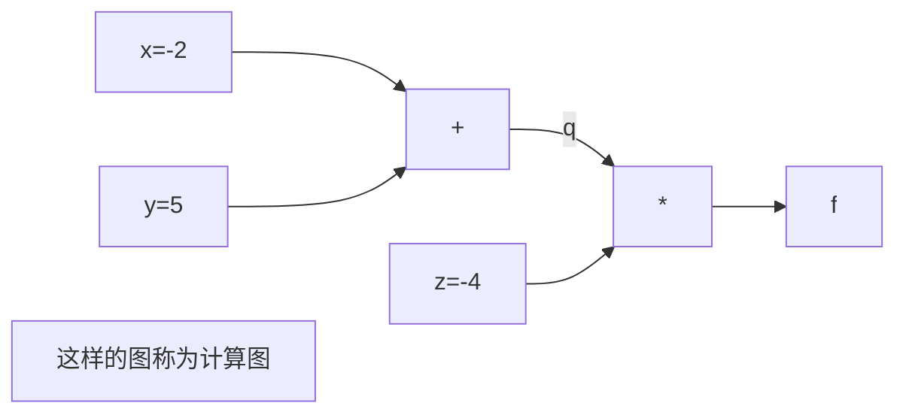
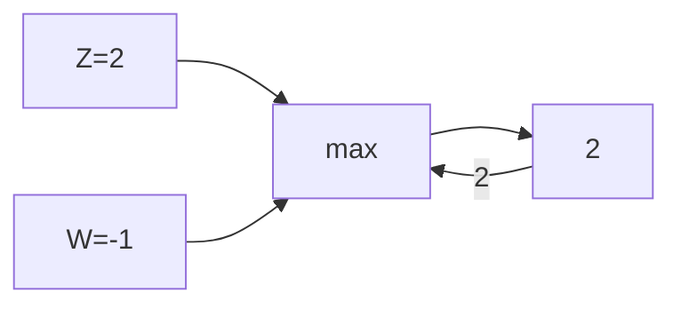
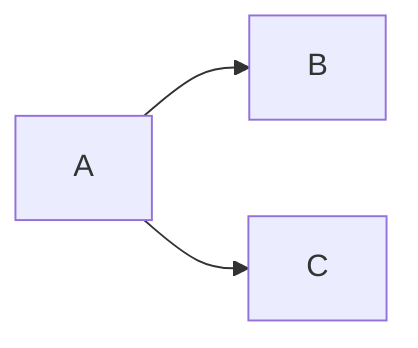

## 1.损失函数(Loss function)

​	定义一个函数，将权重矩阵**W**作为输入，输出W的输出得分，**定量**的估计W的好坏，这个函数称为损失函数。

正式定义：训练集x，y（N个样本），x作为输入，在图像分类问题中x是图片像素点构成的数据集，y是期望的输出(Label or target)，则损失函数Li是通过$f$给出的预测和真实的Label作比较可以定量的描述训练的好坏，而整个数据集L是整个数据集N个样本的损失函数的总和的平均：即
$$
L = \frac{1}{N}\sum\limits_iL_i(f(x_i, W), y_i)
$$
总的来说，损失函数描述了神经网络的预测与期望的误差，因此优化神经网络的任务即找到训练集上使损失函数达到最小的权重W

### 1.1 多分类svm与损失函数svm_loss

​	多分类svm：将图片像素点作为输入，会得到该图片在每个类的得分，神经网络判断图片属于某一类的可能性越大，图片在该类的得分就越高

​	svm_loss：将所有错误分类的得分与正确分类的得分做比较，若正确分类得分高出某个值(某个安全的边距)，即高出一定阈值，则损失为0

<svg xmlns="http://www.w3.org/2000/svg" xmlns:xlink="http://www.w3.org/1999/xlink" width="480" height="226pt" viewBox="0 0 360 226"><defs><symbol overflow="visible" id="a"><path d="M5.203-2.063H.593v-.503h4.61zm0 0"/></symbol><symbol overflow="visible" id="b"><path d="M4.516 0H.48v-.918c.29-.273.563-.535.82-.789a16.1 16.1 0 00.755-.79c.496-.546.836-.983 1.02-1.312.179-.328.269-.668.273-1.027a1.399 1.399 0 00-.086-.476 1.032 1.032 0 00-.235-.344 1.088 1.088 0 00-.355-.196 1.478 1.478 0 00-.445-.066c-.157 0-.317.02-.473.059-.164.039-.317.09-.457.148-.125.05-.242.11-.356.18-.117.07-.21.133-.277.18H.617v-.934c.176-.09.43-.18.754-.266.324-.086.629-.129.922-.129.605 0 1.086.164 1.434.489.343.324.515.761.52 1.312a3.075 3.075 0 01-.09.711 2.566 2.566 0 01-.25.598 4.771 4.771 0 01-.391.57c-.153.188-.317.371-.485.55-.281.302-.586.614-.922.934-.336.325-.605.579-.808.766h3.215zm0 0"/></symbol><symbol overflow="visible" id="c"><path d="M4.688-2.25H3.91V0h-.844v-2.25H.176v-.922l2.926-3.371h.808v3.59h.777zm-1.622-.703v-2.559L.86-2.953zm0 0"/></symbol><symbol overflow="visible" id="d"><path d="M4.617-2.121c0 .336-.058.648-.168.93-.113.289-.261.523-.445.71-.2.204-.418.36-.66.461a2.095 2.095 0 01-.805.157 2.202 2.202 0 01-.805-.149 1.858 1.858 0 01-.64-.445c-.227-.234-.403-.55-.528-.95-.128-.398-.191-.886-.191-1.468 0-.566.059-1.078.176-1.54.117-.452.297-.855.539-1.198a2.43 2.43 0 01.918-.774c.37-.187.804-.281 1.3-.281a3.3 3.3 0 01.407.023c.125.016.234.04.336.07v.84h-.04a1.697 1.697 0 00-.343-.12 2.613 2.613 0 00-.477-.055c-.546.004-.988.187-1.32.55-.34.372-.539.919-.598 1.637.204-.14.418-.254.641-.336.219-.078.461-.117.723-.12a2.8 2.8 0 01.668.077c.191.055.39.16.601.309.239.188.418.418.535.691.118.282.176.606.176.98zm-.89.035c0-.27-.036-.492-.106-.676a1.179 1.179 0 00-.344-.468.973.973 0 00-.39-.184 2.381 2.381 0 00-.442-.043c-.21 0-.41.031-.601.094a2.597 2.597 0 00-.57.265 1.609 1.609 0 00-.012.188 1.395 1.395 0 00-.004.226c-.004.454.039.82.133 1.098.086.281.199.492.332.633.125.14.254.238.386.293a.999.999 0 00.434.082 1.05 1.05 0 00.855-.379c.22-.25.329-.629.329-1.129zm0 0"/></symbol><symbol overflow="visible" id="e"><path d="M3.563-5.02c0-.289-.098-.53-.293-.73-.196-.195-.47-.297-.817-.297-.324 0-.586.09-.785.266-.207.176-.309.414-.305.71a.875.875 0 00.157.551c.101.153.257.286.464.403.09.05.227.12.414.207.184.09.356.156.512.207.254-.195.426-.395.516-.606.09-.203.136-.441.136-.71zm.124 3.278c-.003-.266-.054-.48-.16-.637-.105-.156-.308-.316-.609-.488a5.716 5.716 0 00-.398-.176c-.165-.062-.352-.14-.56-.23a1.705 1.705 0 00-.562.597 1.666 1.666 0 00-.191.805c0 .398.117.723.36.98.234.258.535.387.898.387.367 0 .664-.11.887-.332.222-.219.332-.52.336-.906zM2.458.148a2.764 2.764 0 01-.89-.144 1.816 1.816 0 01-.68-.418 1.612 1.612 0 01-.422-.625 1.933 1.933 0 01-.14-.766c-.005-.351.09-.675.28-.976a1.96 1.96 0 01.829-.711v-.028c-.325-.183-.563-.386-.72-.613-.155-.219-.234-.5-.23-.836a1.552 1.552 0 01.559-1.23c.371-.328.84-.492 1.414-.492.59 0 1.066.156 1.43.468.355.313.535.711.539 1.196a1.73 1.73 0 01-.258.87c-.176.29-.422.512-.738.673v.027c.375.18.664.398.863.648.191.258.289.586.293.985a1.861 1.861 0 01-.61 1.406c-.406.379-.913.563-1.519.566zm0 0"/></symbol><symbol overflow="visible" id="f"><path d="M4.184 0H.992v-.668H2.18v-4.387H.992v-.597c.446.004.778-.059.992-.192.211-.125.332-.367.36-.722h.68v5.898h1.16zm0 0"/></symbol><symbol overflow="visible" id="g"><path d="M2.246-5.918c-.164 0-.32.02-.476.059-.157.039-.313.09-.465.148a2.467 2.467 0 00-.367.184c-.106.07-.2.129-.278.18H.605v-.926c.188-.102.446-.196.774-.282.324-.082.637-.125.937-.125.29 0 .547.032.774.09.219.063.422.156.601.277.192.145.336.313.438.512a1.6 1.6 0 01.148.7c0 .363-.12.68-.359.949-.238.277-.523.449-.852.52v.058c.133.031.282.078.442.14.152.063.297.157.437.282.133.129.243.293.328.488.082.2.125.441.13.723a2.261 2.261 0 01-.153.812c-.102.25-.242.469-.426.66-.191.2-.422.352-.691.453-.27.102-.574.149-.918.153a4.34 4.34 0 01-.977-.121A3.621 3.621 0 01.426-.27v-.925h.062c.18.136.43.265.742.386.31.125.618.188.934.184.172.004.352-.023.535-.086.176-.055.328-.148.453-.277a1.39 1.39 0 00.266-.426c.059-.152.09-.352.094-.59a1.55 1.55 0 00-.106-.582.978.978 0 00-.285-.363 1.126 1.126 0 00-.437-.18 3.467 3.467 0 00-.547-.05h-.375v-.731h.289c.394.004.715-.09.965-.281.246-.184.37-.457.37-.817a.913.913 0 00-.097-.426.87.87 0 00-.242-.285 1.154 1.154 0 00-.371-.156 2.195 2.195 0 00-.43-.043zm0 0"/></symbol><symbol overflow="visible" id="h"><path d="M4.441-2.082c0 .32-.05.613-.152.879a2.092 2.092 0 01-.422.7 1.99 1.99 0 01-.687.468 2.499 2.499 0 01-.922.172A4.543 4.543 0 011.332.03a3.352 3.352 0 01-.785-.27v-.925h.058c.063.05.16.105.29.168.125.062.265.125.417.18.172.062.329.109.477.14.14.04.305.055.484.051.172.004.34-.027.512-.094.164-.058.309-.16.434-.304.101-.13.183-.282.246-.454a2.01 2.01 0 00.086-.609 1.5 1.5 0 00-.094-.57.94.94 0 00-.277-.371 1.146 1.146 0 00-.461-.235 2.94 2.94 0 00-.614-.07 6.29 6.29 0 00-.718.055c-.242.039-.434.074-.575.105v-3.371h3.59v.77H1.66v1.738l.313-.024.28-.011c.333.004.614.03.849.086.226.054.449.164.668.324.21.168.378.375.496.617.117.25.175.57.175.961zm0 0"/></symbol></defs><path d="M7.66 11.563l.422.406.422.41.844.812 1.683 1.63 3.375 3.257 7.313 7.063 6.828 6.593 6.695 6.465 7.262 7.012 6.777 6.547 7.348 7.094 7.21 6.96 6.727 6.497 7.293 7.043 6.809 6.578 6.676 6.445 7.242 6.992 6.758 6.528 7.324 7.074 7.195 6.945 6.703 6.477 7.278 7.023 6.789 6.559 7.355 7.101 7.223 6.977 6.738 6.508 7.309 7.054 6.82 6.586 6.688 6.461 7.254 7.004 6.77 6.54 7.339 7.085.113.106.11.109.226.219.45.433.902.871 1.8 1.739.114.109.11.11.226.214.449.438.902.867 1.801 1.738.211.203.207.203.633.61.207.203.633.61.207.202.105.102.106.098.105.101.012.012M213.977 210.695H351.34" fill="none" stroke-width="1.6" stroke-linecap="square" stroke="#5e81b5" stroke-miterlimit="3.25"/><path d="M7.66 210.695v-4" fill="none" stroke-width=".2" stroke="#666" stroke-miterlimit="3.25"/><use xlink:href="#a" x="2.16" y="222.693" fill="#93a1a1"/><use xlink:href="#b" x="8.16" y="222.693" fill="#93a1a1"/><path d="M24.844 210.695v-2.402M42.027 210.695v-2.402M59.21 210.695v-2.402M76.395 210.695v-4M93.578 210.695v-2.402M110.766 210.695v-2.402M127.95 210.695v-2.402M145.133 210.695v-4" fill="none" stroke-width=".2" stroke="#666" stroke-miterlimit="3.25"/><use xlink:href="#b" x="142.632" y="222.693" fill="#93a1a1"/><path d="M162.316 210.695v-2.402M179.5 210.695v-2.402M196.684 210.695v-2.402M213.867 210.695v-4" fill="none" stroke-width=".2" stroke="#666" stroke-miterlimit="3.25"/><use xlink:href="#c" x="211.368" y="222.693" fill="#93a1a1"/><path d="M231.05 210.695v-2.402M248.234 210.695v-2.402M265.422 210.695v-2.402M282.605 210.695v-4" fill="none" stroke-width=".2" stroke="#666" stroke-miterlimit="3.25"/><use xlink:href="#d" x="280.104" y="222.693" fill="#93a1a1"/><path d="M299.79 210.695v-2.402M316.973 210.695v-2.402M334.156 210.695v-2.402M351.34 210.695v-4" fill="none" stroke-width=".2" stroke="#666" stroke-miterlimit="3.25"/><use xlink:href="#e" x="348.84" y="222.693" fill="#93a1a1"/><path d="M.5 210.695h358" fill="none" stroke-width=".2" stroke="#93a1a1" stroke-miterlimit="3.25"/><path d="M76.395 217.332h2.402M76.395 210.695h4M76.395 204.055h2.402M76.395 197.418h2.402M76.395 190.781h2.402M76.395 184.145h2.402M76.395 177.504h4" fill="none" stroke-width=".2" stroke="#666" stroke-miterlimit="3.25"/><use xlink:href="#f" x="68.396" y="181.005" fill="#93a1a1"/><path d="M76.395 170.867h2.402M76.395 164.23h2.402M76.395 157.594h2.402M76.395 150.953h2.402M76.395 144.316h4" fill="none" stroke-width=".2" stroke="#666" stroke-miterlimit="3.25"/><use xlink:href="#b" x="68.396" y="147.817" fill="#93a1a1"/><path d="M76.395 137.68h2.402M76.395 131.043h2.402M76.395 124.402h2.402M76.395 117.766h2.402M76.395 111.129h4" fill="none" stroke-width=".2" stroke="#666" stroke-miterlimit="3.25"/><use xlink:href="#g" x="68.396" y="114.628" fill="#93a1a1"/><path d="M76.395 104.492h2.402M76.395 97.852h2.402M76.395 91.215h2.402M76.395 84.578h2.402M76.395 77.941h4" fill="none" stroke-width=".2" stroke="#666" stroke-miterlimit="3.25"/><use xlink:href="#c" x="68.396" y="81.44" fill="#93a1a1"/><path d="M76.395 71.3h2.402M76.395 64.664h2.402M76.395 58.027h2.402M76.395 51.39h2.402M76.395 44.75h4" fill="none" stroke-width=".2" stroke="#666" stroke-miterlimit="3.25"/><use xlink:href="#h" x="68.396" y="48.251" fill="#93a1a1"/><path d="M76.395 38.113h2.402M76.395 31.477h2.402M76.395 24.84h2.402M76.395 18.2h2.402M76.395 11.563h4" fill="none" stroke-width=".2" stroke="#666" stroke-miterlimit="3.25"/><use xlink:href="#d" x="68.396" y="15.063" fill="#93a1a1"/><path d="M76.395 4.926h2.402" fill="none" stroke-width=".2" stroke="#666" stroke-miterlimit="3.25"/><path d="M76.395 221.758V.5" fill="none" stroke-width=".2" stroke="#93a1a1" stroke-miterlimit="3.25"/></svg>
$$
L_i = \sum\limits_{j\neq y_i}\begin{cases}0, & \text{if $S_{y_i}$ > $S_j$+1
}\\
S_j-S_{y_i}+1, & \text{otherwise}\end{cases} = \sum\limits_{j\neq y_i}max(0,S_j-S_{y_i}+1) \text{（安全边距设为1）}
$$

$S_j$为错误分类的得分，$S_{y_i}$为其真实类别的得分，由上式可知分数越高，损失$L_i$越接近于0

$S_{y_i}$命名的含义：$S$为分类器预测的输出，即各类的得分，若用于分猫狗两类的分类器，则$S_1$和$S_2$分别是猫和狗的分数，$y_i$为样本正确的类别标签，因此$S_{y_i}$就是第$i$个样本所属的真实类别的得分。

#### 1.1.1 svm和svm_loss的性质

1. 权重矩阵W在初始化时都是使用**较小**的随机数初始化的，这就导致W产生的各类的得分，在训练初期倾向于呈现较小的均匀分布的值。若 假设一开始训练产生的分数都近似于0且近似相等，**那么使用多分类svm后的损失大致是$C-1$($C$为分类数，即类别数目)**，这是因为 由$Li=\sum\limits_{j\neq y_i}max(0, S_j-S_{y_i}+1)$在 $S_j$与$S_{y_i}$近似相等且 $S_j-S_{y_i}\thickapprox0$$\Rightarrow$每个$i$的$max(0, S_i-S_{y_i}+1)\thickapprox1$，且$j\neq y_i$共$C-1$类，所以累加$C-1$次，结果为$C-1$

   这个性质可以作为一开始训练时预估的是损失函数的大小，若损失函数在第一次迭代时并不等于$C-1$，那么程序可能有bug 

 2. 前面提到的整个数据集的损失函数 $L$: $L = \frac{1}{N}\sum\limits_iL_i(f(x_i, W), y_i)$ 只是将整个损失函数缩小一个倍数，任何缩放操作都不会产生影响，因为我们并不在意损失函数的真实值，这只是用来评估网络的一个标准。

 3. **一个损失函数的全部意义在于量化不同的误差有多大**，而不同的分类器会有产生不同的误差，因此，**选择不同的损失函数意义在于如何权衡和处理不同的分类器可能出现的误差**。例如，如果使用**平方项**损失函数，即$L_i=\sum\limits_{j\neq y_i}max^2(0, S_j-S_{y_i}+1)$，则意味着处理误差的方式是放大误差，一个较大的误差会平方式的放大，则权衡单个样例的错误时就会平方放大其错误，这会对我们的评估网络和反馈训练造成很大的影响，因为一个被放大的错误就可能导致了对矩阵的更新会非常大；而使用**非平方项**损失函数（合页损失函数），即$Li=\sum\limits_{j\neq y_i}max(0, S_j-S_{y_i}+1)$，我们对于单个微小的错误并不在意，对评估和反馈的影响也不会非常大，但如果出现了非常多的样例有错误，错误才会累加到很大，此时产生的影响才会非常大，即合页损失函数综合了多个错误样例才进行较大的更新，单个错误样例的影响并不大

### 1.2 权重矩阵W的选取（奥卡姆剃刀原则）

​	上一节提到最优W即在损失函数达到最小（最小就是$L_i=0$，但通常达不到0，且达到0会过拟合）时取到，但由于前面提到的：对于损失函数的缩放并不会产生任何影响，因此会产生多个最优W

#### 1.2.1 分类器将如何在多个达到极小的损失函数的W中作选择？

分类器会产生多个符合条件的W，是因为前面的损失函数里只以数据的误差作为分类器选择W的标准，让分类器尽可能的去拟合训练集数据，但实际上，我们并不关心训练集拟合得有多好，只是关心训练出来的分类器在**测试集中的表现**，也就是**我们关心的是训练出普适的规律，而不是训练集的规律**。

因此之前的只以训练集的损失定义的损失函数是不够的！所以在损失函数里加入一项：
$$
L(W) = \frac{1}{N}\sum_{i=1}^m L_i(f(x_i, W),y_i)+\lambda R(W)
$$
该项称为正则项(regulation) ，该项鼓励模型(W)趋于简洁，这里的“简洁”并不是越小越好，而是基于任务的规模和模型的种类。这方面也体现了“奥卡姆剃刀原则”：要让一个理论的应用更加广泛，当你有多个能解释你观察结果的假设，你应该选择最简洁的，因为这样利于在未来将其用于解释新的结果 (泛化的概念) ，越不简洁，越苛刻，对新的结果的解释也就越不友好。

“奥卡姆剃刀原则”在机器学习中的体现就是，假设正则化惩罚项(regularization penalty)，记作$R$. 而其中的超参数$\lambda$用于平衡 Data loss 和 Regularization 这两项。$\lambda ,R,W$这三项的相互作用组成的正则项$\lambda R(W)$使模型趋于简单并惩罚模型（降低高幂次）防止过拟合，而高幂次模型想要得到保留，就必须克服这项**正则惩罚项**，这三者并不是正则化的一般的线性的关系。

这样，我们就可以回答开始**“如何在多个符合条件的W中作选取”**的问题了——通过正则惩罚项得到最适应任务和模型的最“简洁”的W

#### 1.2.2 正则化类型

​	正如1.2.1提到的正则项 $\lambda R(W)$ ，按正则化的类型有多种计算方法
$$
L2\ Regularization: R(W) = \sum_k\sum_lW^2_{k,l}\\
L1\ Regularization: R(W) = \sum_k\sum_l|W_{k,l}|\\
Elastic\ net(L1+L2):R(W)=\sum_k\sum_l\beta W^2_{k,l}+|W_{k,l}|
$$
最常用的是**L2正则化**，即对权重W的欧式范数进行惩罚；

>欧式范数(Euclidean norm)即距离 = $\sqrt{\sum_1^n{x_i^2}}$

类似的，**L1正则化**就是对权重向量W的L1范数作惩罚。**弹性网络正则化Elastic net**，将L1和L2组合一起。

**最大规范正则化**，按最高准则进行惩罚，不属于L1或L2。

还有一些具体的正则化实现：例如**Dropout**，**批量归一化 batch normalization**，**随机深度stochatic depth**等等

#### 1.2.3 正则化如何度量模型复杂度

一个简单的例子就是：对比两个矩阵 $W_1=[1,0,0,0]$ 和 $W_2=[0.25,0.25,0.25,0.25]$，两者在x=[1,1,1,1]时有着相同输出，但$L2(W_1)=1,\ L2(W_2)=\sqrt{0.25^2+0.25^2+0.25^2+0.25^2}=0.5$，$W_2$的L2范数更小。这样就通过了L2范数来度量两个W的复杂度。

可以看到，上例中L2正则 是粗糙的通过L2范数来铺展开W中的每个元素值，来度量每个元素的影响，而不是仅反映单个元素的影响。

### 1.3 softmax函数与softmax损失函数(softmax loss)

​	前面提到的损失函数与正则惩罚项都是基于**svm loss**进行讨论的，但深度学习中**softmax loss**更为常用。softmax loss也称**multinomial logistic regression loss function——多项式逻辑回归损失函数**。在得到softmax loss之前，先引入**softmax函数(softmax function)**

其表达式：
$$
Softmax\ function:P(Y=k|X=x_i)=\frac{e^{s_k}}{\sum_je^{s_j}}\quad(\sum_je^{s_j}为所有类别分数指数化后的累加)\\
where:s=f(x_i,W)\quad(即x_i经过分类器后各类对应的分数)
$$
分数指数化以便于结果都是正数，再除以指数化的和来**归一化**，**Softmax函数的效果**是类别对应的分数经过softmax函数后就得到了类别的相应概率$P(0\leqslant P \leqslant 1)$且所有类别的$P_i$的和为1。至此就得到了每类得分分数的概率分布。

各类得分经过softmax后，就可以用真实的概率分布与我们的softmax function输出的概率分布作比较并计算softmax loss了

>真实的概率分布很显然应是：一张图片对应的真实类别的概率为1，其他类别的概率为0

我们期望输出的概率分布要逼近于真实概率分布，也就是真实类别的概率较高并接近于1，因此损失函数softmax loss表达式为：
$$
Softmax\ loss:L_i=-logP(Y=y_i|X=x_i)\quad （P(Y=y_i|X=x_i)为真实类别的概率）
$$
因为对数函数log是一个单调函数，找到数学上log函数的最大值只需$P$最大即可，因此选择log函数但底数$P$越逼近于1其对数值越大，但**损失函数是描述分类器的误差程度（就是有多不好）**，所以对log取了负号，以符合 $P(Y=y_i|X=x_i)$ 越大，分类器越好，损失函数越小的预设。

softmax loss函数图象

<svg xmlns="http://www.w3.org/2000/svg" xmlns:xlink="http://www.w3.org/1999/xlink" width="480" height="300" viewBox="0 0 360 225"><defs><symbol overflow="visible" id="a"><path d="M4.547-3.273c0 1.175-.172 2.039-.512 2.586-.344.55-.87.82-1.578.824C1.73.133 1.203-.145.867-.703.531-1.262.363-2.113.363-3.266c0-1.175.168-2.039.512-2.59.34-.542.867-.816 1.582-.82.719.004 1.25.285 1.586.848.336.566.504 1.418.504 2.555zM3.422-1.277c.086-.22.144-.493.18-.825.035-.328.054-.718.054-1.171 0-.446-.02-.836-.054-1.168a3.345 3.345 0 00-.184-.829 1.186 1.186 0 00-.363-.503 1.022 1.022 0 00-.598-.176c-.246.004-.445.062-.602.176-.16.117-.285.285-.37.511a2.854 2.854 0 00-.18.848c-.035.344-.051.726-.047 1.148-.004.461.008.844.039 1.149.023.312.086.586.183.824.083.23.204.406.364.523.152.125.355.184.613.18a.958.958 0 00.598-.172c.156-.117.28-.289.367-.515zm0 0"/></symbol><symbol overflow="visible" id="b"><path d="M1.887 0H.836v-1.254h1.05zm0 0"/></symbol><symbol overflow="visible" id="c"><path d="M4.516 0H.48v-.918c.29-.273.563-.535.82-.789a16.1 16.1 0 00.755-.79c.496-.546.836-.983 1.02-1.312.179-.328.269-.668.273-1.027a1.399 1.399 0 00-.086-.476 1.032 1.032 0 00-.235-.344 1.088 1.088 0 00-.355-.196 1.478 1.478 0 00-.445-.066c-.157 0-.317.02-.473.059-.164.039-.317.09-.457.148-.125.05-.242.11-.356.18-.117.07-.21.133-.277.18H.617v-.934c.176-.09.43-.18.754-.266.324-.086.629-.129.922-.129.605 0 1.086.164 1.434.489.343.324.515.761.52 1.312a3.075 3.075 0 01-.09.711 2.566 2.566 0 01-.25.598 4.771 4.771 0 01-.391.57c-.153.188-.317.371-.485.55-.281.302-.586.614-.922.934-.336.325-.605.579-.808.766h3.215zm0 0"/></symbol><symbol overflow="visible" id="d"><path d="M4.688-2.25H3.91V0h-.844v-2.25H.176v-.922l2.926-3.371h.808v3.59h.777zm-1.622-.703v-2.559L.86-2.953zm0 0"/></symbol><symbol overflow="visible" id="e"><path d="M4.617-2.121c0 .336-.058.648-.168.93-.113.289-.261.523-.445.71-.2.204-.418.36-.66.461a2.095 2.095 0 01-.805.157 2.202 2.202 0 01-.805-.149 1.858 1.858 0 01-.64-.445c-.227-.234-.403-.55-.528-.95-.128-.398-.191-.886-.191-1.468 0-.566.059-1.078.176-1.54.117-.452.297-.855.539-1.198a2.43 2.43 0 01.918-.774c.37-.187.804-.281 1.3-.281a3.3 3.3 0 01.407.023c.125.016.234.04.336.07v.84h-.04a1.697 1.697 0 00-.343-.12 2.613 2.613 0 00-.477-.055c-.546.004-.988.187-1.32.55-.34.372-.539.919-.598 1.637.204-.14.418-.254.641-.336.219-.078.461-.117.723-.12a2.8 2.8 0 01.668.077c.191.055.39.16.601.309.239.188.418.418.535.691.118.282.176.606.176.98zm-.89.035c0-.27-.036-.492-.106-.676a1.179 1.179 0 00-.344-.468.973.973 0 00-.39-.184 2.381 2.381 0 00-.442-.043c-.21 0-.41.031-.601.094a2.597 2.597 0 00-.57.265 1.609 1.609 0 00-.012.188 1.395 1.395 0 00-.004.226c-.004.454.039.82.133 1.098.086.281.199.492.332.633.125.14.254.238.386.293a.999.999 0 00.434.082 1.05 1.05 0 00.855-.379c.22-.25.329-.629.329-1.129zm0 0"/></symbol><symbol overflow="visible" id="f"><path d="M3.563-5.02c0-.289-.098-.53-.293-.73-.196-.195-.47-.297-.817-.297-.324 0-.586.09-.785.266-.207.176-.309.414-.305.71a.875.875 0 00.157.551c.101.153.257.286.464.403.09.05.227.12.414.207.184.09.356.156.512.207.254-.195.426-.395.516-.606.09-.203.136-.441.136-.71zm.124 3.278c-.003-.266-.054-.48-.16-.637-.105-.156-.308-.316-.609-.488a5.716 5.716 0 00-.398-.176c-.165-.062-.352-.14-.56-.23a1.705 1.705 0 00-.562.597 1.666 1.666 0 00-.191.805c0 .398.117.723.36.98.234.258.535.387.898.387.367 0 .664-.11.887-.332.222-.219.332-.52.336-.906zM2.458.148a2.764 2.764 0 01-.89-.144 1.816 1.816 0 01-.68-.418 1.612 1.612 0 01-.422-.625 1.933 1.933 0 01-.14-.766c-.005-.351.09-.675.28-.976a1.96 1.96 0 01.829-.711v-.028c-.325-.183-.563-.386-.72-.613-.155-.219-.234-.5-.23-.836a1.552 1.552 0 01.559-1.23c.371-.328.84-.492 1.414-.492.59 0 1.066.156 1.43.468.355.313.535.711.539 1.196a1.73 1.73 0 01-.258.87c-.176.29-.422.512-.738.673v.027c.375.18.664.398.863.648.191.258.289.586.293.985a1.861 1.861 0 01-.61 1.406c-.406.379-.913.563-1.519.566zm0 0"/></symbol><symbol overflow="visible" id="g"><path d="M4.184 0H.992v-.668H2.18v-4.387H.992v-.597c.446.004.778-.059.992-.192.211-.125.332-.367.36-.722h.68v5.898h1.16zm0 0"/></symbol><symbol overflow="visible" id="h"><path d="M2.246-5.918c-.164 0-.32.02-.476.059-.157.039-.313.09-.465.148a2.467 2.467 0 00-.367.184c-.106.07-.2.129-.278.18H.605v-.926c.188-.102.446-.196.774-.282.324-.082.637-.125.937-.125.29 0 .547.032.774.09.219.063.422.156.601.277.192.145.336.313.438.512a1.6 1.6 0 01.148.7c0 .363-.12.68-.359.949-.238.277-.523.449-.852.52v.058c.133.031.282.078.442.14.152.063.297.157.437.282.133.129.243.293.328.488.082.2.125.441.13.723a2.261 2.261 0 01-.153.812c-.102.25-.242.469-.426.66-.191.2-.422.352-.691.453-.27.102-.574.149-.918.153a4.34 4.34 0 01-.977-.121A3.621 3.621 0 01.426-.27v-.925h.062c.18.136.43.265.742.386.31.125.618.188.934.184.172.004.352-.023.535-.086.176-.055.328-.148.453-.277a1.39 1.39 0 00.266-.426c.059-.152.09-.352.094-.59a1.55 1.55 0 00-.106-.582.978.978 0 00-.285-.363 1.126 1.126 0 00-.437-.18 3.467 3.467 0 00-.547-.05h-.375v-.731h.289c.394.004.715-.09.965-.281.246-.184.37-.457.37-.817a.913.913 0 00-.097-.426.87.87 0 00-.242-.285 1.154 1.154 0 00-.371-.156 2.195 2.195 0 00-.43-.043zm0 0"/></symbol></defs><path d="M16.59 11.55l.09.571.113.703.23 1.383.457 2.664.915 4.961.113.59.113.582.227 1.148.457 2.223.914 4.191 1.828 7.512.105.41.106.403.215.8.425 1.567.852 3.004 1.707 5.543.105.328.11.328.21.644.427 1.274.855 2.453 1.703 4.602.106.27.105.265.207.535.418 1.047.836 2.039 1.672 3.86.105.234.106.23.207.461.418.906.836 1.77 1.672 3.379.113.218.113.223.227.438.457.867.906 1.691 1.813 3.23 3.629 5.938.21.328.211.325.422.644.848 1.266 1.691 2.445 3.387 4.578 7.34 8.766 7.203 7.41 6.719 6.101 7.289 5.918 6.8 4.993 6.669 4.484 7.238 4.477 6.75 3.867 7.316 3.898 7.188 3.574 6.699 3.133 7.266 3.203 6.785 2.825 7.351 2.906 7.215 2.707 6.73 2.41 7.301 2.496 6.813 2.227 6.684 2.101 7.246 2.192 6.761 1.964 7.332 2.055 7.196 1.942 6.714 1.75 7.278 1.835 6.797 1.66 6.66 1.579 7.23 1.664 6.743 1.504 7.312 1.59 6.824 1.437 6.696 1.379 7.257 1.453 6.778 1.32 7.34 1.399 7.21 1.336 6.723 1.219 7.293 1.292 6.809 1.176 6.672 1.133 7.242 1.2 6.754 1.097.117.02.117.015.238.04.47.073.944.153 1.883.3.121.02.118.016.234.039.473.074.94.148.235.04.239.035.468.074.121.02.118.019.234.035.234.04.121.019.118.015" fill="none" stroke-width="1.6" stroke-linecap="square" stroke="#5e81b5" stroke-miterlimit="3.25"/><path d="M8 210.488v-4M25.168 210.488v-2.398M42.336 210.488v-2.398M59.504 210.488v-2.398M76.668 210.488v-4" fill="none" stroke-width=".2" stroke="#666" stroke-miterlimit="3.25"/><g fill="#93a1a1"><use xlink:href="#a" x="70.169" y="222.49"/><use xlink:href="#b" x="75.082" y="222.49"/><use xlink:href="#c" x="77.807" y="222.49"/></g><path d="M93.836 210.488v-2.398M111.004 210.488v-2.398M128.172 210.488v-2.398M145.34 210.488v-4" fill="none" stroke-width=".2" stroke="#666" stroke-miterlimit="3.25"/><g fill="#93a1a1"><use xlink:href="#a" x="138.839" y="222.49"/><use xlink:href="#b" x="143.752" y="222.49"/><use xlink:href="#d" x="146.476" y="222.49"/></g><path d="M162.508 210.488v-2.398M179.672 210.488v-2.398M196.84 210.488v-2.398M214.008 210.488v-4" fill="none" stroke-width=".2" stroke="#666" stroke-miterlimit="3.25"/><g fill="#93a1a1"><use xlink:href="#a" x="207.508" y="222.49"/><use xlink:href="#b" x="212.421" y="222.49"/><use xlink:href="#e" x="215.146" y="222.49"/></g><path d="M231.176 210.488v-2.398M248.344 210.488v-2.398M265.512 210.488v-2.398M282.676 210.488v-4" fill="none" stroke-width=".2" stroke="#666" stroke-miterlimit="3.25"/><g fill="#93a1a1"><use xlink:href="#a" x="276.178" y="222.49"/><use xlink:href="#b" x="281.091" y="222.49"/><use xlink:href="#f" x="283.815" y="222.49"/></g><path d="M299.844 210.488v-2.398M317.012 210.488v-2.398M334.18 210.488v-2.398M351.348 210.488v-4" fill="none" stroke-width=".2" stroke="#666" stroke-miterlimit="3.25"/><g fill="#93a1a1"><use xlink:href="#g" x="344.847" y="222.49"/><use xlink:href="#b" x="349.76" y="222.49"/><use xlink:href="#a" x="352.485" y="222.49"/></g><path d="M.848 210.488H358.5" fill="none" stroke-width=".2" stroke="#93a1a1" stroke-miterlimit="3.25"/><path d="M8 221.277h2.398M8 210.488h4M8 199.703h2.398M8 188.914h2.398M8 178.125h2.398M8 167.34h2.398M8 156.55h4" fill="none" stroke-width=".2" stroke="#666" stroke-miterlimit="3.25"/><use xlink:href="#g" y="160.051" fill="#93a1a1"/><path d="M8 145.762h2.398M8 134.977h2.398M8 124.188h2.398M8 113.398h2.398M8 102.613h4" fill="none" stroke-width=".2" stroke="#666" stroke-miterlimit="3.25"/><use xlink:href="#c" y="106.112" fill="#93a1a1"/><path d="M8 91.824h2.398M8 81.035h2.398M8 70.25h2.398M8 59.46h2.398M8 48.672h4" fill="none" stroke-width=".2" stroke="#666" stroke-miterlimit="3.25"/><use xlink:href="#h" y="52.174" fill="#93a1a1"/><path d="M8 37.887h2.398M8 27.098h2.398M8 16.309h2.398M8 5.523h2.398" fill="none" stroke-width=".2" stroke="#666" stroke-miterlimit="3.25"/><path d="M8 221.543V.5" fill="none" stroke-width=".2" stroke="#93a1a1" stroke-miterlimit="3.25"/></svg>
#### 1.3.1 softmax loss函数性质

1. 正如之前提到的svm loss的 *预估首次迭代后的损失值检测机制*  性质一样，softmax loss首次迭代后的值应是$-log\frac{1}{C}=logC$，这同样可以作为调试和检测依据。
2. 通过对比 softmax loss 与 svm loss 发现：在某一个正确类别的得分高出错误分类得分一个阈值时，svm loss=0，这个数据点就不会再影响loss了，带来的影响就是在后续的优化过程中不再考虑这个得到高分的数据点；而softmax loss 不同，就算正确类别的得分再高，错误类别的得分再低，softmax loss 仍不会达到0，这样在**优化方向上就会持续给正确类别积累更多的概率**，也就会给正确类别的分数推向无穷大，并将不正确的类别的分数推向负无穷。

## 2. 优化(Optimization)

多元情况下生成的导数就是梯度

**step size 步长**，也叫**learning rate 学习率**是在训练网络的时候第一个要检查的超参数

## 3. 反向传播与神经网络(Back propagation and neural network)

### 3.1 反向传播是如何工作的——链式法则 (chain rule)

先用上图中$f(x,y,z)=(x+y)*z\quad e.g.\ x=-2, y=5, z=-4$ 这样简单的函数来作链式法则，有：
$$
f(x,y,z)=(x+y)*z\quad e.g.\ x=-2, y=5, z=-4\\
q=x+y\quad\frac{\partial {q}}{\partial x}=1,\frac{\partial {q}}{\partial y}=1\\
f=qz\quad\frac{\partial{f}}{\partial{q}}=z,\frac{\partial{f}}{\partial{z}}=q\\
Want:\frac{\partial{f}}{\partial{x}},\frac{\partial{f}}{\partial{y}}\\
Chain\ rule:\frac{\partial{f}}{\partial{x}}=\frac{\partial{q}}{\partial{x}}\frac{\partial{f}}{\partial{q}}=z=-4,\ \frac{\partial{f}}{\partial{y}}=\frac{\partial{q}}{\partial{y}}\frac{\partial{f}}{\partial{q}}=z=-4
$$
总的来说，对于每个节点，我们都可以用其输入和直接输出得到相应的梯度，称作**本地梯度**。而**反向传播**所做的是，从一个节点的上游为该节点返回一个梯度，该梯度是对节点输出的求导，接着根据链式法则将 传播回来的梯度和该节点的本地梯度相乘，就得到关于*该节点输入*的梯度。

之所以在这里不使用微积分直接得出$\frac{\partial{f}}{\partial{x}}$ 而是要用链式法则的方式得出，是因为在在深度学习复杂的模型下$\frac{\partial{f}}{\partial{x}}$用微积分的方法难以计算，而通过链式法则，就可以利用乘法将上游传递的梯度和本地梯度连接得到想要的梯度。

#### 3.1.1 max门的反向传播

假设max门接收到从上游传回来梯度是2，则反向传播得到Z，W梯度分别是2和0，即表明：max门选取的其中一个变量（也就是最大值）会获得传播回来的梯度完整值，而另外一个变量获得的梯度会取为0，也就是**max门会获取上游梯度并将其全部传递到其中前向传递最大值的那个分支**。

可以通过**前向传递过程**解释max门这种梯度传递的效果。前向传递过程中只有最大值Z能通过max门被传递到计算图的剩余部分，所以**只有这个最大值真正影响到了最终的计算结果，因此，同样在反向传播梯度的时候，上游梯度只需要去更新那个产生影响的值**。

#### 3.1.2 反向传播的实质

​	由max门的例子可以看出，一个节点在前向传递的过程中产生了多少程度的影响，在反向传播时的上游梯度就会对这个节点产生多少程度的调整，**一个节点的的影响越大，反向传播对其做出相对应更新的比重也就越大，获得的上游梯度也就越大**。由此可知，当一个节点连接多个节点时，如

在前向传递过程中节点A的微小改变会对连接节点A的所有节点都产生影响，所以B、C返回的梯度也都会对A产生影响，因此节点A的总上游梯度等于节点B、C返回的上游梯度相加。

#### 3.1.3 向量输入的反向传播

向量作为输入时的反向传播：
$$
f(x,W)=||W\cdot x||^2=\sum_{i=1}^n(W\cdot x)^2\\
q=W\cdot x=\left (\begin{matrix}
W_{1,1}x_1+...+W_{1,n}x_n\\.\\.\\W_{n,1}x_1+...+W_{n,n}x_n\end{matrix}\right)\\
f(q)=||q||^2=q_1^2+...+q_n^2\\
\Downarrow \\
\frac{\partial q_k}{\partial W_{i,j}}=x_j,\ \frac{\partial{f}}{\partial W_{i,j}}=\sum_k\frac{\partial{f}}{\partial q_k}\frac{\partial{q_k}}{\partial W_{i,j}}=\sum_k{(2q_k)x_j}=2q_ix_j \Rightarrow\bigtriangledown_wf=\left[\begin{matrix} \frac{\partial{f}}{\partial W_{1,1}} &...&\frac{\partial{f}}{\partial W_{1,n}}\\
 &.& \\
 &.& \\
 &.& \\
 \frac{\partial{f}}{\partial W_{n,1}} &...&\frac{\partial{f}}{\partial W_{n,n}}\end{matrix}\right]_{(雅可比矩阵)}=2q\cdot x^T\\
\frac{\partial q_k}{\partial x_i}=W_{k,i}\ (k=1,2,3...,n)因为每行q都有x_i的参与,\ \frac{\partial{f}}{\partial x_i}=\sum_k\frac{\partial{f}}{\partial q_k}\frac{\partial{q_k}}{\partial x_i}=\sum_k{(2q_k)W_{k,i}} \Rightarrow\bigtriangledown_xf=\left[\begin{matrix} \frac{\partial{f}}{\partial x_{1,1}} &...&\frac{\partial{f}}{\partial x_{1,n}}\\
 &.& \\
 &.& \\
 &.& \\
 \frac{\partial{f}}{\partial x_{n,1}} &...&\frac{\partial{f}}{\partial x_{n,n}}\end{matrix}\right]=2W^T\cdot q
$$
示例：$W=\left [\begin{matrix} 0.1&0.5\\-0.3&0.8 \end{matrix}\right],x=\left [\begin{matrix} 0.2\\0.4 \end{matrix}\right],求\frac{\partial{f}}{\partial W}、\frac{\partial{f}}{\partial x}$

修正：$\frac{\partial{f}}{\partial W}=\left[\begin{matrix}0.088&0.176\\0.104&0.208\end{matrix}\right]$，是图片中的矩阵的转置

向量中每个元素的梯度，代表着对应的这个元素对最终计算结果的影响的大小，而每个梯度元素，量化了每个元素对最终输出影响的贡献。

### 3.2 神经网络(neural networks)

#### 3.2.1 神经网络的基本结构——层的堆叠(stack of layers)

以一组简化的函数作为例子：
$$
Linear\ score\ function:f=Wx\\
(用max函数简单的作为非线性部分的示例)\\
2-layer\ Neural\ Network:f=W_2max(0,W_1x)\\
3-layer\ Neural\ Network:f=W_3(max(0,W_2max(0,W_1x)))
$$
线性层：$W_kx,(k=1,2,3...)$；非线性计算部分：$max函数$。线性层和非线性计算部分的组合形成一个**层**(layer)，继而在层的顶部再加上另一个线性层$W_2$ ，得到两层神经网络的输出向量；还可以再加上非线性计算形成神经网络的第二层，再加上线性层$W_3$形成三层神经网络。神经网络就是**线性层和非线性计算部分组成的许多组简单函数，再用一种层次化的嵌套方式将这些组函数堆叠而成，层层堆叠形成网络深度**，其中的**非线性计算部分**特别重要，如果没有非线性部分，整个网络就简化成了一个线性方程。

#### 3.2.2 生物神经元的工作与神经网络的类比与区别

**类比**：

神经元之间通过树突(dendrite)接收传递的脉冲信号，细胞体(cell body)集中处理传入的信号，再通过轴突(axon)传递给连接的下游神经元

而在神经网络中，权重矩阵$W$类比接收信号的树突，提取传递进来的信号x，再对所有传递的信号进行集中，经过激活函数（类比于细胞体和轴突的处理和激发机制），最后传递到下游。

**区别**：生物神经元的工作机制远比神经网络复杂多变，而神经网络的线性与非线性的简单堆叠远模拟不了神经元的种种多变情况，**在这里列出两者区别希望可以给更进神经网络结构一些启发**

1. 生物神经元有许多不同的种类
2. 类比为权重矩阵$W_0$的神经元树突，并不像$W_0$描述的那样只有简单的权重，而是实际上是一个复杂的动态非线性系统
3. 类比为激活函数的神经元轴突的触发(firing)机制，其激发阈值可能会变化，~~相比较起来，一个具有固定数学形式的激活函数设定可能有些过于简单~~

## 4. 卷积神经网络(Convolutional neural network)

与全连接神经网络展开输入图像的像素，形成一组向量不同，卷积神经网络可以保留输入图像的空间结构。

### 4.1 卷积层的工作机制

卷积神经网络利用的是一个大小小于输入图像的**卷积核(filter)**作为权重，在输入图像上（以一定的步长）进行滑动直至遍历整张图像，计算与每个经过的空间区域的**哈达玛积(hadamard products，也称点积，dot products)**

> 哈达玛积，大小完全相同的矩阵，对应元素相乘，例如$\left (\begin {matrix}1&3&2\\1&0&0\\1&2&2\end{matrix}\right)\ast\left (\begin {matrix}0&0&2\\7&5&0\\2&1&1\end{matrix}\right)=\left (\begin {matrix}1\times 0&3\times 0&2\times 2\\1\times 7&0\times 5&0\times 0\\1\times 2&2\times 1&2\times 1\end{matrix}\right)=\left (\begin {matrix}0&0&4\\7&0&0\\2&2&2\end{matrix}\right)$

**点积的结果的每个元素相加并加上偏置，就得到输出激活映射(output activation map)的一个值，垂直方向和水平方向做相同的卷积核滑动处理，最终得到整个输出激活映射**

输入图像每经过一次卷积核处理后（即输入图像的部分区域经过一个哈达玛积），输出是一个值，这就要求卷积核遍历输入图像的所有通道，**因此卷积核的深度（维数）必须与输入深度一致**。例如输入一个$32\times 32\times 3$的图像，选取大小为5的卷积核，则卷积核为$5\times 5\times 3$的矩阵，因此可以看到上图中输出的维数相比输入发生了变化。**在实际应用中，通常使用多个卷积核对同一图像进行处理，因为每个卷积核都可以从图像中获取不同的信息**，每个卷积核得到不同的输出，形成了每层卷积层输出的深度(维度)

卷积核每次滑动扫过的像素区间，称为**步长(stride)**，步长($srtide$)、输入大小($N$)、卷积核大小($F$)三者与输出的关系（简化）：
$$
Output\ size:(N-F)/stride+1\\
e.g.N=7,F=3:\\
stride\ 1 \Rightarrow(7-3)/1+1=5\\
stride\ 2 \Rightarrow(7-3)/2+1=3\\
stride\ 3 \Rightarrow(7-3)/3+1=2.33\ (error)
$$

#### 4.1.1 解决边缘区域问题

可以观察到，卷积核滑动过程中，边界内的像素都经历了两次卷积运算，而边界像素只经历了一次；并且卷积处理后的大小相比于输入有所缩小，这样就会随着层数的深入，图像会越来越小，而用很大程度缩小后的图像来包含原图像的信息是不好的。

为了在实际应用中为了得到实际需要的输出大小（与输入大小相同）且边界区域像素可以和其他区域应用相同次数的卷积核运算，**通常使用0像素拓展输入图像的边界**：

上图中，边界上拓展一层0像素，步长仍为1时，输出就变成$output\ size=(N+2-F)/1=7$；当卷积核大小改变，相应需要拓展的0像素层数也就改变，在步长恒为1情况下其二者**关系为：$zero-padding=(F-1)/2$**（可由前面的数学公式推导）**！注意：拓展是对图像的边界进行拓展，因此每拓展一层，输入大小由$N\rightarrow N+2$，拓展x层，输入大小:$N\rightarrow N+2\times x$**

#### 4.1.2 如何选择步长

可以想到，当选择一个较大的步长的时候，获得的输出图像是一个**对输入图像降采样的结果**；再者，因为卷积网络的全连接层会连接到最后的所有卷积层的输出值，所以步长的大小会影响到最后的全连接层(FC)连接到的参数个数，**步长越大，降采样的比例越大，参数越少**，最终**提供给全连接层的信息**也就越少

综上，选取步长的考虑因素涉及：参数数量，模型尺寸，以及过拟合之间的权衡

### 4.2 卷积神经网络的结构

与 *3.2.1 神经网络的基本结构——层的堆叠* 提到的类似，卷积神经网络是多个卷积层（每个卷积层具有多个卷积核）依次堆叠组成的一个**序列(sequence)**，每层卷积层都经过激活函数（像Relu函数等等，作为非线性层）的处理，得到的输出又作为下一个卷积层的输入，**将最后的卷积层输出展开成一维输入，连接一个全连接层**，最终得到类别分值

通过由浅入深的每层输入观察到，卷积网络的输出是一个由简单到复杂的序列

#### 4.2.1 卷积神经网络的设计因素及卷积层参数

**设计因素**：在设计Conv Net时，步长的大小，每层卷积核的大小及数量，拓展的零像素边界大小（这几个因素都符合4.1节提到的数学形式），都会称为设计架构考虑的因素。

**卷积核的大小通常为3x3，5x5，7x7；步长通常为1或2；根据期望输出的大小以及相应数学公式设置零像素层数；卷积核个数通常使用2的次方数，32，64，128，512等等**

**卷积层参数**：卷积核作为权重再加上偏置，并考虑每层卷积核的个数；假设一个$5\times 5$的卷积核，深度与输入图像深度对应，假设为3，则每个卷积核有$5\times 5\times 3=75$个参数，加上一个偏置$=76$，假设卷积层有十个卷积核，那该卷积层的参数$=76\times 10=760$。

### 4.3 关于卷积神经网络的补充

#### 4.3.1 大脑层面理解卷积神经网络

每个卷积核可以看作一个神经元的**感受野(receptive field)**

> 神经元的感受野，即该神经元所能接收到的视野

与全连接中一个神经元和图像的整个区域相关不同，卷积神经网络中的一个神经元只与图像的一个局部区域发生关联，也就是一个神经元只负责图像的一部分信息处理

#### 4.3.2 池化层(Pooling layer)

除了*4.2神经网络结构* 提到的之外，在非线性层后还通常会进行池化层处理，使输出变得更小而更好控制（属于一种降采样处理的方法）

**注意，池化层的降采样只会对平面层面上进行操作，并不会对输入层的深度产生影响。**

##### 最大池化法(Max pooling)

与选取卷积核类似，选取一个大小小于被处理矩阵的矩阵作为**过滤器(filter)**并规定步长，过滤器遍历被处理矩阵，每经过一个区域**取该区域最大值**，最终得到输出，例如：

像上例一样，通常规定步长以**使过滤器滑动过程经过区域不会重叠**，因为池化过程期望的是**降采样**的效果，因此**保证每个区域避免重叠并用区域最大值代表整个区域**是符合降采样的要求的。 

##### 最大池化法的优点

前面提到，池化层是在非线性层之后的，因此池化层处理的矩阵是由经过激活函数后的激活值组成的，**每个激活值代表了这个位置的卷积核激发程度，也就是该位置的特征信息影响程度**，因此区域的一个值代表区域包含的所有位置的激发程度，最好的方法是取最大值而不是取均值等等，以避免总激发程度（区域的总影响程度）经过池化后衰减，而是以最大的激活程度激活这个区域。

##### 池化层的设置

1. 进行池化前不对矩阵做零填充，因为池化只是在做降采样且池化过滤器经过的区域不会相互重叠
2. 池化层的典型设置：$2\times 2$过滤器和2的步长；或$3\times 3$的过滤器和3的步长

# 训练网络(Train Neural Network)

## 5. 激活函数(Activation functions)

### 5.1 sigmoid

### 5.2 tanh

### 5.3 ReLU(Rectified Linear Unit)

### 5.4 Leaky ReLU

 ### 5.5 ELU(Exponential Linear Units)

### 5.6 Maxout "Neuron"

### 5.7 总结：实际应用

1. 首选的是**ReLU**函数，这是在大多数方法中最为标准的；
2. 学习速率很关键，这个参数需要非常谨慎的调整，在*第2节优化* 也提到学习率是在训练网络的时候第一个要检查的超参数
3. 可以尝试**Leaky ReLU / Maxout / ELU**，但一般实用性较弱，还是根据函数的属性和实际问题决定是否尝试使用
4. 可以尝试tanh但可能不会又更好的表现
5. **不要使用sigmoid**

## 6. 数据预处理

## 

